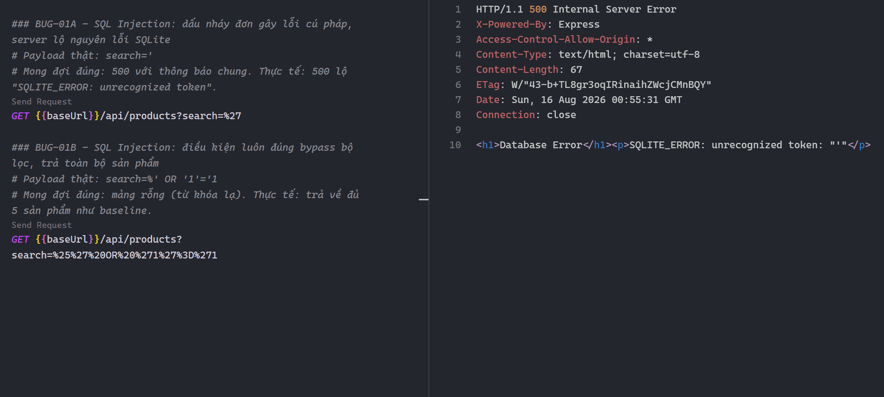
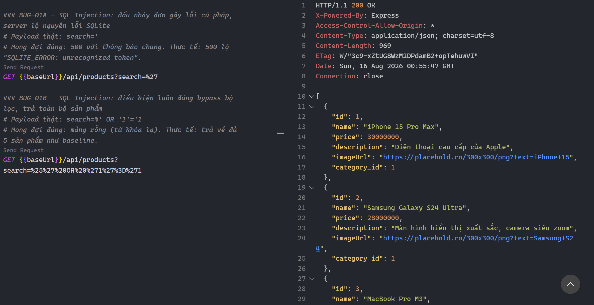
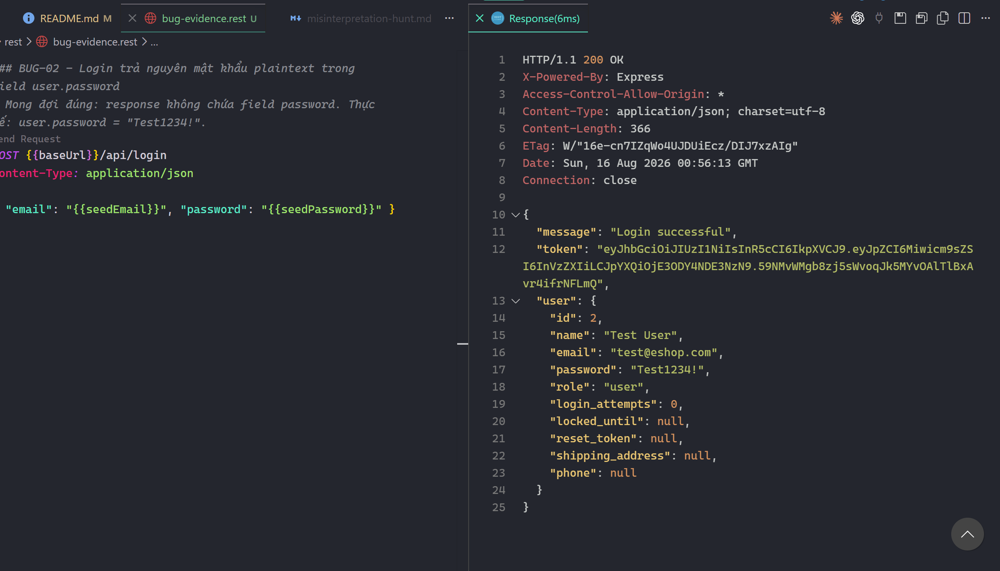
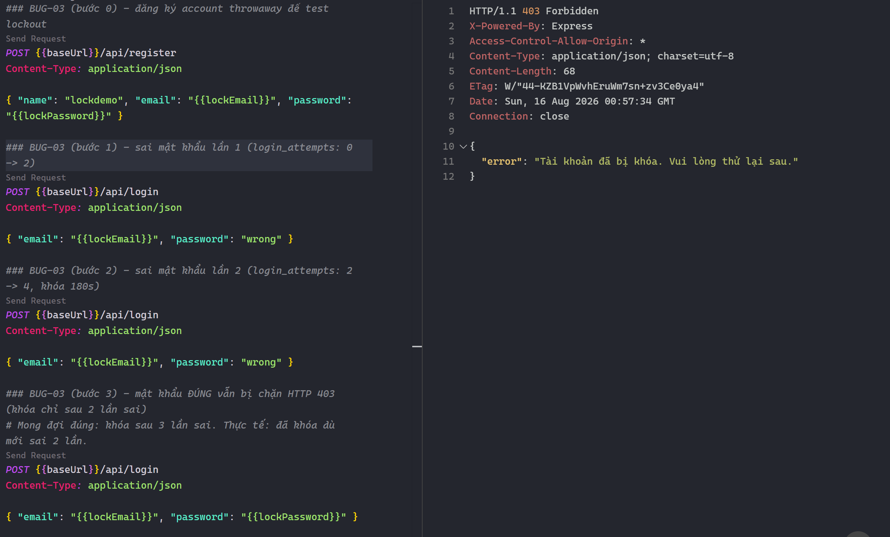
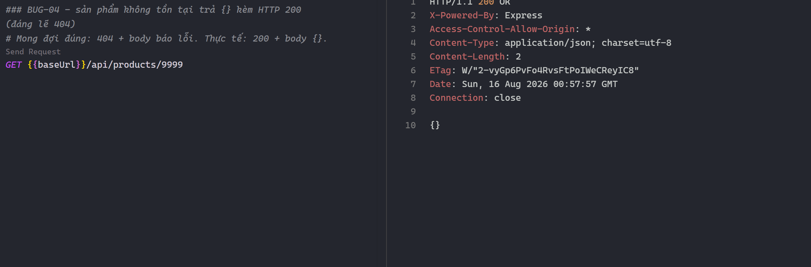
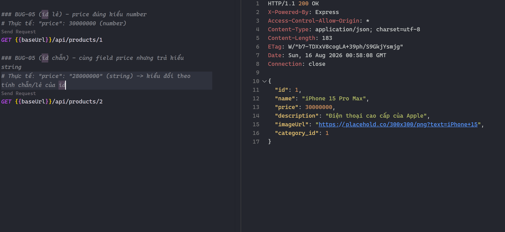
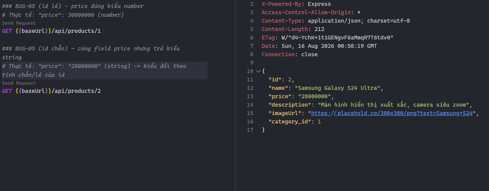

# Bug Report (HW05)

Các bug dưới đây lộ ra trong lúc smoke test (P0) và đo hiệu năng SUT EShop. Mỗi bug trình bày theo cấu trúc đầy đủ: metadata, môi trường, điều kiện tiên quyết, dữ liệu test, bước tái hiện, kết quả mong đợi và thực tế, chỗ để dán ảnh, đoạn code lỗi, nguyên nhân gốc, ảnh hưởng, đề xuất sửa. Mọi output là response thật lấy trực tiếp từ server.

## Thông tin chung

| Mục | Giá trị |
|---|---|
| SUT | EShop backend (Node + Express + SQLite), `backend/server.js` |
| Base URL | `http://localhost:3000` |
| Môi trường | Node v20.20.2, SQLite (node-sqlite3), Windows 11, hostname `Tony` |
| Account seed | `test@eshop.com` / `Test1234!` (sống sót sau reseed) |
| Người báo | Nguyễn Thành Dâng (23127334) |
| Ngày kiểm thử | 2026-08-11, tái xác minh 2026-08-16 |
| File tái hiện | `rest/bug-evidence.rest` (mở bằng REST Client, bấm Send Request từng block) |
| GitHub Issues | [#43](https://github.com/ThanhDang-Vn/software-testing/issues/43), [#44](https://github.com/ThanhDang-Vn/software-testing/issues/44), [#45](https://github.com/ThanhDang-Vn/software-testing/issues/45), [#46](https://github.com/ThanhDang-Vn/software-testing/issues/46), [#47](https://github.com/ThanhDang-Vn/software-testing/issues/47) |

## Bảng tổng hợp

| ID | Bug | Mức độ | Ưu tiên | Loại | Endpoint | Vị trí code | Issue |
|---|---|---|---|---|---|---|---|
| BUG-01 | SQL Injection ở tham số `search` | 🔴 Nghiêm trọng | P1 | Bảo mật | `GET /api/products?search=` | `server.js:144` | #43 |
| BUG-02 | Login lộ mật khẩu plaintext | 🟠 Cao | P1 | Bảo mật | `POST /api/login` | `server.js:46,52` | #44 |
| BUG-03 | Khóa tài khoản sau 2 lần sai (spec 3) | 🟡 Trung bình | P2 | Logic xác thực | `POST /api/login` | `server.js:54-57` | #45 |
| BUG-04 | Sản phẩm không tồn tại trả `{}` + 200 | 🟡 Trung bình | P2 | Sai mã trạng thái | `GET /api/products/:id` | `server.js:161` | #46 |
| BUG-05 | id chẵn trả `price` kiểu string | 🟢 Thấp | P3 | Sai kiểu dữ liệu | `GET /api/products/:id` | `server.js:162` | #47 |

> Thang mức độ: 🔴 Nghiêm trọng = khai thác từ xa không cần auth, ảnh hưởng toàn bộ dữ liệu. 🟠 Cao = lộ thông tin nhạy cảm. 🟡 Trung bình = sai hành vi nghiệp vụ, ảnh hưởng UX/độ tin cậy. 🟢 Thấp = sai hợp đồng dữ liệu, dễ gây bug phía client.
>
> Trạng thái: tất cả **Open** (chưa fix trong SUT, đã báo issue). Loại kiểm thử: manual smoke + reproduce bằng curl/REST Client.

---

## BUG-01: SQL Injection ở tham số `search` 🔴

**Tóm tắt:** Tham số `search` được nối thẳng vào câu SQL, cho phép chèn SQL và làm lộ thông tin engine qua thông báo lỗi.

| | |
|---|---|
| **Mức độ** | 🔴 Nghiêm trọng | 
| **Ưu tiên** | P1 |
| **Trạng thái** | Open |
| **Loại** | Bảo mật (injection) |
| **Endpoint** | `GET /api/products?search=` |
| **Vị trí code** | `backend/server.js:141-157` (SQL ở dòng 144, rò rỉ lỗi dòng 146-149) |
| **Issue** | #43 |

**Điều kiện tiên quyết:** Backend đang chạy ở `http://localhost:3000`. Không cần đăng nhập.

**Dữ liệu test:** hai payload trên query string: `'` và `%' OR '1'='1`.

**Các bước tái hiện** (`rest/bug-evidence.rest`: block Baseline, BUG-01A, BUG-01B):
1. Gọi baseline để biết số sản phẩm thật: `GET /api/products` (trả về 5 sản phẩm).
2. Chèn dấu nháy đơn gây lỗi cú pháp:
   ```bash
   curl -s "http://localhost:3000/api/products?search='" -w "\n[HTTP %{http_code}]\n"
   ```
3. Chèn điều kiện luôn đúng để bypass bộ lọc:
   ```bash
   curl -s "http://localhost:3000/api/products?search=%25%27%20OR%20%271%27%3D%271"
   ```

**Kết quả mong đợi:** Truy vấn tham số hoá. Từ khóa lạ trả mảng rỗng. Lỗi nội bộ trả 500 với thông báo chung, không lộ chi tiết engine.

**Kết quả thực tế:**
- Bước 2: `HTTP 500`, body lộ nguyên lỗi engine:
  ```
  <h1>Database Error</h1><p>SQLITE_ERROR: unrecognized token: "'"</p>
  ```
- Bước 3: trả về đủ 5 sản phẩm (bằng baseline), tức bộ lọc bị vô hiệu.

**Bằng chứng:**

Bước 2 (dấu nháy đơn gây lỗi, lộ SQLite):



Bước 3 (bypass bộ lọc, trả toàn bộ sản phẩm):



**Đoạn code lỗi:**
```js
// server.js:144
const query = `SELECT * FROM products WHERE name LIKE '%${searchQuery}%'`;
db.all(query, [], (err, rows) => {
  if (err)
    return res.status(500).send(`<h1>Database Error</h1><p>${err.message}</p>`); // lộ lỗi engine
```

**Nguyên nhân gốc:** `searchQuery` nối thẳng vào SQL bằng template literal, không dùng prepared statement. Nhánh lỗi trả nguyên `err.message` của SQLite ra client (information disclosure).

**Ảnh hưởng:** Kẻ tấn công không cần auth có thể dò cấu trúc DB qua thông báo lỗi, và với payload phức tạp hơn (UNION SELECT) có thể trích dữ liệu bảng khác, kể cả `users` chứa mật khẩu plaintext (xem BUG-02). Lỗ hổng khai thác từ xa nên xếp Nghiêm trọng.

**Đề xuất sửa:**
```js
const query = "SELECT * FROM products WHERE name LIKE ?";
db.all(query, [`%${searchQuery}%`], (err, rows) => {
  if (err) return res.status(500).json({ error: "Internal server error" });
  res.json(rows);
});
```

---

## BUG-02: Login lộ mật khẩu plaintext 🟠

**Tóm tắt:** Response login trả nguyên bản ghi user, gồm cả field `password` đang lưu chưa băm.

| | |
|---|---|
| **Mức độ** | 🟠 Cao |
| **Ưu tiên** | P1 |
| **Trạng thái** | Open |
| **Loại** | Bảo mật (lộ thông tin nhạy cảm) |
| **Endpoint** | `POST /api/login` (và `GET /api/users/me`) |
| **Vị trí code** | `server.js:46` (so sánh), `server.js:52` (trả về), gốc lưu plaintext `server.js:22-24` |
| **Issue** | #44 |

**Điều kiện tiên quyết:** Backend đang chạy. Có một account hợp lệ (dùng seed `test@eshop.com`).

**Dữ liệu test:** `{"email":"test@eshop.com","password":"Test1234!"}`.

**Các bước tái hiện** (`rest/bug-evidence.rest`: block BUG-02):
```bash
curl -s -X POST http://localhost:3000/api/login -H "Content-Type: application/json" \
  -d '{"email":"test@eshop.com","password":"Test1234!"}'
```

**Kết quả mong đợi:** Response không bao giờ chứa field `password`. Mật khẩu lưu ở dạng băm (bcrypt/argon2) và so sánh bằng hàm compare.

**Kết quả thực tế (rút gọn):**
```json
{"message":"Login successful","token":"eyJ...","user":{"id":2,"name":"Test User","email":"test@eshop.com","password":"Test1234!","role":"user",...}}
```
Field `user.password` bằng đúng mật khẩu người dùng gõ, xác nhận DB đang lưu plaintext.

**Bằng chứng:**



**Đoạn code lỗi:**
```js
// server.js:46 — so sánh trực tiếp, mật khẩu đang lưu plaintext
if (user.password === password) {
  // server.js:52 — trả nguyên object user (gồm field password)
  res.json({ message: "Login successful", token, user });
}
```

**Nguyên nhân gốc:** Hai lỗi cộng hưởng. Mật khẩu lưu không băm (`register` insert thẳng plaintext ở dòng 23), và response trả nguyên object `user` từ DB nên field `password` lọt ra ngoài. `GET /api/users/me` cũng trả nguyên `user`, lộ tương tự.

**Ảnh hưởng:** Ai bắt được response (log, proxy, XSS) đọc được mật khẩu. Nếu DB bị lộ qua BUG-01 thì toàn bộ mật khẩu người dùng lộ ngay. Cần đã đăng nhập đúng mới thấy password của chính mình, nhưng lưu plaintext là rủi ro hệ thống nên xếp Cao.

**Đề xuất sửa:** băm khi register (`bcrypt.hash`), so sánh bằng `bcrypt.compare`, và loại field password khi trả về:
```js
const { password: _omit, ...safeUser } = user;
res.json({ message: "Login successful", token, user: safeUser });
```

---

## BUG-03: Khóa tài khoản sau 2 lần sai (spec là 3) 🟡

**Tóm tắt:** Mỗi lần login sai cộng 2 vào `login_attempts` thay vì 1, nên tài khoản bị khóa ngay sau lần sai thứ hai.

| | |
|---|---|
| **Mức độ** | 🟡 Trung bình |
| **Ưu tiên** | P2 |
| **Trạng thái** | Open |
| **Loại** | Logic xác thực |
| **Endpoint** | `POST /api/login` |
| **Vị trí code** | `server.js:53-62` (dòng 54 cộng +2, dòng 56-57 khóa 180s) |
| **Issue** | #45 |

**Điều kiện tiên quyết:** Backend đang chạy. Có một account chưa bị khóa. Nếu account test đã khóa từ lần trước, restart server để reseed hoặc dùng email mới.

**Dữ liệu test:** account throwaway `lockdemo01@eshop.com` / `Good123!`.

**Các bước tái hiện** (`rest/bug-evidence.rest`: block BUG-03 bước 0 tới 3):
```bash
B=http://localhost:3000
curl -s -X POST $B/api/register -H "Content-Type: application/json" -d '{"name":"x","email":"lockdemo01@eshop.com","password":"Good123!"}'
curl -s -X POST $B/api/login -H "Content-Type: application/json" -d '{"email":"lockdemo01@eshop.com","password":"wrong"}'   # attempts 0 -> 2
curl -s -X POST $B/api/login -H "Content-Type: application/json" -d '{"email":"lockdemo01@eshop.com","password":"wrong"}'   # attempts 2 -> 4, khóa
curl -s -X POST $B/api/login -H "Content-Type: application/json" -d '{"email":"lockdemo01@eshop.com","password":"Good123!"}' # đúng pw vẫn bị chặn
```

**Kết quả mong đợi:** Khóa sau 3 lần sai (`login_attempts += 1`, khóa khi `>= 3`). Sau 2 lần sai, mật khẩu đúng vẫn đăng nhập được.

**Kết quả thực tế:**
- Sai lần 1: `HTTP 401` `{"error":"Invalid email or password"}`
- Sai lần 2: `HTTP 401` `{"error":"Invalid email or password"}`
- Mật khẩu đúng: `HTTP 403` `{"error":"Tài khoản đã bị khóa. Vui lòng thử lại sau."}`

Cột `login_attempts` đi 0, 2, 4 qua các lần.

**Bằng chứng:**



**Đoạn code lỗi:**
```js
// server.js:54 — cộng 2 mỗi lần sai thay vì 1
const newAttempts = user.login_attempts + 2;
let lockedUntil = null;
if (newAttempts >= 3) {                                      // server.js:56
  lockedUntil = new Date(Date.now() + 180000).toISOString(); // server.js:57 — khóa 180s
}
```

**Nguyên nhân gốc:** Bước nhảy `login_attempts` là +2. Chuỗi giá trị 0, 2, 4 chạm ngưỡng `>= 3` ngay ở lần sai thứ hai, tức khóa sau 2 lần thay vì 3.

**Ảnh hưởng:** Người dùng thật gõ sai 2 lần bị chặn 3 phút. Nghiêm trọng hơn về an ninh là có thể bị lạm dụng làm DoS tài khoản (cố tình login sai 2 lần để khóa tài khoản nạn nhân). Bug này cũng buộc phải reset lockout giữa các lần chạy Stress/Spike (xem `results/run-summary.md`).

**Đề xuất sửa:** `const newAttempts = user.login_attempts + 1;` (giữ ngưỡng `>= 3`).

---

## BUG-04: Sản phẩm không tồn tại trả `{}` kèm 200 🟡

**Tóm tắt:** Truy vấn sản phẩm không tồn tại trả `HTTP 200` với body rỗng thay vì `404`.

| | |
|---|---|
| **Mức độ** | 🟡 Trung bình |
| **Ưu tiên** | P2 |
| **Trạng thái** | Open |
| **Loại** | Sai mã trạng thái (REST contract) |
| **Endpoint** | `GET /api/products/:id` |
| **Vị trí code** | `server.js:159-165` (dòng 161) |
| **Issue** | #46 |

**Điều kiện tiên quyết:** Backend đang chạy. Không cần đăng nhập.

**Dữ liệu test:** id không tồn tại, ví dụ `9999`.

**Các bước tái hiện** (`rest/bug-evidence.rest`: block BUG-04):
```bash
curl -s "http://localhost:3000/api/products/9999" -w "  [HTTP %{http_code}]\n"
```

**Kết quả mong đợi:** `HTTP 404` với body báo lỗi, ví dụ `{"error":"Product not found"}`.

**Kết quả thực tế:** `{}  [HTTP 200]`

**Bằng chứng:**



**Đoạn code lỗi:**
```js
// server.js:161
if (!row) return res.status(200).json({});   // đáng lẽ 404
```

**Nguyên nhân gốc:** Khi không tìm thấy bản ghi, code cố tình trả `200 {}` thay vì `404`. Mã trạng thái không phản ánh việc tài nguyên không tồn tại.

**Ảnh hưởng:** Client không phân biệt được "không tồn tại" với "sản phẩm rỗng". Assertion dựa trên status code sẽ báo pass sai trong test tự động. Frontend có thể render trang sản phẩm trống thay vì trang 404.

**Đề xuất sửa:** `if (!row) return res.status(404).json({ error: "Product not found" });`

---

## BUG-05: id chẵn trả `price` kiểu string 🟢

**Tóm tắt:** Cùng field `price` nhưng kiểu dữ liệu đổi theo tính chẵn/lẻ của `id`.

| | |
|---|---|
| **Mức độ** | 🟢 Thấp |
| **Ưu tiên** | P3 |
| **Trạng thái** | Open |
| **Loại** | Sai kiểu dữ liệu (data contract) |
| **Endpoint** | `GET /api/products/:id` |
| **Vị trí code** | `server.js:162` |
| **Issue** | #47 |

**Điều kiện tiên quyết:** Backend đang chạy. Không cần đăng nhập.

**Dữ liệu test:** hai sản phẩm id lẻ và id chẵn, ví dụ `1` và `2`.

**Các bước tái hiện** (`rest/bug-evidence.rest`: block BUG-05 id lẻ và id chẵn):
```bash
curl -s http://localhost:3000/api/products/1   # id lẻ
curl -s http://localhost:3000/api/products/2   # id chẵn
```

**Kết quả mong đợi:** `price` luôn cùng kiểu (number) cho mọi sản phẩm.

**Kết quả thực tế:**
- id 1: `"price":30000000` (number)
- id 2: `"price":"28000000"` (string)

**Bằng chứng:**

id lẻ (price number):



id chẵn (price string):



**Đoạn code lỗi:**
```js
// server.js:162
if (row.id % 2 === 0) row.price = row.price.toString(); // ép price -> string khi id chẵn
```

**Nguyên nhân gốc:** Có nhánh cố tình ép `price` sang string khi `id` chẵn, làm kiểu dữ liệu của cùng một field không ổn định.

**Ảnh hưởng:** Phía client tính toán (`price * quantity`, tổng giỏ hàng) có thể ra kết quả sai do JS ép kiểu ngầm. `"28000000" + fee` khi cộng chuỗi sẽ nối chuỗi thay vì cộng số. Sai hợp đồng dữ liệu, dễ gây bug ẩn phía client.

**Đề xuất sửa:** xóa dòng 162, đảm bảo `price` luôn là number.

---

## (A) Quan sát hiệu năng (không phải lỗi chức năng)

Trong cả 4 lần chạy (Load/Stress/Spike/Endurance), error% = 0, không crash, không từ chối kết nối, nên không có defect hiệu năng. Có một điểm về giới hạn năng lực đáng ghi nhận (không phải bug):

- Khi ép tải (endurance 300 VU không think-time), throughput chạm trần khoảng 276 req/s còn độ trễ phình to: avg ~1.001s, p95 ~1.741s, 54.4% request vượt 1 giây. Server xếp hàng thay vì trả lỗi.
- Nguyên nhân là giới hạn kiến trúc Node đơn tiến trình + SQLite khóa ghi toàn file ở bước checkout (`INSERT INTO orders`), không phải defect.
- Chi tiết và ngưỡng: `results/endurance/endurance-summary.md`.

---

## (B) Phụ lục: bug khác phát hiện trong code (ngoài phạm vi perf-testing)

Các lỗi sau có thật trong `server.js` nhưng nằm ngoài workflow perf-testing của HW05. Ghi lại để tham khảo, chưa chạy tái hiện đầy đủ nên chưa đưa vào bảng chính.

| Bug | Vị trí | Mô tả ngắn | Mức độ |
|---|---|---|---|
| Tự nâng quyền | `server.js:118-135` | `PUT /api/users/me` cho phép tự set `role` (kể cả `admin`) cho chính mình | 🔴 Nghiêm trọng |
| SECRET_KEY hardcode | `server.js:9` | Khóa ký JWT nằm cứng trong mã, ai đọc source đều giả mạo được token | 🟠 Cao |
| JWT không có hạn | `server.js:51` | `jwt.sign` không đặt `expiresIn`, token sống vĩnh viễn | 🟠 Cao |
| Sai công thức giảm giá | `server.js:399-400` | `discount = total * (1 - discount_value)`, coupon 10% lại giảm 90% | 🟠 Cao |
| Cho hủy đơn sai trạng thái | `server.js:328-331` | Đơn `shipping` vẫn hủy được | 🟡 Trung bình |
| Chuyển trạng thái phi lý | `server.js:550-551` | Cho phép `canceled -> delivered` | 🟡 Trung bình |

---

## (C) Nội dung GitHub Issue (đã post #43-#47)

Mỗi khối là một issue theo cùng cấu trúc bug ở trên. Đã post và gán label `hw5`. Nhớ đính ảnh response/terminal vào từng issue.

### Issue #43
- **Title:** `[Security][Critical] SQL Injection ở GET /api/products?search=`
- **Labels:** `bug`, `security`, `critical`, `hw5`
- **Body:**
```
Mức độ: Nghiêm trọng (P1) | Loại: Bảo mật | Vị trí: backend/server.js:144
Endpoint: GET /api/products?search=

Mô tả: tham số search nối thẳng vào SQL qua template literal:
  SELECT * FROM products WHERE name LIKE '%${searchQuery}%'
Không dùng prepared statement; nhánh lỗi (server.js:146-149) trả nguyên err.message ra client.

Môi trường: Node v20.20.2, SQLite, http://localhost:3000.
Tiền đề: không cần đăng nhập.

Bước tái hiện:
1) curl "http://localhost:3000/api/products?search='"
   -> HTTP 500, body: <h1>Database Error</h1><p>SQLITE_ERROR: unrecognized token: "'"</p>
2) curl "http://localhost:3000/api/products?search=%25' OR '1'='1"
   -> trả về đủ 5 sản phẩm (bypass filter).

Mong đợi: truy vấn tham số hoá; từ khóa lạ trả mảng rỗng; không lộ lỗi engine ra client.
Thực tế: chèn được SQL, bypass filter, lộ thông tin DB.
Đề xuất sửa: LIKE ? với tham số [`%${searchQuery}%`]; nhánh lỗi trả thông báo chung.
```

### Issue #44
- **Title:** `[Security][High] Response login lộ mật khẩu plaintext`
- **Labels:** `bug`, `security`, `high`, `hw5`
- **Body:**
```
Mức độ: Cao (P1) | Loại: Bảo mật | Vị trí: server.js:46 (so sánh), server.js:52 (trả về); register lưu plaintext server.js:22-24
Endpoint: POST /api/login (và GET /api/users/me)

Mô tả: login thành công trả nguyên object user, gồm field password chưa băm.

Bước tái hiện:
curl -X POST http://localhost:3000/api/login -H "Content-Type: application/json" \
  -d '{"email":"test@eshop.com","password":"Test1234!"}'
-> response.user.password = "Test1234!"

Mong đợi: không trả field password; lưu mật khẩu dạng băm (bcrypt/argon2).
Thực tế: password trả plaintext; so sánh user.password === password xác nhận lưu plaintext.
Đề xuất sửa: băm khi register, so sánh bằng bcrypt.compare, loại field password khỏi response.
```

### Issue #45
- **Title:** `[Auth][Medium] Tài khoản bị khóa sau 2 lần sai thay vì 3`
- **Labels:** `bug`, `auth`, `medium`, `hw5`
- **Body:**
```
Mức độ: Trung bình (P2) | Loại: Logic xác thực | Vị trí: server.js:54-57
Endpoint: POST /api/login

Mô tả: login_attempts += 2 mỗi lần sai (thay vì +1), khóa khi >= 3 -> khóa ngay sau lần sai thứ hai, giữ 180s.

Bước tái hiện: đăng ký 1 account, login sai 2 lần, rồi login đúng.
- sai #1 -> HTTP 401
- sai #2 -> HTTP 401
- đúng pw -> HTTP 403 "Tài khoản đã bị khóa. Vui lòng thử lại sau."
login_attempts đi 0, 2, 4.

Mong đợi: khóa sau 3 lần sai (+= 1, ngưỡng >= 3).
Thực tế: khóa sau 2 lần; có thể bị lạm dụng để khóa tài khoản người khác (DoS tài khoản).
Đề xuất sửa: const newAttempts = user.login_attempts + 1;
```

### Issue #46
- **Title:** `[API][Medium] GET /api/products/:id không tồn tại trả {} kèm 200`
- **Labels:** `bug`, `api`, `medium`, `hw5`
- **Body:**
```
Mức độ: Trung bình (P2) | Loại: Sai mã trạng thái | Vị trí: server.js:161
Endpoint: GET /api/products/:id

Mô tả: khi không tìm thấy bản ghi, trả 200 {} thay vì 404.

Bước tái hiện: curl "http://localhost:3000/api/products/9999" -> HTTP 200, body {}.

Mong đợi: HTTP 404 với body báo lỗi.
Thực tế: 200 với body rỗng; client không phân biệt "không tồn tại" với "rỗng"; assertion theo status dễ pass sai.
Đề xuất sửa: if (!row) return res.status(404).json({ error: "Product not found" });
```

### Issue #47
- **Title:** `[API][Low] GET /api/products/:id trả price kiểu string với id chẵn`
- **Labels:** `bug`, `api`, `low`, `hw5`
- **Body:**
```
Mức độ: Thấp (P3) | Loại: Sai kiểu dữ liệu | Vị trí: server.js:162
Endpoint: GET /api/products/:id

Mô tả: nhánh ép price sang string khi id chẵn -> kiểu field không ổn định theo chẵn/lẻ.

Bước tái hiện:
curl http://localhost:3000/api/products/1 -> "price":30000000 (number)
curl http://localhost:3000/api/products/2 -> "price":"28000000" (string)

Mong đợi: price luôn là number.
Thực tế: kiểu đổi theo tính chẵn/lẻ của id, dễ làm hỏng phép tính phía client.
Đề xuất sửa: xóa dòng ép kiểu (server.js:162).
```
