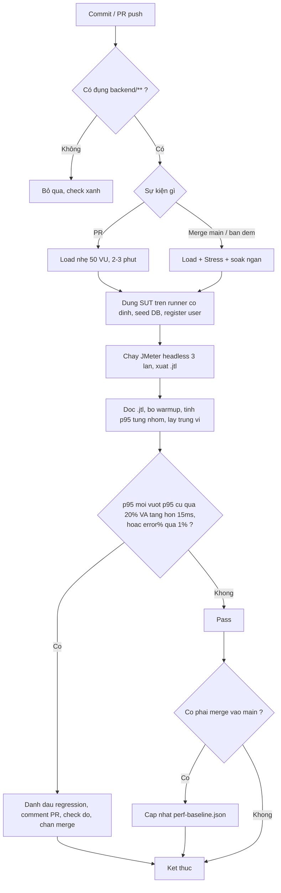

# P4. Kiểm thử hiệu năng liên tục (Task 3)

Ý tưởng gọn lại thế này: mỗi khi có commit vào backend, hệ thống tự chạy lại bài đo hiệu năng, so p95 với lần trước, và nếu thấy chậm đi đáng kể thì chặn PR lại để người ta xem. Cái khó không nằm ở chỗ chạy được JMeter trong CI, mà ở hai chỗ: chạy cho commit nào (vì chạy tốn thời gian), và làm sao đừng báo nhầm khiến dev mất tin.

## Mấy điều rút ra từ Task 1 và 2, đem thẳng vào đây

    Những điểm bên dưới không phải lý thuyết chép ở đâu, mà là thứ mình đo được trong bài này:

- Canh p95/p99, đừng canh trung bình. Ở Task 2, trung bình 10ms trông rất yên tâm, nhưng đúng chỗ đó p95/p99 mới cho thấy đuôi độ trễ đã kéo dài.
- Nhìn mỗi error% thì hụt. Lúc SUT đã quá tải trong bài soak, error vẫn 0% vì Node xếp hàng chứ không trả lỗi. Muốn biết nó đuối phải nhìn độ trễ.
- Số đo phụ thuộc máy chạy. Nếu lần này chạy trên máy này, lần sau máy khác thì baseline vô nghĩa. Buộc phải cố định một máy.
- Một lần chạy có thể dính nhiễu. Lần soak của mình có một phút throughput vọt lên 556/s rồi tụt lại, do GC xả dồn hàng đợi. Nên phải chạy vài lần rồi lấy trung vị chứ đừng tin một lần.
- Bỏ đoạn khởi động ra khi tính. Phút đầu latency với RAM còn chưa vào nhịp.

## Chạy cho commit nào

Không phải commit nào cũng đáng chạy. Sửa README hay đổi frontend thì backend không đổi, chạy perf test chỉ tổ phí. Nên mình chia theo mức:

| Khi nào | Điều kiện | Chạy gì | Lâu cỡ |
|---|---|---|---|
| Push lên PR | chỉ khi đụng vào `backend/**` | một lượt Load nhẹ (~50 VU) | 2–3 phút |
| Merge vào `main` | luôn chạy | Load đầy đủ, pass thì cập nhật baseline | ~5 phút |
| Nửa đêm (cron) | mỗi đêm một lần | Load + Stress + một đợt soak ngắn | dài |
| Bấm tay | dev gắn nhãn `perf` | tuỳ chọn | tuỳ |

Cách chia này để PR trả kết quả nhanh, còn mấy bài nặng dồn vào lúc merge với ban đêm cho đỡ tốn.

## Bắt regression p95 ra sao

Mình giữ một file `perf-baseline.json` chứa p95 của lần `main` xanh gần nhất, tách theo ba nhóm endpoint (auth, read, transactional). Sau mỗi lần chạy thì đọc raw `.jtl`, bỏ mấy giây warmup, tính lại p95 cho từng nhóm rồi đem so.

Gọi là regression khi p95 mới vượt p95 cũ quá một khoảng cho phép, hoặc error% vượt ngưỡng. Để đỡ báo nhầm vì nhiễu vặt, mình đặt thêm hai điều kiện: một là chạy ba lần lấy trung vị rồi mới so, hai là chỉ tính khi mức tăng đủ lớn về tuyệt đối chứ không chỉ tính theo phần trăm (tăng 20% của 5ms thì kệ nó). Khoảng cho phép ban đầu mình để 20% kèm sàn khoảng 15ms. Con số 20% chọn theo mức dao động mình thấy giữa các bucket trong bài soak, cỡ trên dưới 10%, nhân đôi lên cho có biên. Chạy một thời gian có số nhiễu thật của máy thì siết lại.

Nếu vượt thì bot comment lên PR một bảng p95 cũ/mới kèm phần trăm và cho check đỏ để chặn merge. Nếu không vượt và đây là lần merge vào `main` thì ghi đè baseline mới.

## Sơ đồ luồng

## Được và mất

### Về chi phí

Chạy perf lâu hơn unit test nhiều, nên nếu bắt mọi PR chạy đủ thì dev sẽ ngán. Cách giảm là lọc theo đường dẫn và để PR chỉ chạy bản nhẹ, dồn bài nặng sang ban đêm. Khoản tốn thứ hai là phải nuôi một máy riêng chạy đo, không xài chung runner của CI, vì runner chung lúc rảnh lúc bận sẽ làm số đo nhảy lung tung. Với lượng commit đụng backend không nhiều thì một self-hosted runner dùng lại là đủ; nếu sau này nhiều PR chạy song song thì một máy sẽ thành nút cổ chai, phải xếp hàng lần lượt hoặc thêm máy. Chạy ba lần lấy trung vị thì tốn gấp ba, nên mình chỉ làm vậy ở bản nhẹ; bản ban đêm chạy một lần nhưng dài hơn.

### Về báo nhầm

Đây mới là chỗ dễ hỏng. Nếu báo nhầm nhiều lần, dev sẽ quen tay bấm bỏ qua, và lúc đó cảnh báo thật cũng chẳng ai đọc. Mấy nguồn nhiễu mình lường trước:

- Máy chạy dao động: xử bằng runner cố định, cô lập tài nguyên.
- Warmup, JIT, GC: cắt vài giây đầu trước khi tính p95, đúng như thứ thấy trong bài soak.
- Biến thiên tự nhiên giữa các lần: lấy trung vị ba lần, cộng khoảng cho phép, cộng sàn tuyệt đối.
- Ngưỡng đặt quá nhạy: chỉ canh p95/p99, không canh max vì max nhiễu quá.

Chốt lại là phải cân giữa nhạy và ồn. Đặt ngưỡng chặt thì bắt được cả regression nhỏ nhưng báo nhầm nhiều; đặt lỏng thì yên nhưng lọt. Với một SUT nhỏ như EShop, mình nghiêng về đặt lỏng vừa phải rồi siết dần khi biết rõ mức nhiễu của máy. Đội nào lớn hơn thì nên so bằng kiểm định thống kê trên cả phân phối latency thay cho một ngưỡng cứng, nhưng với bài này thì hơi quá tay.

## Dùng lại đồ đã có

Mô hình này không phải viết mới từ đầu. `generate-plans.js` sinh test plan, `register-users.js` seed tài khoản, `analyze-jtl.js` tính p95, mình đã dựng hết ở Task 1 và 2. Việc còn lại chỉ là gói chúng vào một GitHub Actions workflow và thêm đoạn so p95 với `perf-baseline.json`.

---

Sơ đồ trên đang là Mermaid, render thẳng trên GitHub và Moodle. Nếu bạn muốn mình dựng thành ảnh Excalidraw để dán vào bản PDF cho gọn mắt thì nói, mình làm.
