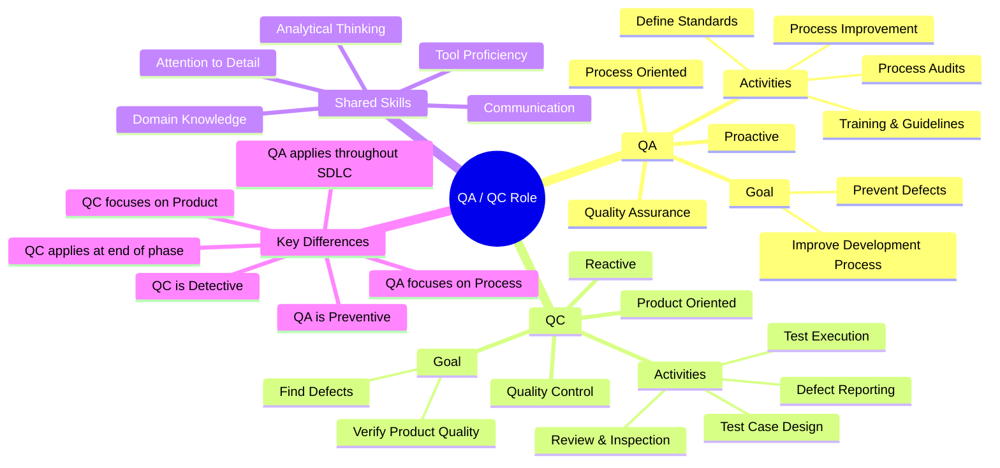

# QA / QC Role Mindmap

```mermaid
mindmap
  root((QA / QC Role))
    QA
      Quality Assurance
      Process Oriented
      Proactive
      Activities
        Define Standards
        Process Audits
        Training & Guidelines
        Process Improvement
      Goal
        Prevent Defects
        Improve Development Process
    QC
      Quality Control
      Product Oriented
      Reactive
      Activities
        Test Execution
        Defect Reporting
        Test Case Design
        Review & Inspection
      Goal
        Find Defects
        Verify Product Quality
    Shared Skills
      Analytical Thinking
      Attention to Detail
      Communication
      Domain Knowledge
      Tool Proficiency
    Key Differences
      QA focuses on Process
      QC focuses on Product
      QA is Preventive
      QC is Detective
      QA applies throughout SDLC
      QC applies at end of phase
```
