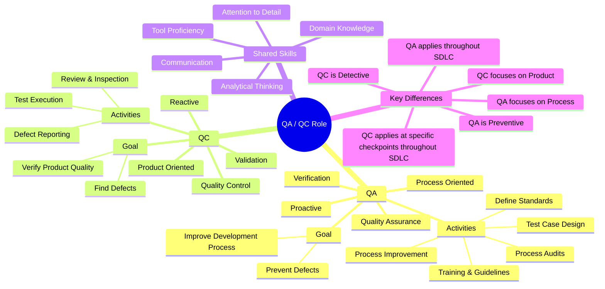

# QA / QC Role Mindmap

**Mistake 1 — QC: "Test Case Design" sai nhánh**
Test Case Design là hoạt động thuộc về **QA** (process-oriented, được làm trước khi test), không phải QC. QC chỉ *thực thi* test case, không thiết kế quy trình tạo ra chúng.

---

**Mistake 2 — Key Differences: "QC applies at end of phase" không chính xác**
QC không chỉ áp dụng ở cuối phase. QC có thể xảy ra ở **nhiều điểm trong SDLC** (review requirements, inspect design, test after each sprint). Câu đúng hơn là: *"QC applies at specific checkpoints throughout SDLC"*.

---

**Mistake 3 — QA: Thiếu "Verification", QC: Thiếu "Validation"**
Theo chuẩn ISO/IEEE:
- QA liên quan đến **Verification** *(Are we building the product right?)*
- QC liên quan đến **Validation** *(Are we building the right product?)*
