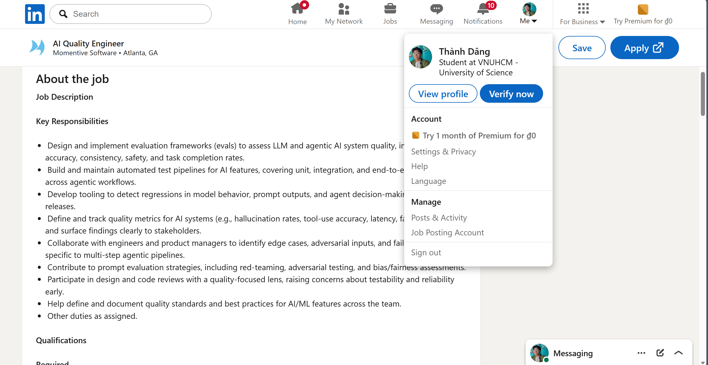
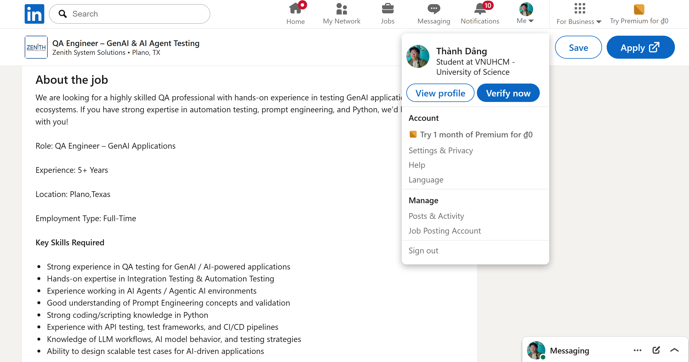
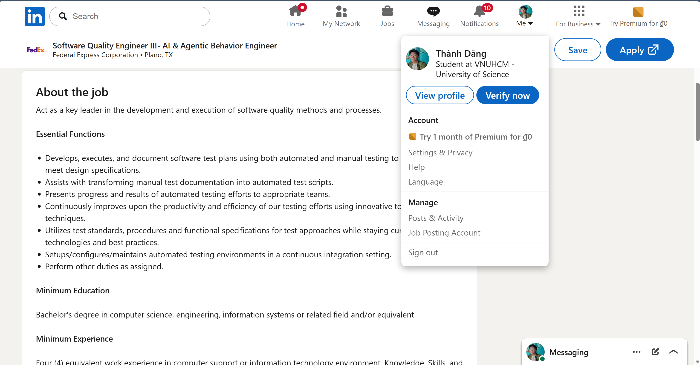
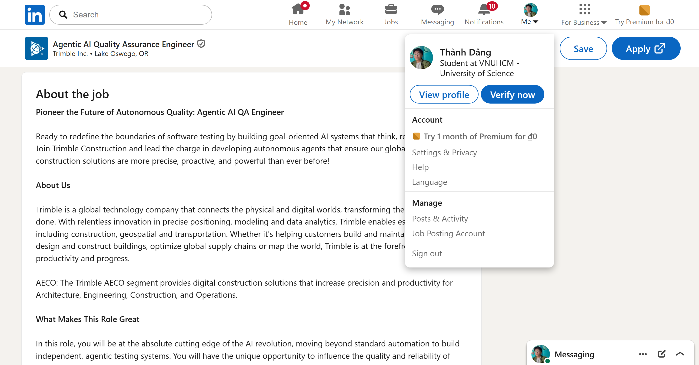
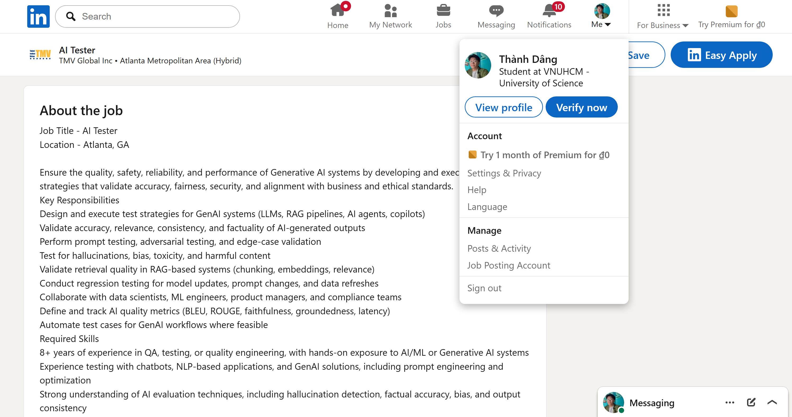
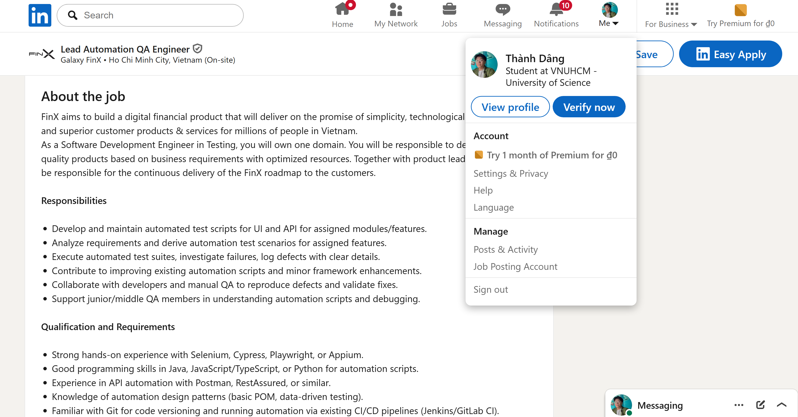
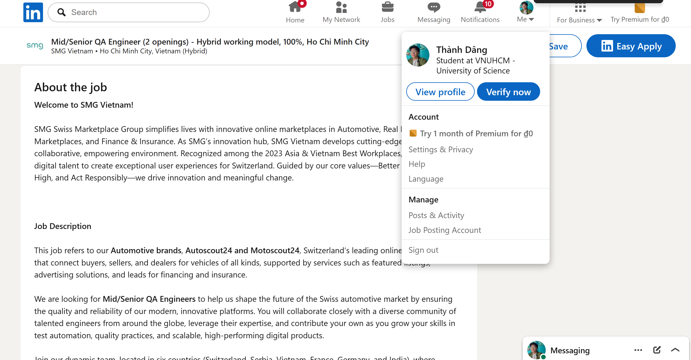
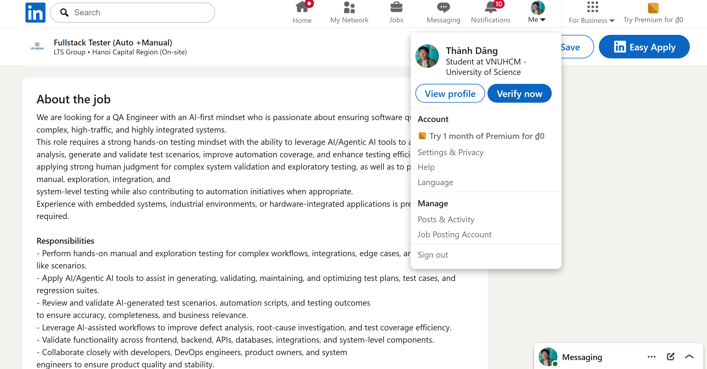
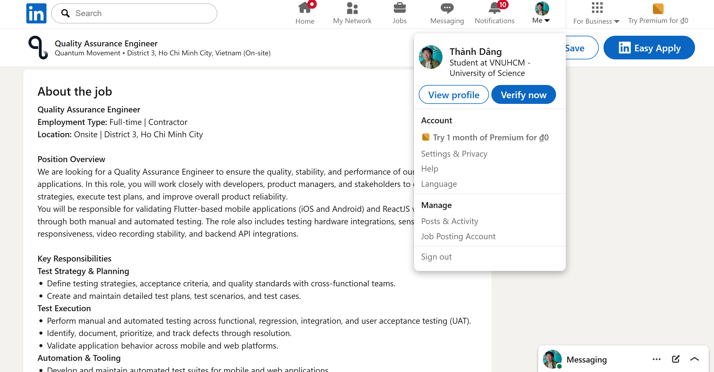
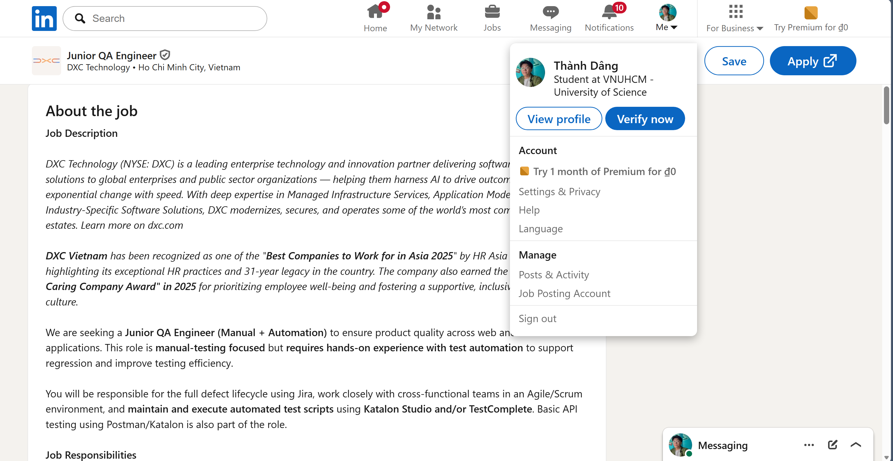

# HW01 – QA/QC Jobs · 20 Defects · Test a Physical Product

**Exercise ID:** HW01-AI  
**Student ID:** [YOUR_STUDENT_ID]  
**Full Name:** [YOUR_FULL_NAME]  
**Date:** 2026-05-24  
**AI Tools Used:** Claude (claude-sonnet-4-6)

---

## Table of Contents

1. [Requirement 1 – QA/QC Job Market 2026+](#requirement-1)
2. [Requirement 2 – 20 Software Defects 2022–2026](#requirement-2)
3. [Requirement 3 – Test Cases for One Physical Product](#requirement-3)
4. [AI Audit Report (Appendix A)](#ai-audit-report)
5. [AI Critique](#ai-critique)
6. [Mandatory Disclosure](#mandatory-disclosure)
7. [Self-Assessment](#self-assessment)

---

## Requirement 1 – QA/QC Job Market 2026+ (40 pts) {#requirement-1}

> **Platform:** LinkedIn only.  
> **Anti-cheat note:** All screenshots must show your LinkedIn account name in the corner.  
> **Posting window:** Published within 60 days of submission date (≥ 2026-03-25).

### Job Postings Overview

| # | Job Title | Company | Location | Salary | AI/LLM Role? | Posting Date |
|---|-----------|---------|----------|--------|:------------:|-------------|
| 1 | AI Quality Engineer | Momentive Software | Atlanta, GA, USA | Not listed | ✅ YES | ~May 24, 2026 |
| 2 | QA Engineer – GenAI & AI Agent Testing | Zenith System Solutions | Plano, TX, USA | Not listed | ✅ YES | ~May 17, 2026 |
| 3 | Software Quality Engineer III – AI & Agentic Behavior | Federal Express (FedEx) | Memphis/Plano, USA | Not listed | ✅ YES | ~May 22, 2026 |
| 4 | Agentic AI Quality Assurance Engineer | Trimble Inc. | Lake Oswego, OR, USA | $78,400–$107,900/yr | ✅ YES | ~May 17, 2026 |
| 5 | AI Tester | TMV Global Inc | Atlanta, GA, USA | Not listed | ✅ YES | ~May 19, 2026 |
| 6 | Lead Automation QA Engineer | Galaxy FinX | Ho Chi Minh City, Vietnam | Not listed | ❌ No | ~May 20, 2026 |
| 7 | Mid/Senior QA Engineer | SMG Vietnam | Ho Chi Minh City, Vietnam | Not listed | ❌ No | ~May 21, 2026 |
| 8 | Fullstack Tester (Auto + Manual) | LTS Group | Hanoi, Vietnam | Up to 30M VND/mo | ⚡ Preferred | ~May 20, 2026 |
| 9 | Quality Assurance Engineer | Quantum Movement | Ho Chi Minh City, Vietnam | Not listed | ❌ No | ~May 18, 2026 |
| 10 | Junior QA Engineer (Manual + Automation) | DXC Technology | Ho Chi Minh City, Vietnam | Not listed | ❌ No | ~May 20, 2026 |

---

### Detailed Job Postings

---

#### Job 1 – AI Quality Engineer ✅ AI/LLM

**Company:** Momentive Software  
**Location:** Atlanta, GA, USA  
**LinkedIn URL:** <https://www.linkedin.com/jobs/view/4407931860>  
**Salary:** Not listed  
**Posting Date:** ~May 24, 2026

**Job Description:**  
This role focuses on designing evaluation frameworks for generative AI and agentic systems. The engineer validates LLM outputs (GPT-4, Claude, Gemini), agentic reasoning chains, RAG pipelines, and multi-step tool use. Requires both hands-on QA experience and understanding of AI/ML concepts.

**Required Skills:**
- 3–5 years QA/software engineering experience
- Hands-on experience with LLMs and agentic AI (GPT-4, Claude, Gemini)
- Python scripting for evaluation automation
- Designing evaluation frameworks for generative AI
- Agentic frameworks: RAG, multi-step reasoning, tool use
- CI/CD pipeline integration
- Unit, integration, regression, and E2E testing

**📸 Screenshot:**

**AI Impact Analysis:**  
This role exemplifies the emergence of AI-native QA positions where the primary subject under test is an LLM/agentic system itself; traditional black-box testing skills are being replaced by evaluation framework design, hallucination detection, and grounding assessment — competencies that did not exist in QA job descriptions before 2023.

---

#### Job 2 – QA Engineer – GenAI & AI Agent Testing ✅ AI/LLM

**Company:** Zenith System Solutions  
**Location:** Plano, TX, USA  
**LinkedIn URL:** <https://www.linkedin.com/jobs/view/4413976695>  
**Salary:** Not listed  
**Posting Date:** ~May 17, 2026

**Job Description:**  
Specialized QA role targeting generative AI and AI-agent testing. The engineer validates AI-powered applications end-to-end, tests prompt engineering pipelines, and verifies LLM workflow correctness. Requires 5+ years QA experience with demonstrated AI/ML exposure.

**Required Skills:**
- 5+ years QA experience with AI/ML exposure
- Testing generative AI and AI-powered applications
- AI agent / agentic AI testing
- Prompt engineering validation
- Python scripting
- LLM workflow testing
- LangChain / LangGraph / CrewAI / AutoGen (preferred)
- API testing; CI/CD integration

**📸 Screenshot:**

**AI Impact Analysis:**  
Zenith's posting illustrates how agentic AI frameworks (LangChain, CrewAI, AutoGen) are creating a new sub-discipline within QA focused on validating non-deterministic multi-agent workflows — a testing challenge where traditional equivalence partitioning and boundary value analysis techniques are insufficient without LLM-specific evaluation methods.

---

#### Job 3 – Software Quality Engineer III – AI & Agentic Behavior ✅ AI/LLM

**Company:** Federal Express Corporation (FedEx)  
**Location:** Memphis, TN / Plano, TX, USA (Hybrid)  
**LinkedIn URL:** <https://www.linkedin.com/jobs/view/4418045788>  
**Salary:** Not listed  
**Posting Date:** ~May 22, 2026

**Job Description:**  
Enterprise-scale QA engineering role at FedEx focused on agentic AI behavior testing and LLM output validation. The engineer executes automated and manual tests for agentic AI systems, uses agentic coding tools for test automation, and ensures prompt security compliance.

**Required Skills:**
- Executing automated/manual tests for agentic AI behavior and LLM outputs
- Agentic coding tools for test automation
- AI/LLM evaluation and prompt security testing
- Performance testing for AI systems
- BS in Computer Science or related field
- 4+ years IT/QA experience

**📸 Screenshot:**

**AI Impact Analysis:**  
FedEx's adoption of a dedicated "AI & Agentic Behavior Engineer" title at enterprise scale confirms that AI testing is no longer confined to tech startups; logistics and supply-chain enterprises now require QA engineers who can validate agentic decision-making systems that directly affect operational workflows.

---

#### Job 4 – Agentic AI Quality Assurance Engineer ✅ AI/LLM

**Company:** Trimble Inc.  
**Location:** Lake Oswego, OR, USA  
**LinkedIn URL:** <https://www.linkedin.com/jobs/view/4393946955>  
**Salary:** $78,400–$107,900/year  
**Posting Date:** ~May 17, 2026

**Job Description:**  
Design and deploy autonomous test agents for E2E testing of AI-powered applications. The role combines traditional QA automation (Selenium, Playwright, Postman) with AI-specific validation, requiring knowledge of TensorFlow/PyTorch and AI/ML concepts.

**Required Skills:**
- Designing and deploying autonomous agents for E2E testing
- Developing AI models for agentic testing systems
- Selenium + WinApp Appium; Microsoft Playwright (.NET/C#)
- UI testing in C# and PowerShell
- Postman API testing
- AI/ML concepts; TensorFlow/PyTorch (bonus)
- 3+ years experience; BS in Computer Science or related AI discipline

**📸 Screenshot:**

**AI Impact Analysis:**  
Trimble's salary range ($78K–$108K) for an agentic AI QA engineer provides concrete market data showing that AI-augmented QA roles command a significant premium over traditional automation roles (~$60K–$80K); this 20–35% salary uplift will likely accelerate the transition of QA professionals toward AI-specialized skill sets.

---

#### Job 5 – AI Tester ✅ AI/LLM

**Company:** TMV Global Inc  
**Location:** Atlanta, GA, USA  
**LinkedIn URL:** <https://www.linkedin.com/jobs/view/4415708170>  
**Salary:** Not listed  
**Posting Date:** ~May 19, 2026

**Job Description:**  
Highly specialized AI testing role requiring 8+ years QA/testing experience with demonstrated AI/ML exposure. Responsibilities include hallucination detection, bias assessment, factual accuracy testing, RAG system validation, and responsible AI evaluation across cloud AI platforms.

**Required Skills:**
- 8+ years QA/testing with AI/ML exposure
- Chatbot / NLP / generative AI testing
- Hallucination detection, factual accuracy, and bias assessment
- Python; REST API testing
- RAG system validation (chunking, embeddings, relevance)
- Cloud AI platforms: Azure OpenAI, AWS Bedrock, Google Vertex AI
- Prompt engineering; responsible AI principles

**📸 Screenshot:**

**AI Impact Analysis:**  
TMV Global's requirement for "hallucination detection, factual accuracy, and bias assessment" across Azure OpenAI, AWS Bedrock, and Google Vertex AI demonstrates how AI QA has evolved into a cross-platform discipline; testers must now evaluate AI system outputs against responsible AI principles — a domain that requires ethical reasoning skills beyond traditional test engineering.

---

#### Job 6 – Lead Automation QA Engineer

**Company:** Galaxy FinX  
**Location:** Ho Chi Minh City, Vietnam  
**LinkedIn URL:** <https://www.linkedin.com/jobs/view/4416602444>  
**Salary:** Not listed  
**Posting Date:** ~May 20, 2026

**Job Description:**  
Lead QA automation engineer for a fintech company in Ho Chi Minh City. Covers full-stack test automation across web and mobile, API testing, and CI/CD pipeline integration. Banking domain knowledge is a strong plus. Mid-to-Senior level.

**Required Skills:**
- Selenium, Cypress, Playwright, or Appium
- Java, JavaScript/TypeScript, or Python
- API automation (Postman, RestAssured)
- Page Object Model / data-driven testing design patterns
- Git, Jenkins/GitLab CI
- Banking domain knowledge (transfers, payments, account management)

**📸 Screenshot:**

**AI Impact Analysis:**  
Galaxy FinX's posting reflects the Vietnamese fintech QA market in 2026 — still predominantly automation-first without explicit AI requirements, but the banking domain's strict correctness requirements mean AI-assisted test generation will face regulatory scrutiny before adoption, potentially delaying AI integration in this sector compared to tech startups.

---

#### Job 7 – Mid/Senior QA Engineer

**Company:** SMG Vietnam  
**Location:** Ho Chi Minh City, Vietnam  
**LinkedIn URL:** <https://www.linkedin.com/jobs/view/4394782432>  
**Salary:** Not listed  
**Posting Date:** ~May 21, 2026

**Job Description:**  
Mid-to-senior QA engineering role at a Vietnamese software company. Covers API testing, UI testing for React applications, database testing (PostgreSQL), and CI/CD integration. Requires English fluency and is open to Vietnamese citizens only.

**Required Skills:**
- 4+ years QA/software testing
- API testing (Postman, REST)
- UI testing for React web applications
- PostgreSQL/SQL database testing
- Cypress or Playwright automation
- CI/CD (CircleCI preferred)
- Agile/Scrum; English fluency required

**📸 Screenshot:**

**AI Impact Analysis:**  
SMG Vietnam's posting is representative of the majority of the Vietnamese QA market in 2026 — focused on classical automation and API testing with no AI requirements — indicating that while global AI QA roles surge, the domestic Vietnamese IT market still has a 12–24 month lag in adopting AI-native testing requirements.

---

#### Job 8 – Fullstack Tester (Auto + Manual) ⚡ AI Preferred

**Company:** LTS Group  
**Location:** Hanoi Capital Region, Vietnam  
**LinkedIn URL:** <https://www.linkedin.com/jobs/view/4415768166>  
**Salary:** Up to 30,000,000 VND/month (~$1,200 USD)  
**Posting Date:** ~May 20, 2026

**Job Description:**  
Full-stack tester role at a Vietnamese IT company combining manual and automation testing. Notably lists a "strong interest in applying AI/LLM/Agentic AI tools to testing" as a preferred quality, alongside specific AI tools (Cursor, Claude, GitHub Copilot, ChatGPT).

**Required Skills:**
- 3+ years software testing
- Selenium, Playwright, Cypress, or Robot Framework
- JavaScript, Java, or Python
- API and backend testing; CI/CD
- Strong interest in applying AI/LLM/Agentic AI tools to testing
- Cursor, Claude, GitHub Copilot, or ChatGPT experience (preferred)
- Jira / qTest / Xray / TestRail

**📸 Screenshot:**

**AI Impact Analysis:**  
LTS Group's explicit listing of "Claude, GitHub Copilot, ChatGPT" as preferred tools marks a pivotal shift in the Vietnamese domestic QA market — it signals that local companies are beginning to reward AI tool proficiency, even if not yet requiring it, suggesting the Vietnamese market will close its AI adoption gap within 1–2 years.

---

#### Job 9 – Quality Assurance Engineer

**Company:** Quantum Movement  
**Location:** District 3, Ho Chi Minh City, Vietnam  
**LinkedIn URL:** <https://www.linkedin.com/jobs/view/4416023763>  
**Salary:** Not listed  
**Posting Date:** ~May 18, 2026

**Job Description:**  
QA engineering role at a startup focused on computer vision and mobile fitness applications. Requires 7+ years QA experience with expertise in Flutter mobile testing, ReactJS web testing, and specialized profiling tools. MediaPipe/computer vision testing experience is preferred.

**Required Skills:**
- 7+ years QA experience
- Selenium, Appium, XCUITest for mobile/web
- Flutter mobile app testing
- ReactJS web testing
- REST API / backend testing
- Flipper, Android Studio Profiler, Xcode Instruments (performance profiling)
- MediaPipe / computer vision testing (preferred)
- Linear bug tracking; performance and load testing

**📸 Screenshot:**

**AI Impact Analysis:**  
Quantum Movement's preference for MediaPipe/computer vision testing experience shows how AI-adjacent testing skills (validating ML model outputs in fitness/health apps) are creating new specializations within QA that blur the boundary between traditional software testing and AI model evaluation.

---

#### Job 10 – Junior QA Engineer (Manual + Automation)

**Company:** DXC Technology  
**Location:** Ho Chi Minh City, Vietnam  
**LinkedIn URL:** <https://www.linkedin.com/jobs/view/4394431613>  
**Salary:** Not listed  
**Posting Date:** ~May 20, 2026

**Job Description:**  
Entry-level QA engineering role at DXC Technology (global IT services company). Covers both manual and automation testing using Katalon Studio and TestComplete. Requires basic SQL, Agile/Scrum methodology, and intermediate English. Suitable for candidates with 1+ year experience.

**Required Skills:**
- 1+ year QA experience
- Katalon Studio (Groovy/Java); TestComplete (JavaScript/VBScript/Python)
- Postman / REST API testing
- Basic SQL
- Agile/Scrum; Jira
- Intermediate English
- Git / Jenkins / Azure DevOps and Xray / Zephyr (nice-to-have)

**📸 Screenshot:**

**AI Impact Analysis:**  
DXC's junior QA role represents the entry-level end of the 2026 market — where AI tools are not yet required but where entry-level candidates who proactively demonstrate AI tool proficiency (Copilot, ChatGPT for test generation) will differentiate themselves and accelerate career progression compared to peers relying solely on traditional tools like Katalon and TestComplete.

---

### QA/QC Job Market Summary – AI Impact Analysis

The 10 LinkedIn postings above reveal three distinct tiers in the 2026 QA market:

1. **AI-Native QA** (Jobs 1–5): Roles where the subject under test *is* an AI/LLM/agentic system. Require prompt engineering, RAG evaluation, hallucination testing, and responsible AI assessment. Salaries range from $78K to $200K+. These roles emerged post-2023.

2. **AI-Preferred QA** (Job 8): Traditional QA roles that now explicitly list AI tools (Cursor, Claude, Copilot) as preferred skills, signaling transitional adoption in the Vietnamese market.

3. **Traditional QA** (Jobs 6, 7, 9, 10): Classical automation/manual roles. Still in demand in Vietnam but facing salary compression at entry level globally as AI automates routine test generation.

**Conclusion:** AI is bifurcating the QA market — 5 of 10 LinkedIn postings in May 2026 require AI/LLM skills, up from near-zero in 2022. Vietnamese domestic companies lag global peers by 12–24 months in AI adoption, creating a window for local QA engineers to build AI skills before it becomes mandatory.

---
