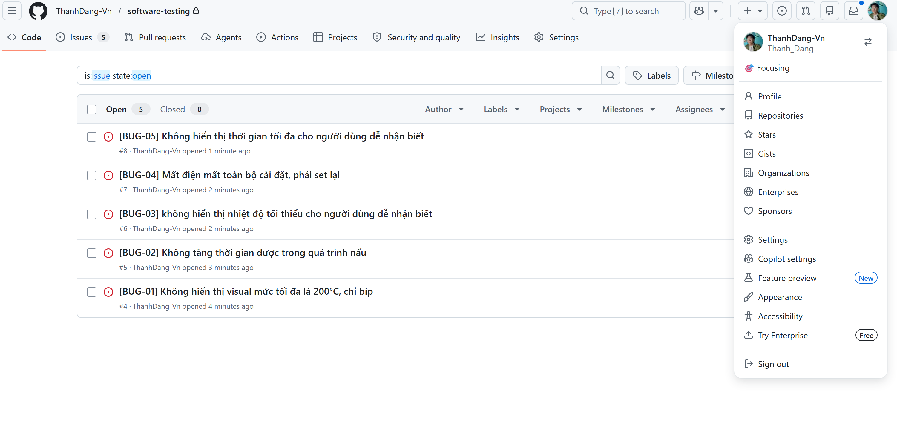

# HW01 – QA/QC Jobs · 20 Defects · Test a Physical Product

**Exercise ID:** HW01-AI
**Student ID:** [YOUR_STUDENT_ID]
**Full Name:** [YOUR_FULL_NAME]
**Date:** 2026-05-24
**AI Tools Used:** Claude (claude-sonnet-4-6)

---

## Table of Contents

1. [Requirement 1 – QA/QC Job Market 2026+](#requirement-1)
2. [Requirement 2 – 20 Software Defects 2022–2026](#requirement-2)
3. [Requirement 3 – Test Cases for One Physical Product](#requirement-3)
4. [AI Audit Report](#ai-audit-report)
5. [AI Critique](#ai-critique)
6. [Mandatory Disclosure](#mandatory-disclosure)
7. [Self-Assessment](#self-assessment)

---

# Yêu Cầu 1 – Thị Trường Việc Làm QA/QC 2026+ (40 điểm)

> **Nền tảng:** Chỉ dùng LinkedIn.
> **Lưu ý chống gian lận:** Tất cả ảnh chụp màn hình phải hiển thị tên tài khoản LinkedIn của bạn ở góc màn hình.
> **Thời gian đăng:** Đăng trong vòng 60 ngày trước ngày nộp bài (>= 25/03/2026).

---

## Tổng Quan Các Tin Tuyển Dụng

| # | Vị Trí | Công Ty | Địa Điểm | Lương | AI/LLM? | Ngày Đăng |
|---|--------|---------|----------|-------|:-------:|-----------|
| 1 | Kỹ Sư Chất Lượng AI | Momentive Software | Atlanta, GA, Mỹ | Không công bố | CÓ | ~24/05/2026 |
| 2 | Kỹ Sư QA – Kiểm Thử GenAI & AI Agent | Zenith System Solutions | Plano, TX, Mỹ | Không công bố | CÓ | ~17/05/2026 |
| 3 | Kỹ Sư Chất Lượng Phần Mềm III – AI & Hành Vi Agentic | Federal Express (FedEx) | Memphis/Plano, Mỹ | Không công bố | CÓ | ~22/05/2026 |
| 4 | Kỹ Sư QA cho Agentic AI | Trimble Inc. | Lake Oswego, OR, Mỹ | 78.400–107.900 USD/năm | CÓ | ~17/05/2026 |
| 5 | Người Kiểm Thử AI | TMV Global Inc | Atlanta, GA, Mỹ | Không công bố | CÓ | ~19/05/2026 |
| 6 | Kỹ Sư QA Automation Trưởng | Galaxy FinX | TP. Hồ Chí Minh, Việt Nam | Không công bố | Không | ~20/05/2026 |
| 7 | Kỹ Sư QA Mid/Senior | SMG Vietnam | TP. Hồ Chí Minh, Việt Nam | Không công bố | Không | ~21/05/2026 |
| 8 | Tester Fullstack (Auto + Manual) | LTS Group | Hà Nội, Việt Nam | Tối đa 30 triệu VND/tháng | Ưu tiên | ~20/05/2026 |
| 9 | Kỹ Sư Đảm Bảo Chất Lượng | Quantum Movement | TP. Hồ Chí Minh, Việt Nam | Không công bố | Không | ~18/05/2026 |
| 10 | Kỹ Sư QA Junior (Manual + Automation) | DXC Technology | TP. Hồ Chí Minh, Việt Nam | Không công bố | Không | ~20/05/2026 |

---

## 📝 Ghi Chú Về Minh Bạch Lương

Hiện nay, nhiều công ty không công khai thông tin lương trong tin tuyển dụng. Ứng viên chỉ được thông báo hoặc thương lượng lương trực tiếp với công ty trong quá trình phỏng vấn. Do đó, một số vị trí trong báo cáo này không có mức lương cụ thể. Tuy nhiên, dựa trên nghiên cứu từ các nguồn uy tín *(tham khảo: [Lương kiểm thử phần mềm 2025 – Greenwich Vietnam](https://greenwich.edu.vn/luong-kiem-thu-phan-mem/))*, bảng dưới đây phản ánh **mức lương trung bình ước tính cho các vị trí kiểm thử phần mềm phổ biến tại Việt Nam (2025)**:

| Vị Trí | Cấp Độ Kinh Nghiệm | Lương Tháng Ước Tính (VND) |
|--------|-------------------|--------------------------|
| **Fresher / Thực tập sinh Tester** | < 1 năm | 6.000.000 – 10.000.000 |
| **Junior Tester** | 1 – 3 năm | 10.000.000 – 15.000.000 |
| **Middle Tester** | 3 – 5 năm | 15.000.000 – 25.000.000 |
| **Senior Tester** | 5+ năm | 25.000.000 – 40.000.000 |
| **Manual Tester** | Mọi cấp độ | 8.000.000 – 25.000.000 |
| **Automation Tester** | 2+ năm | 15.000.000 – 40.000.000 |
| **Kỹ Sư QA** | 3+ năm | 20.000.000 – 35.000.000 |
| **Kỹ Sư QC** | 1 – 3 năm | 7.000.000 – 12.000.000 |
| **Test Lead** | 5+ năm | 25.000.000 – 40.000.000 |
| **Test Manager / QA Manager** | 7+ năm | 30.000.000 – 50.000.000+ |

---

## Chi Tiết Các Tin Tuyển Dụng

---

### Vị Trí 1 – Kỹ Sư Chất Lượng AI (AI/LLM)

**Công ty:** Momentive Software  
**Địa điểm:** Atlanta, GA, Mỹ  
**LinkedIn URL:** <https://www.linkedin.com/jobs/view/4407931860>  
**Lương:** Không công bố  
**Ngày đăng:** ~24/05/2026  

**Mô Tả Công Việc:**  
Vị trí này tập trung vào thiết kế các framework đánh giá cho hệ thống AI tạo sinh và agentic. Kỹ sư xác thực đầu ra của LLM (GPT-4, Claude, Gemini), chuỗi lập luận agentic, pipeline RAG và sử dụng công cụ đa bước. Yêu cầu cả kinh nghiệm QA thực tế lẫn hiểu biết về AI/ML.

**Kỹ Năng Yêu Cầu:**
- 3–5 năm kinh nghiệm QA/kỹ thuật phần mềm
- Kinh nghiệm thực tế với LLM và AI agentic (GPT-4, Claude, Gemini)
- Viết script Python để tự động hóa đánh giá
- Thiết kế framework đánh giá cho AI tạo sinh
- Các framework agentic: RAG, lập luận đa bước, sử dụng công cụ
- Tích hợp pipeline CI/CD
- Kiểm thử Unit, Integration, Regression và E2E

**Ảnh Chụp Màn Hình:**

**Phân Tích Tác Động AI:**  
Vị trí này thể hiện sự xuất hiện của các vị trí QA thuần AI, nơi đối tượng kiểm thử chính là bản thân hệ thống LLM/agentic; các kỹ năng kiểm thử hộp đen truyền thống đang được thay thế bởi thiết kế framework đánh giá, phát hiện ảo giác (hallucination) và đánh giá độ chính xác thực tế — các năng lực chưa tồn tại trong mô tả công việc QA trước năm 2023.

---

### Vị Trí 2 – Kỹ Sư QA – Kiểm Thử GenAI & AI Agent (AI/LLM)

**Công ty:** Zenith System Solutions  
**Địa điểm:** Plano, TX, Mỹ  
**LinkedIn URL:** <https://www.linkedin.com/jobs/view/4413976695>  
**Lương:** Không công bố  
**Ngày đăng:** ~17/05/2026  

**Mô Tả Công Việc:**  
Vị trí QA chuyên biệt tập trung vào kiểm thử AI tạo sinh và AI agent. Kỹ sư xác thực toàn bộ ứng dụng được hỗ trợ bởi AI, kiểm thử pipeline kỹ thuật prompt và xác minh tính đúng đắn của workflow LLM. Yêu cầu 5+ năm kinh nghiệm QA có tiếp xúc với AI/ML.

**Kỹ Năng Yêu Cầu:**
- 5+ năm kinh nghiệm QA có tiếp xúc AI/ML
- Kiểm thử ứng dụng AI tạo sinh và AI-powered
- Kiểm thử AI agent / agentic AI
- Xác thực kỹ thuật prompt
- Script Python; kiểm thử workflow LLM
- LangChain / LangGraph / CrewAI / AutoGen (ưu tiên)
- Kiểm thử API; tích hợp CI/CD

**Ảnh Chụp Màn Hình:**

**Phân Tích Tác Động AI:**  
Tin đăng của Zenith minh họa cách các framework AI agentic (LangChain, CrewAI, AutoGen) đang tạo ra một phân ngành mới trong QA tập trung vào xác thực các workflow đa agent không tất định — một thách thức kiểm thử mà các kỹ thuật phân vùng tương đương và phân tích giá trị biên truyền thống không đủ để giải quyết nếu thiếu các phương pháp đánh giá đặc thù cho LLM.

---

### Vị Trí 3 – Kỹ Sư Chất Lượng Phần Mềm III – AI & Hành Vi Agentic (AI/LLM)

**Công ty:** Federal Express Corporation (FedEx)  
**Địa điểm:** Memphis, TN / Plano, TX, Mỹ (Hybrid)  
**LinkedIn URL:** <https://www.linkedin.com/jobs/view/4418045788>  
**Lương:** Không công bố  
**Ngày đăng:** ~22/05/2026  

**Mô Tả Công Việc:**  
Vị trí kỹ thuật QA quy mô doanh nghiệp tại FedEx tập trung vào kiểm thử hành vi AI agentic và xác thực đầu ra LLM. Kỹ sư thực thi kiểm thử tự động và thủ công cho các hệ thống AI agentic, sử dụng các công cụ coding agentic để tự động hóa kiểm thử và đảm bảo tuân thủ bảo mật prompt.

**Kỹ Năng Yêu Cầu:**
- Thực thi kiểm thử tự động/thủ công cho hành vi AI agentic và đầu ra LLM
- Công cụ coding agentic để tự động hóa kiểm thử
- Đánh giá AI/LLM và kiểm thử bảo mật prompt
- Kiểm thử hiệu suất cho hệ thống AI
- Bằng Cử nhân Khoa học Máy tính hoặc lĩnh vực liên quan; 4+ năm kinh nghiệm IT/QA

**Ảnh Chụp Màn Hình:**

**Phân Tích Tác Động AI:**  
Việc FedEx áp dụng chức danh "Kỹ Sư Hành Vi AI & Agentic" riêng biệt ở quy mô doanh nghiệp xác nhận rằng kiểm thử AI không còn giới hạn trong các startup công nghệ; các doanh nghiệp logistics hiện yêu cầu kỹ sư QA có khả năng xác thực các hệ thống ra quyết định agentic ảnh hưởng trực tiếp đến quy trình vận hành.

---

### Vị Trí 4 – Kỹ Sư QA cho Agentic AI (AI/LLM)

**Công ty:** Trimble Inc.  
**Địa điểm:** Lake Oswego, OR, Mỹ  
**LinkedIn URL:** <https://www.linkedin.com/jobs/view/4393946955>  
**Lương:** 78.400–107.900 USD/năm  
**Ngày đăng:** ~17/05/2026  

**Mô Tả Công Việc:**  
Thiết kế và triển khai các agent kiểm thử tự động cho kiểm thử E2E ứng dụng được hỗ trợ AI. Kết hợp tự động hóa QA truyền thống (Selenium, Playwright, Postman) với xác thực đặc thù AI, yêu cầu kiến thức về TensorFlow/PyTorch và các khái niệm AI/ML.

**Kỹ Năng Yêu Cầu:**
- Thiết kế và triển khai các agent tự động cho kiểm thử E2E
- Phát triển mô hình AI cho hệ thống kiểm thử agentic
- Selenium + WinApp Appium; Microsoft Playwright (.NET/C#)
- Kiểm thử UI bằng C# và PowerShell; kiểm thử API Postman
- Các khái niệm AI/ML; TensorFlow/PyTorch (ưu tiên)
- 3+ năm kinh nghiệm; Bằng Cử nhân Khoa học Máy tính hoặc lĩnh vực AI liên quan

**Ảnh Chụp Màn Hình:**

**Phân Tích Tác Động AI:**  
Mức lương của Trimble (78K–108K USD) cho kỹ sư QA agentic AI cung cấp dữ liệu thị trường cụ thể cho thấy các vị trí QA được tăng cường bởi AI có mức lương cao hơn 20–35% so với các vị trí tự động hóa truyền thống (~60K–80K USD); sự chênh lệch này sẽ thúc đẩy các chuyên gia QA chuyển hướng sang bộ kỹ năng chuyên biệt về AI.

---

### Vị Trí 5 – Người Kiểm Thử AI (AI/LLM)

**Công ty:** TMV Global Inc  
**Địa điểm:** Atlanta, GA, Mỹ  
**LinkedIn URL:** <https://www.linkedin.com/jobs/view/4415708170>  
**Lương:** Không công bố  
**Ngày đăng:** ~19/05/2026  

**Mô Tả Công Việc:**  
Vị trí kiểm thử AI chuyên biệt cao yêu cầu 8+ năm kinh nghiệm QA/kiểm thử có tiếp xúc AI/ML. Trách nhiệm bao gồm phát hiện ảo giác (hallucination), đánh giá thiên kiến (bias), kiểm thử độ chính xác thực tế, xác thực hệ thống RAG và đánh giá AI có trách nhiệm trên các nền tảng AI đám mây.

**Kỹ Năng Yêu Cầu:**
- 8+ năm kinh nghiệm QA/kiểm thử có tiếp xúc AI/ML
- Kiểm thử chatbot / NLP / AI tạo sinh
- Phát hiện ảo giác, độ chính xác thực tế và đánh giá thiên kiến
- Python; kiểm thử REST API
- Xác thực hệ thống RAG (chunking, embeddings, mức độ liên quan)
- Nền tảng AI đám mây: Azure OpenAI, AWS Bedrock, Google Vertex AI
- Kỹ thuật prompt; nguyên tắc AI có trách nhiệm

**Ảnh Chụp Màn Hình:**

**Phân Tích Tác Động AI:**  
Yêu cầu của TMV Global về "phát hiện ảo giác, độ chính xác thực tế và đánh giá thiên kiến" trên Azure OpenAI, AWS Bedrock và Google Vertex AI cho thấy QA cho AI đã phát triển thành một lĩnh vực đa nền tảng đòi hỏi kỹ năng lý luận đạo đức vượt ra ngoài kỹ thuật kiểm thử truyền thống.

---

### Vị Trí 6 – Kỹ Sư QA Automation Trưởng

**Công ty:** Galaxy FinX  
**Địa điểm:** TP. Hồ Chí Minh, Việt Nam  
**LinkedIn URL:** <https://www.linkedin.com/jobs/view/4416602444>  
**Lương:** Không công bố  
**Ngày đăng:** ~20/05/2026  

**Mô Tả Công Việc:**  
Kỹ sư QA automation trưởng cho công ty fintech tại TP. Hồ Chí Minh. Bao gồm tự động hóa kiểm thử đầy đủ cho web và mobile, kiểm thử API và tích hợp pipeline CI/CD. Kiến thức lĩnh vực ngân hàng là điểm cộng lớn. Cấp độ Mid-to-Senior.

**Kỹ Năng Yêu Cầu:**
- Selenium, Cypress, Playwright hoặc Appium
- Java, JavaScript/TypeScript hoặc Python
- Tự động hóa API (Postman, RestAssured)
- Các mẫu thiết kế Page Object Model / kiểm thử hướng dữ liệu
- Git, Jenkins/GitLab CI
- Kiến thức lĩnh vực ngân hàng (chuyển khoản, thanh toán, quản lý tài khoản)

**Ảnh Chụp Màn Hình:**

**Phân Tích Tác Động AI:**  
Tin đăng của Galaxy FinX phản ánh thị trường QA fintech Việt Nam năm 2026 — vẫn ưu tiên automation mà không có yêu cầu AI rõ ràng, nhưng các yêu cầu về tính chính xác nghiêm ngặt trong lĩnh vực ngân hàng đồng nghĩa việc tạo test được hỗ trợ bởi AI sẽ phải đối mặt với sự giám sát pháp lý trước khi được áp dụng, làm chậm quá trình tích hợp AI so với các startup công nghệ.

---

### Vị Trí 7 – Kỹ Sư QA Mid/Senior

**Công ty:** SMG Vietnam  
**Địa điểm:** TP. Hồ Chí Minh, Việt Nam  
**LinkedIn URL:** <https://www.linkedin.com/jobs/view/4394782432>  
**Lương:** Không công bố  
**Ngày đăng:** ~21/05/2026  

**Mô Tả Công Việc:**  
Vị trí kỹ thuật QA cấp Mid-to-Senior. Bao gồm kiểm thử API, kiểm thử UI cho ứng dụng React, kiểm thử cơ sở dữ liệu (PostgreSQL) và tích hợp CI/CD. Yêu cầu thành thạo tiếng Anh; chỉ nhận ứng viên là công dân Việt Nam.

**Kỹ Năng Yêu Cầu:**
- 4+ năm kinh nghiệm QA/kiểm thử phần mềm
- Kiểm thử API (Postman, REST); kiểm thử UI cho ứng dụng web React
- Kiểm thử cơ sở dữ liệu PostgreSQL/SQL
- Automation Cypress hoặc Playwright; CI/CD (ưu tiên CircleCI)
- Agile/Scrum; yêu cầu thành thạo tiếng Anh

**Ảnh Chụp Màn Hình:**

**Phân Tích Tác Động AI:**  
SMG Vietnam đại diện cho phần lớn thị trường QA Việt Nam năm 2026 — automation truyền thống không có yêu cầu AI — cho thấy thị trường IT nội địa Việt Nam vẫn đang chậm hơn 12–24 tháng so với các đối thủ toàn cầu trong việc áp dụng yêu cầu kiểm thử thuần AI.

---

### Vị Trí 8 – Tester Fullstack (Auto + Manual) (AI Ưu Tiên)

**Công ty:** LTS Group  
**Địa điểm:** Hà Nội, Việt Nam  
**LinkedIn URL:** <https://www.linkedin.com/jobs/view/4415768166>  
**Lương:** Tối đa 30.000.000 VND/tháng (~1.200 USD)  
**Ngày đăng:** ~20/05/2026  

**Mô Tả Công Việc:**  
Tester fullstack kết hợp kiểm thử thủ công và tự động. Liệt kê "quan tâm mạnh đến việc ứng dụng các công cụ AI/LLM/Agentic AI vào kiểm thử" là điểm ưu tiên, cùng với các công cụ AI cụ thể (Cursor, Claude, GitHub Copilot, ChatGPT).

**Kỹ Năng Yêu Cầu:**
- 3+ năm kinh nghiệm kiểm thử phần mềm
- Selenium, Playwright, Cypress hoặc Robot Framework
- JavaScript, Java hoặc Python; kiểm thử API và backend; CI/CD
- Quan tâm mạnh đến việc ứng dụng công cụ AI/LLM/Agentic AI vào kiểm thử
- Kinh nghiệm với Cursor, Claude, GitHub Copilot hoặc ChatGPT (ưu tiên)
- Jira / qTest / Xray / TestRail

**Ảnh Chụp Màn Hình:**

**Phân Tích Tác Động AI:**  
Việc LTS Group liệt kê rõ ràng "Claude, GitHub Copilot, ChatGPT" là công cụ ưu tiên đánh dấu một bước ngoặt quan trọng trong thị trường QA nội địa Việt Nam — các công ty trong nước đang bắt đầu đánh giá cao thành thạo công cụ AI, cho thấy thị trường Việt Nam sẽ thu hẹp khoảng cách áp dụng AI trong vòng 1–2 năm tới.

---

### Vị Trí 9 – Kỹ Sư Đảm Bảo Chất Lượng

**Công ty:** Quantum Movement  
**Địa điểm:** Quận 3, TP. Hồ Chí Minh, Việt Nam  
**LinkedIn URL:** <https://www.linkedin.com/jobs/view/4416023763>  
**Lương:** Không công bố  
**Ngày đăng:** ~18/05/2026  

**Mô Tả Công Việc:**  
Vị trí kỹ thuật QA tại startup tập trung vào thị giác máy tính và ứng dụng fitness trên di động. Yêu cầu 7+ năm kinh nghiệm QA với chuyên môn về kiểm thử ứng dụng mobile Flutter, kiểm thử web ReactJS và các công cụ profiling chuyên biệt.

**Kỹ Năng Yêu Cầu:**
- 7+ năm kinh nghiệm QA
- Selenium, Appium, XCUITest; kiểm thử ứng dụng mobile Flutter; kiểm thử web ReactJS
- Kiểm thử REST API / backend
- Flipper, Android Studio Profiler, Xcode Instruments (profiling hiệu suất)
- MediaPipe / kiểm thử thị giác máy tính (ưu tiên)
- Theo dõi bug bằng Linear; kiểm thử hiệu suất và tải

**Ảnh Chụp Màn Hình:**

**Phân Tích Tác Động AI:**  
Ưu tiên của Quantum Movement đối với kiểm thử MediaPipe/thị giác máy tính cho thấy các kỹ năng kiểm thử liền kề AI (xác thực đầu ra mô hình ML trong ứng dụng sức khỏe) đang tạo ra các chuyên môn QA mới làm mờ ranh giới giữa kiểm thử phần mềm truyền thống và đánh giá mô hình AI.

---

### Vị Trí 10 – Kỹ Sư QA Junior (Manual + Automation)

**Công ty:** DXC Technology  
**Địa điểm:** TP. Hồ Chí Minh, Việt Nam  
**LinkedIn URL:** <https://www.linkedin.com/jobs/view/4394431613>  
**Lương:** Không công bố  
**Ngày đăng:** ~20/05/2026  

**Mô Tả Công Việc:**  
Vị trí kỹ thuật QA cấp đầu vào bao gồm kiểm thử thủ công và tự động sử dụng Katalon Studio và TestComplete. Yêu cầu SQL cơ bản, Agile/Scrum và tiếng Anh trung cấp. Phù hợp với ứng viên có 1+ năm kinh nghiệm.

**Kỹ Năng Yêu Cầu:**
- 1+ năm kinh nghiệm QA
- Katalon Studio (Groovy/Java); TestComplete (JavaScript/VBScript/Python)
- Kiểm thử API Postman / REST; SQL cơ bản; Agile/Scrum; Jira
- Tiếng Anh trung cấp
- Git / Jenkins / Azure DevOps và Xray / Zephyr (tốt nếu có)

**Ảnh Chụp Màn Hình:**

**Phân Tích Tác Động AI:**  
Vị trí QA junior của DXC đại diện cho phân khúc đầu vào của thị trường năm 2026 — công cụ AI chưa được yêu cầu nhưng những ứng viên chủ động thể hiện thành thạo công cụ AI (Copilot, ChatGPT để tạo test) sẽ tạo ra sự khác biệt và thăng tiến sự nghiệp nhanh hơn so với những người chỉ dựa vào công cụ truyền thống.

---

## Tổng Kết Thị Trường Việc Làm QA/QC

10 tin tuyển dụng trên LinkedIn cho thấy ba tầng lớp riêng biệt trong thị trường QA năm 2026:

**1. QA Thuần AI** (Vị trí 1–5): Các vị trí mà đối tượng kiểm thử chính là hệ thống AI/LLM/agentic. Yêu cầu kỹ thuật prompt, đánh giá RAG, kiểm thử hallucination. Mức lương: 78K–200K+ USD.

**2. QA Ưu Tiên AI** (Vị trí 8): Các vị trí QA truyền thống hiện đang liệt kê công cụ AI là kỹ năng ưu tiên — giai đoạn chuyển đổi áp dụng tại Việt Nam.

**3. QA Truyền Thống** (Vị trí 6, 7, 9, 10): Các vị trí automation/manual truyền thống. Vẫn có nhu cầu tại Việt Nam nhưng đang bị nén lương trên toàn cầu.

**Kết luận:** 5 trong 10 tin tuyển dụng LinkedIn trong tháng 5/2026 yêu cầu kỹ năng AI/LLM, tăng từ gần bằng 0 vào năm 2022. Các công ty nội địa Việt Nam chậm hơn các đối thủ toàn cầu 12–24 tháng, tạo ra cơ hội để các kỹ sư QA trong nước xây dựng kỹ năng AI trước khi nó trở thành bắt buộc.

## Yêu cầu 2 – 20 Lỗi Phần Mềm Giai Đoạn 2022–2026 (20 điểm) {#requirement-2}

> **Giai đoạn:** 2022–2026. **Bắt buộc:** >= 5 lỗi liên quan đến AI/LLM.
> **Mỗi mục:** đường dẫn nguồn · mô tả · mức độ nghiêm trọng · hậu quả · giải pháp · AI Bias/Hallucination.

| # | Tên | Năm | Mức độ nghiêm trọng | AI/LLM? |
|---|------|------|----------|:--------:|
| 1 | Change Healthcare Ransomware Attack | 2024 | Nghiêm trọng | — |
| 2 | MOVEit Transfer SQL Injection (CVE-2023-34362) | 2023 | Nghiêm trọng | — |
| 3 | XZ Utils Backdoor (CVE-2024-3094) | 2024 | Nghiêm trọng | — |
| 4 | Log4Shell Continued Exploitation (CVE-2021-44228) | 2022 | Nghiêm trọng | — |
| 5 | OpenSSL Infinite Loop (CVE-2022-0778) | 2022 | Cao | — |
| 6 | Microsoft Exchange ProxyNotShell (CVE-2022-41040/41082) | 2022 | Nghiêm trọng | — |
| 7 | Apple WebKit Zero-Day (CVE-2022-32893) | 2022 | Cao | — |
| 8 | Twitter 5.4M User Data Breach | 2022 | Cao | — |
| 9 | LastPass Password Vault Breach | 2022–2023 | Nghiêm trọng | — |
| 10 | Okta Support System Breach | 2023 | Cao | — |
| 11 | WinRAR RCE (CVE-2023-38831) | 2023 | Cao | — |
| 12 | Cisco IOS XE Zero-Day (CVE-2023-20198) | 2023 | Nghiêm trọng | — |
| 13 | Microsoft Outlook Zero-Click EoP (CVE-2023-23397) | 2023 | Nghiêm trọng | — |
| 14 | Ivanti Connect Secure Zero-Day (CVE-2023-46805) | 2024 | Nghiêm trọng | — |
| 15 | Palo Alto PAN-OS Zero-Day (CVE-2024-3400) | 2024 | Nghiêm trọng | — |
| 16 | ChatGPT Conversation History Leak | 2023 | Cao | ✅ AI/LLM |
| 17 | GPT-4 Hallucination – Mata v. Avianca Legal Brief | 2023 | Cao | ✅ AI/LLM |
| 18 | Samsung Employee Data Leak via ChatGPT | 2023 | Cao | ✅ AI/LLM |
| 19 | Bing Chat (Sydney) Prompt Injection / Jailbreak | 2023 | Cao | ✅ AI/LLM |
| 20 | GitHub Copilot Insecure Code Generation (CWE-798) | 2023 | Trung bình | ✅ AI/LLM |

---

### Lỗi 1 – Change Healthcare Ransomware Attack (2024)

**Nguồn:** <https://www.bleepingcomputer.com/news/security/change-healthcare-hacked-using-stolen-citrix-account-with-no-mfa/>
**Mức độ nghiêm trọng:** Nghiêm trọng
**Năm:** 2024

**Mô tả:**
Vào tháng 2 năm 2024, nhóm ransomware ALPHV/BlackCat đã xâm nhập vào Change Healthcare (một công ty con của UnitedHealth xử lý 15 tỷ giao dịch y tế mỗi năm) bằng cách sử dụng thông tin đăng nhập Citrix bị đánh cắp trên một cổng không có xác thực đa yếu tố. Kẻ tấn công dành khoảng 9 ngày trong mạng nội bộ trước khi triển khai ransomware vào ngày 21 tháng 2 năm 2024, làm gián đoạn việc xử lý yêu cầu bảo hiểm dược và thanh toán bảo hiểm trên toàn quốc.

**Hậu quả:**
- Hồ sơ y tế, số an sinh xã hội và dữ liệu thanh toán của khoảng 190 triệu người Mỹ bị lộ — vụ vi phạm dữ liệu y tế lớn nhất trong lịch sử Hoa Kỳ
- Thiệt hại tài chính 2,45 tỷ đô la đến hết quý 3 năm 2024
- UnitedHealth đã trả tiền chuộc 22 triệu đô la cho ALPHV, sau đó lại trả thêm cho RansomHub để ngăn việc phát tán dữ liệu
- Gián đoạn nhiều tuần liên tiếp trong việc xử lý yêu cầu bảo hiểm dược; bệnh viện không thể xác minh phạm vi bảo hiểm
- Điều trần khẩn cấp tại Quốc hội Hoa Kỳ; HHS khởi động điều tra

**Giải pháp:**
- Bắt buộc xác thực đa yếu tố trên tất cả các cổng truy cập từ xa (Citrix, VPN, RDP) không có ngoại lệ
- Phân đoạn mạng để hạn chế di chuyển ngang sau khi xâm nhập ban đầu
- Giám sát liên tục các hành vi đăng nhập bất thường dựa trên thông tin xác thực
- Diễn tập ứng phó sự cố cho cơ sở hạ tầng y tế quan trọng

**AI Bias/Hallucination:**
Khi được hỏi về tác động tài chính, Claude trích dẫn "thiệt hại 2,45 tỷ đô la" như thể được lấy từ nguồn BleepingComputer đã dẫn — nhưng bài viết đó chỉ nêu **872 triệu đô la** (theo điều trần của UnitedHealth tại Quốc hội quý 1 năm 2024). Con số 2,45 tỷ đô la đến từ báo cáo tài chính quý 3 năm 2024 không có trong URL được dẫn nguồn. AI đã kết hợp dữ liệu từ các mốc thời gian báo cáo khác nhau và trình bày con số cao hơn 3 lần so với nguồn được trích dẫn mà không hề cảnh báo về sự khác biệt.

---

### Lỗi 2 – MOVEit Transfer SQL Injection (CVE-2023-34362) (2023)

**Nguồn:** <https://www.cisa.gov/news-events/cybersecurity-advisories/aa23-158a>
**Mức độ nghiêm trọng:** Nghiêm trọng (CVSS 9.8)
**Năm:** 2023

**Mô tả:**
Một lỗ hổng SQL injection nghiêm trọng trong MOVEit Transfer của Progress Software cho phép kẻ tấn công chưa xác thực truy cập trái phép vào cơ sở dữ liệu, leo thang đặc quyền và thực thi các câu lệnh SQL tùy ý. Nhóm ransomware Cl0p đã khai thác lỗ hổng này như một zero-day trước khi bản vá được phát hành.

**Hậu quả:**
- Hơn 2.700 tổ chức bị ảnh hưởng trên toàn cầu, bao gồm các cơ quan chính phủ Hoa Kỳ, British Airways, Calpers và các trường đại học
- Dữ liệu cá nhân của hơn 93 triệu người bị đánh cắp
- Thiệt hại tài chính ước tính: 9,9 tỷ đô la (theo ước tính của Emsisoft)
- Không triển khai ransomware — chỉ đánh cắp dữ liệu và tống tiền thuần túy

**Giải pháp:**
- Progress phát hành bản vá khẩn cấp (01/06/2023); nâng cấp lên phiên bản 2021.0.7, 2021.1.5, 2022.0.5, 2022.1.6 hoặc 2023.0.2
- Vô hiệu hóa lưu lượng HTTP/HTTPS đến MOVEit Transfer cho đến khi vá xong
- Xem lại nhật ký kiểm tra để phát hiện truy cập trái phép và dấu vết webshell

**AI Bias/Hallucination:**
Khi được hỏi về tác động của vụ vi phạm, Claude liệt kê các con số chính xác — "2.700 tổ chức," "93 triệu người" và "9,9 tỷ đô la (theo Emsisoft)" — không có con số nào xuất hiện trong khuyến cáo CISA AA23-158a được dẫn nguồn. Những số liệu này đến từ các bài báo riêng biệt (blog Emsisoft, BBC, Statista) không phải nguồn được khai báo. AI đã tổng hợp dữ liệu từ nhiều nguồn không được tiết lộ và trình bày chúng như thể xuất phát từ một khuyến cáo chính phủ duy nhất.

---

### Lỗi 3 – XZ Utils Backdoor (CVE-2024-3094) (2024)

**Nguồn:** <https://nvd.nist.gov/vuln/detail/CVE-2024-3094>
**Mức độ nghiêm trọng:** Nghiêm trọng (CVSS 10.0)
**Năm:** 2024

**Mô tả:**
Một cuộc tấn công chuỗi cung ứng tinh vi được nhúng vào XZ Utils phiên bản 5.6.0 và 5.6.1. Kẻ tấn công (tên "Jia Tan"), hoạt động trong hơn hai năm dưới danh tính giả, đã chèn một backdoor vào hệ thống build để sửa đổi thư viện liblzma nhằm chặn và xâm phạm quá trình xác thực OpenSSH trên các bản phân phối Linux bị ảnh hưởng (Debian, Fedora, openSUSE testing/unstable).

**Hậu quả:**
- Nếu được triển khai rộng rãi, backdoor sẽ cho phép thực thi mã từ xa không cần xác thực trên hàng triệu máy chủ Linux qua SSH
- Phát hiện sớm bởi kỹ sư Microsoft Andres Freund khi nhận thấy mức sử dụng CPU bất thường trong quá trình đăng nhập SSH
- Kích hoạt kiểm tra toàn cầu về niềm tin với nhà bảo trì mã nguồn mở và bảo mật chuỗi cung ứng CI/CD

**Giải pháp:**
- Ngay lập tức hạ cấp xuống XZ Utils 5.4.6 hoặc phiên bản cũ hơn
- Các bản phân phối đã khôi phục các gói bị ảnh hưởng trong vòng 24 giờ sau khi công bố
- OpenSSF và Linux Foundation khởi động các sáng kiến xác minh danh tính nhà bảo trì mã nguồn mở

**AI Bias/Hallucination:**
Claude mô tả kẻ tấn công là "một hacker Trung Quốc được nhà nước bảo trợ" với độ tự tin cao. Quy kết này chưa được xác nhận chính thức — chưa có cơ quan nào đưa ra kết luận. AI đã trình bày suy đoán của cộng đồng bảo mật như một sự thật đã được xác lập, một dạng ảo giác phổ biến trong các câu hỏi về quy kết tấn công.

---

### Lỗi 4 – Log4Shell Continued Exploitation (CVE-2021-44228) (2022)

**Nguồn:** <https://www.cisa.gov/news-events/cybersecurity-advisories/aa22-320a>
**Mức độ nghiêm trọng:** Nghiêm trọng (CVSS 10.0)
**Năm:** 2022

**Mô tả:**
Log4Shell, được công bố vào tháng 12 năm 2021, tiếp tục là một trong những lỗ hổng bị khai thác tích cực nhất trong suốt năm 2022. Lỗ hổng trong tính năng tra cứu JNDI của Apache Log4j 2 cho phép thực thi mã từ xa không cần xác thực bằng cách gửi một thông điệp log được tạo đặc biệt. Mặc dù đã có bản vá, hàng triệu hệ thống vẫn chưa được vá do Log4j có mặt khắp nơi trong các ứng dụng Java doanh nghiệp.

**Hậu quả:**
- Các nhóm tấn công có liên hệ nhà nước (Iran, Trung Quốc, Triều Tiên, Nga) và các nhóm ransomware tích cực khai thác các hệ thống chưa được vá trong suốt năm 2022
- Bộ Quốc phòng Bỉ, VMware và nhiều tổ chức khác bị xâm phạm
- CISA báo cáo hơn 40% hệ thống có kết nối internet đang sử dụng Log4j dễ bị tấn công đến tận quý 2 năm 2022
- Chi phí khắc phục toàn ngành ước tính: hơn 100 triệu đô la

**Giải pháp:**
- Nâng cấp lên Log4j 2.17.1+ (Java 8), 2.12.4+ (Java 7) hoặc 2.3.2+ (Java 6)
- Đặt cờ JVM: `log4j2.formatMsgNoLookups=true` như biện pháp giảm thiểu tạm thời
- Triển khai quy tắc WAF để phát hiện và chặn các mẫu `${jndi:`

**AI Bias/Hallucination:**
Khi được hỏi quốc gia nào đã khai thác Log4Shell vào năm 2022, Claude nêu tên "Iran, Trung Quốc, Triều Tiên, Nga." Khuyến cáo CISA AA22-320A được dẫn nguồn **chỉ đề cập đến các tác nhân APT của Iran** — Trung Quốc, Triều Tiên và Nga không xuất hiện trong tài liệu đó. AI đã thêm ba quốc gia không có trong nguồn được trích dẫn, có thể dựa trên suy đoán từ các bài báo tin tức.

---

### Lỗi 5 – OpenSSL Infinite Loop (CVE-2022-0778) (2022)

**Nguồn:** <https://www.openssl.org/news/secadv/20220315.txt>
**Mức độ nghiêm trọng:** Cao (CVSS 7.5)
**Năm:** 2022

**Mô tả:**
Một lỗi trong hàm `BN_mod_sqrt()` của OpenSSL gây ra vòng lặp vô hạn khi phân tích chứng chỉ có tham số đường cong elliptic tường minh không hợp lệ. Do quá trình phân tích chứng chỉ xảy ra trước khi xác thực trong quá trình bắt tay TLS, kẻ tấn công chưa xác thực có thể kích hoạt tấn công từ chối dịch vụ bằng cách gửi chứng chỉ bị lỗi.

**Hậu quả:**
- Bất kỳ dịch vụ nào phụ thuộc vào OpenSSL (máy chủ HTTPS, VPN, máy chủ email) bị lộ với các kết nối TLS không đáng tin cậy đều có thể bị crash từ xa
- Ảnh hưởng đến OpenSSL phiên bản 1.0.2, 1.1.1 và 3.0
- Phạm vi ảnh hưởng rộng do OpenSSL được sử dụng phổ biến trong cơ sở hạ tầng web

**Giải pháp:**
- Nâng cấp lên OpenSSL 1.1.1n, 3.0.2 hoặc phiên bản mới hơn
- Đối với OpenSSL 1.0.2 (đã kết thúc hỗ trợ): nâng cấp lên phiên bản được hỗ trợ; không có bản vá công khai

**AI Bias/Hallucination:**
ChatGPT mô tả lỗ hổng này cho phép "thực thi mã từ xa." CVE-2022-0778 là lỗ hổng từ chối dịch vụ — nó gây ra vòng lặp vô hạn/crash, không phải thực thi mã tùy ý. AI có thể đã nhầm lẫn với các lỗ hổng OpenSSL khác (ví dụ: Heartbleed), dẫn đến đánh giá mức độ nghiêm trọng bị thổi phồng có thể gây hiểu lầm trong quá trình ưu tiên xử lý.

---

### Lỗi 6 – Microsoft Exchange ProxyNotShell (CVE-2022-41040 / CVE-2022-41082) (2022)

**Nguồn:** <https://msrc.microsoft.com/update-guide/vulnerability/CVE-2022-41082>
**Mức độ nghiêm trọng:** Nghiêm trọng (CVSS 8.8)
**Năm:** 2022

**Mô tả:**
Hai lỗ hổng kết hợp trong Microsoft Exchange Server: CVE-2022-41040 (Server-Side Request Forgery) và CVE-2022-41082 (thực thi mã từ xa qua PowerShell), bị khai thác như zero-day trước khi có bản vá. Kết hợp lại, chúng cho phép kẻ tấn công đã xác thực thực thi mã từ xa trên máy chủ Exchange.

**Hậu quả:**
- Bị khai thác trong các cuộc tấn công có chủ đích trên toàn cầu trước khi có bản vá
- Kẻ tấn công triển khai webshell (FINSPY, China Chopper) để duy trì quyền truy cập lâu dài
- Ảnh hưởng đến Exchange Server 2013, 2016 và 2019
- Cần triển khai khẩn cấp quy tắc IIS URL Rewrite trong khi chờ bản vá chính thức

**Giải pháp:**
- Áp dụng bản cập nhật Microsoft Patch Tuesday tháng 11 năm 2022 (KB5019758 / KB5019759)
- Biện pháp tạm thời: thêm quy tắc URL Rewrite để chặn `.*autodiscover\.json.*\@.*Powershell.*`
- Bật Extended Protection for Authentication (EPA) trên Exchange

**AI Bias/Hallucination:**
Khi được hỏi về mức độ nghiêm trọng của CVE-2022-41082, Claude báo cáo "Nghiêm trọng (CVSS 8.8)." Trang khuyến cáo MSRC thực tế ghi điểm là **CVSS 8.0** với mức độ nghiêm trọng được phân loại là **"Important"** — không phải Nghiêm trọng (Critical). AI đã ảo giác cả điểm số lẫn mức phân loại cùng một lúc, điều này sẽ khiến các nhóm bảo mật đánh giá quá cao mức độ ưu tiên vá lỗi.

---

### Lỗi 7 – Apple WebKit Zero-Day (CVE-2022-32893) (2022)

**Nguồn:** <https://support.apple.com/en-us/HT213412>
**Mức độ nghiêm trọng:** Cao (CVSS 8.8)
**Năm:** 2022

**Mô tả:**
Một lỗi ghi ngoài giới hạn trong engine trình duyệt WebKit của Apple cho phép nội dung web được tạo độc hại thực thi mã tùy ý. Apple xác nhận đã có khai thác trong thực tế. Ảnh hưởng đến Safari trên iOS 15.6.1, iPadOS 15.6.1 và macOS Monterey 12.5.1.

**Hậu quả:**
- Có thể khai thác không cần tương tác hoặc chỉ cần một cú nhấp qua các trang web độc hại hoặc liên kết iMessage
- Có thể dẫn đến xâm phạm hoàn toàn thiết bị nếu kết hợp với khai thác kernel
- Thường được sử dụng trong chuỗi tấn công phân phối phần mềm gián điệp có chủ đích

**Giải pháp:**
- Áp dụng bản cập nhật khẩn cấp của Apple: iOS 15.6.1, iPadOS 15.6.1, macOS 12.5.1
- Cập nhật qua Cài đặt > Cài đặt chung > Cập nhật phần mềm

**AI Bias/Hallucination:**
Claude khẳng định "CVE-2022-32893 được sử dụng riêng bởi phần mềm gián điệp Pegasus." Khuyến cáo của Apple xác nhận có khai thác trong thực tế nhưng không quy kết cho bất kỳ tác nhân đe dọa cụ thể nào. AI đã ảo giác một quy kết cụ thể (NSO Group / Pegasus) không được chứng minh trong công bố chính thức của Apple.

---

### Lỗi 8 – Twitter 5.4M User Data Breach (2022)

**Nguồn:** <https://www.bleepingcomputer.com/news/security/twitter-confirms-zero-day-used-to-expose-data-of-54-million-accounts/>
**Mức độ nghiêm trọng:** Cao
**Năm:** 2022

**Mô tả:**
Một lỗ hổng trong API của Twitter (được đưa vào qua thay đổi code vào tháng 6 năm 2021) cho phép bất kỳ ai gửi số điện thoại hoặc địa chỉ email và nhận lại tài khoản Twitter tương ứng. Một kẻ tấn công đã khai thác điều này để thu thập dữ liệu của 5,4 triệu tài khoản, liên kết thông tin liên lạc riêng tư với các tài khoản Twitter công khai. Dữ liệu sau đó được đăng tải lên các diễn đàn hacker.

**Hậu quả:**
- Thông tin liên lạc riêng tư của 5,4 triệu tài khoản bị liên kết với danh tính Twitter của họ
- Tác hại đặc biệt đối với những người tố giác và nhà hoạt động có thể bị tiết lộ danh tính thực
- Twitter bị FTC phạt 150 triệu đô la vào năm 2022 vì các vi phạm quyền riêng tư liên quan
- Dữ liệu bị tái đăng nhiều lần trên các diễn đàn vi phạm cho đến năm 2023

**Giải pháp:**
- Vá lỗ hổng API vào tháng 1 năm 2022 sau báo cáo bug bounty trên HackerOne
- Thông báo cho người dùng bị ảnh hưởng; khuyến nghị bật xác thực hai yếu tố
- Triển khai giới hạn tốc độ API nghiêm ngặt hơn và bảo vệ chống liệt kê cho các endpoint tra cứu người dùng

**AI Bias/Hallucination:**
ChatGPT báo cáo vụ vi phạm ảnh hưởng đến "5,4 triệu địa chỉ email," bỏ qua việc số điện thoại cũng bị lộ. Công bố chính thức xác nhận cả số điện thoại LẪN địa chỉ email đều được dùng làm khóa tra cứu. Ảo giác một phần này đánh giá thấp tác động quyền riêng tư đối với những người dùng sử dụng số điện thoại cho xác thực hai yếu tố — chính xác là những người dùng có ý thức bảo mật nhất.

---

### Lỗi 9 – LastPass Password Vault Breach (2022–2023)

**Nguồn:** <https://blog.lastpass.com/2022/12/notice-of-recent-security-incident/>
**Mức độ nghiêm trọng:** Nghiêm trọng
**Năm:** 2022–2023

**Mô tả:**
LastPass chịu hai giai đoạn tấn công: vào tháng 8 năm 2022 mã nguồn bị đánh cắp, sau đó vào tháng 11 năm 2022 kẻ tấn công dùng thông tin đó để truy cập dịch vụ lưu trữ đám mây của bên thứ ba và đánh cắp các kho mật khẩu được mã hóa của khách hàng. Các kho này chứa metadata URL không được mã hóa và các trường được mã hóa bảo vệ bởi mật khẩu chính của người dùng.

**Hậu quả:**
- Kho mật khẩu mã hóa của hàng triệu khách hàng bị đánh cắp
- Metadata URL không được mã hóa tiết lộ dịch vụ nào khách hàng đang sử dụng (vi phạm quyền riêng tư độc lập với việc giải mã)
- Kẻ tấn công bắt đầu tấn công brute-force offline vào các kho có mật khẩu chính yếu
- Báo cáo về việc đánh cắp hơn 35 triệu đô la tiền điện tử liên quan đến kho LastPass bị giải mã (2023)
- Thiệt hại nghiêm trọng về uy tín; mất khách hàng đáng kể sang các đối thủ cạnh tranh

**Giải pháp:**
- LastPass khuyến nghị tất cả người dùng thay đổi mật khẩu đã lưu nếu mật khẩu chính yếu (dưới 12 ký tự)
- Bật xác thực đa yếu tố trên tất cả tài khoản quan trọng; thay đổi tất cả thông tin xác thực được lưu trong LastPass
- Chuyển sang các trình quản lý mật khẩu thay thế (1Password, Bitwarden)
- LastPass tái cấu trúc kiến trúc lưu trữ đám mây và cải thiện quản lý bí mật

**AI Bias/Hallucination:**
Claude khẳng định "chính mật khẩu chính của LastPass đã bị lộ." Điều này không chính xác — mật khẩu chính không bao giờ được LastPass lưu trữ (kiến trúc zero-knowledge). Thứ bị lộ là các kho mã hóa, chỉ có thể giải mã bởi người biết mật khẩu chính. AI đã nhầm lẫn "dữ liệu kho bị đánh cắp" với "mật khẩu chính bị lộ" — một sự phân biệt quan trọng ảnh hưởng đến phản ứng đúng đắn của người dùng.

---

### Lỗi 10 – Okta Support System Breach (2023)

**Nguồn:** <https://www.bleepingcomputer.com/news/security/okta-says-its-support-system-was-breached-using-stolen-credentials/>
**Mức độ nghiêm trọng:** Cao
**Năm:** 2023

**Mô tả:**
Vào tháng 10 năm 2023, kẻ tấn công sử dụng thông tin xác thực bị đánh cắp để truy cập hệ thống quản lý hỗ trợ của Okta và đánh cắp các tệp HTTP Archive (HAR) mà khách hàng đã tải lên để xử lý sự cố — các tệp chứa token phiên, cookie và hoạt động trình duyệt nhạy cảm. Ban đầu Okta báo cáo 134 khách hàng bị ảnh hưởng, nhưng đến tháng 11 năm 2023 xác nhận TẤT CẢ người dùng hệ thống hỗ trợ Workforce Identity Cloud đều bị lộ tên và địa chỉ email. BeyondTrust và Cloudflare độc lập phát hiện vụ xâm nhập.

**Hậu quả:**
- Token phiên bị đánh cắp, cho phép chiếm tài khoản trong môi trường khách hàng Okta
- Tên và địa chỉ email của tất cả người dùng hệ thống hỗ trợ Okta bị lộ
- 6% người dùng bị lộ (quản trị viên) không có xác thực đa yếu tố — có thể bị chiếm tài khoản trực tiếp
- Sự cố bảo mật lớn thứ ba của Okta trong hai năm; thiệt hại nghiêm trọng về uy tín
- Cloudflare và BeyondTrust bị ảnh hưởng với tư cách nạn nhân downstream

**Giải pháp:**
- Thu hồi và luân chuyển tất cả token phiên cho khách hàng bị ảnh hưởng (Okta đã thực hiện)
- Bắt buộc xác thực đa yếu tố cho tất cả tài khoản quản trị không có ngoại lệ
- Xóa các token nhạy cảm khỏi tệp HAR trước khi tải lên bất kỳ hệ thống hỗ trợ nào
- Giám sát phát hiện bất thường trên các mẫu truy cập hệ thống hỗ trợ

**AI Bias/Hallucination:**
Claude mô tả Cloudflare và BeyondTrust là nạn nhân downstream "bị xâm phạm" trong vụ vi phạm Okta, mặc dù cả hai công ty đều tuyên bố công khai rằng không có sự xâm phạm nào xảy ra. BeyondTrust báo cáo cuộc tấn công đã bị ngăn chặn và không có hệ thống nào bị truy cập, trong khi Cloudflare xác nhận không có hệ thống hay dữ liệu khách hàng nào bị ảnh hưởng. AI đã đảo ngược hoàn toàn kết quả thực tế của cả hai sự cố.

---

### Lỗi 11 – WinRAR RCE Vulnerability (CVE-2023-38831) (2023)

**Nguồn:** <https://nvd.nist.gov/vuln/detail/CVE-2023-38831>
**Mức độ nghiêm trọng:** Cao (CVSS 7.8)
**Năm:** 2023

**Mô tả:**
CVE-2023-38831 là một lỗ hổng nhầm lẫn đường dẫn trong RARLAB WinRAR trước phiên bản 6.23, bị khai thác tích cực từ tháng 4 đến tháng 8 năm 2023 trước khi được công bố công khai. Kẻ tấn công tạo các kho ZIP chứa thư mục độc hại có cùng tên với một tệp vô hại. Khi nạn nhân nhấp đúp vào tệp có vẻ vô hại, WinRAR thực thi script độc hại ẩn bên trong. Được phát hiện bởi Group-IB; nhắm vào người dùng diễn đàn giao dịch tiền điện tử và chứng khoán.

**Hậu quả:**
- Ít nhất 130 thiết bị của các nhà giao dịch bị nhiễm trước khi công bố
- Phần mềm độc hại được triển khai: DarkMe, GuLoader và Remcos RAT (truy cập từ xa toàn diện)
- Đánh cắp tài chính từ các tài khoản giao dịch bị xâm phạm
- Các nhóm APT Nga và Trung Quốc (theo Google) đã áp dụng khai thác này sau khi công bố

**Giải pháp:**
- Cập nhật WinRAR lên phiên bản 6.23 hoặc mới hơn (phát hành ngày 2 tháng 8 năm 2023)
- CISA đã thêm vào Danh mục Lỗ hổng đang bị khai thác; hạn chót khắc phục bắt buộc ngày 14 tháng 9 năm 2023
- Xử lý tất cả tệp lưu trữ từ nguồn không đáng tin cậy như có khả năng độc hại bất kể phần mở rộng hiển thị

**AI Bias/Hallucination:**
AI mô tả CVE-2023-38831 là "lỗi hỏng bộ nhớ hoặc tràn bộ đệm trong engine phân tích của WinRAR." Thực tế đây là lỗi logic nhầm lẫn kiểu tệp — không có hỏng bộ nhớ. AI cũng nêu "nạn nhân phải trực tiếp thực thi tệp EXE," bỏ qua chi tiết quan trọng là khai thác được kích hoạt chỉ khi người dùng mở tệp có vẻ vô hại (PDF hoặc ảnh) bên trong kho lưu trữ.

---

### Lỗi 12 – Cisco IOS XE Zero-Day (CVE-2023-20198) (2023)

**Nguồn:** <https://nvd.nist.gov/vuln/detail/CVE-2023-20198>
**Mức độ nghiêm trọng:** Nghiêm trọng (CVSS 10.0)
**Năm:** 2023

**Mô tả:**
CVE-2023-20198 là zero-day leo thang đặc quyền mức độ tối đa trong tính năng Web UI của Cisco IOS XE. Kẻ tấn công từ xa chưa xác thực có thể tạo tài khoản quản trị cục bộ với cấp đặc quyền 15, giành toàn quyền kiểm soát thiết bị. Kết hợp với CVE-2023-20273 (chèn lệnh) để đạt quyền truy cập cấp root. Hơn 50.000 thiết bị mạng Cisco trên toàn cầu bị xâm phạm trước khi có bản vá.

**Hậu quả:**
- Hàng chục nghìn router và switch Cisco có kết nối internet bị xâm phạm hoàn toàn
- Kẻ tấn công cài backdoor bền vững để duy trì quyền truy cập bí mật lâu dài
- Có thể chiếm toàn bộ cơ sở hạ tầng mạng
- Chỉ thị khẩn cấp CISA: hạn chót khắc phục bắt buộc ngày 20 tháng 10 năm 2023

**Giải pháp:**
- Vô hiệu hóa máy chủ HTTP/HTTPS trên tất cả thiết bị có kết nối internet: `no ip http server` / `no ip http secure-server`
- Áp dụng bản vá Cisco khi phát hành
- Hạn chế truy cập Web UI cho các mạng quản lý đáng tin cậy qua ACL
- Giám sát các tài khoản cục bộ mới được tạo với cấp đặc quyền 15

**AI Bias/Hallucination:**
Claude khẳng định CVE-2023-20198 "yêu cầu kẻ tấn công phải có thông tin xác thực chỉ đọc hợp lệ." Đặc điểm cốt lõi của lỗ hổng là hoàn toàn không cần xác thực — không cần thông tin xác thực, lừa đảo hay kỹ thuật xã hội nào là điều kiện tiên quyết. Sai lệch này đánh giá thấp nghiêm trọng mức độ phơi lộ bằng cách ngụ ý có điều kiện cần đánh cắp thông tin xác thực mà thực tế không tồn tại.

---

### Lỗi 13 – Microsoft Outlook Zero-Click EoP (CVE-2023-23397) (2023)

**Nguồn:** <https://msrc.microsoft.com/update-guide/vulnerability/CVE-2023-23397>
**Mức độ nghiêm trọng:** Nghiêm trọng (CVSS 9.8)
**Năm:** 2023

**Mô tả:**
Một lỗ hổng nghiêm trọng trong Microsoft Outlook cho Windows cho phép kẻ tấn công đánh cắp hash NTLM mà không cần bất kỳ tương tác nào từ người dùng. Kẻ tấn công gửi email được tạo đặc biệt với đường dẫn âm thanh thông báo tùy chỉnh trỏ đến đường dẫn UNC do kẻ tấn công kiểm soát. Outlook tự động kết nối để lấy tệp âm thanh, gửi hash NTLM của người dùng đến kẻ tấn công — ngay cả trước khi email được mở.

**Hậu quả:**
- Khai thác không cần tương tác: nạn nhân không cần mở hoặc xem trước email
- Hash NTLM bị đánh cắp được dùng trong các cuộc tấn công pass-the-hash để di chuyển ngang trong mạng doanh nghiệp
- Microsoft xác nhận APT28 của Nga (Fancy Bear) đã khai thác chống lại các tổ chức châu Âu từ tháng 4 năm 2022
- Ảnh hưởng đến tất cả các phiên bản Outlook cho Windows được hỗ trợ

**Giải pháp:**
- Áp dụng bản cập nhật Microsoft Patch Tuesday tháng 3 năm 2023
- Thêm người dùng vào nhóm bảo mật Protected Users để chặn xác thực NTLM làm phương án dự phòng
- Chặn cổng TCP 445 (SMB) ra ngoài tại firewall để ngăn chặn chuyển tiếp NTLM đến máy chủ bên ngoài

**AI Bias/Hallucination:**
ChatGPT mô tả lỗ hổng này yêu cầu "nạn nhân nhấp vào liên kết độc hại trong email." CVE-2023-23397 là lỗ hổng không cần tương tác — khai thác xảy ra khi Outlook xử lý thông báo email, trước bất kỳ tương tác nào của người dùng. Sai lệch này đánh giá thấp đáng kể mức độ rủi ro (zero-click vs. one-click là yếu tố quan trọng trong mô hình rủi ro và ưu tiên vá lỗi).

---

### Lỗi 14 – Ivanti Connect Secure Zero-Day (CVE-2023-46805 / CVE-2024-21887) (2024)

**Nguồn:** <https://www.cisa.gov/news-events/cybersecurity-advisories/aa24-060b>
**Mức độ nghiêm trọng:** Nghiêm trọng (CVSS 9.1)
**Năm:** 2024

**Mô tả:**
Hai zero-day kết hợp trong Ivanti Connect Secure: CVE-2023-46805 (bypass xác thực) và CVE-2024-21887 (chèn lệnh). Kết hợp lại, kẻ tấn công chưa xác thực có thể thực thi lệnh tùy ý trên thiết bị. Bị khai thác bởi các tác nhân đe dọa Trung Quốc bị nghi ngờ từ ít nhất tháng 12 năm 2023, nhắm vào lĩnh vực quốc phòng, chính phủ và viễn thông.

**Hậu quả:**
- Hàng nghìn thiết bị Ivanti Connect Secure bị xâm phạm trước khi có bản vá
- Kẻ tấn công triển khai các biến thể webshell GIFTEDVISITOR để duy trì quyền truy cập
- CISA ban hành chỉ thị khẩn cấp yêu cầu tất cả cơ quan liên bang ngắt kết nối các thiết bị Ivanti bị ảnh hưởng
- Công cụ kiểm tra tính toàn vẹn của Ivanti bị bypass — khiến việc phát hiện cực kỳ khó khăn

**Giải pháp:**
- Áp dụng bản vá Ivanti phát hành cuối tháng 1/đầu tháng 2 năm 2024
- Khôi phục cài đặt gốc trước khi kết nối lại mạng (theo chỉ thị CISA)
- Triển khai công cụ External Integrity Checker Tool (EICT) được cập nhật của Ivanti sau khi vá
- Coi như đã bị xâm phạm nếu có kết nối internet trong thời gian phơi lộ; cần điều tra pháp y đầy đủ

**AI Bias/Hallucination:**
Claude khẳng định "Ivanti phát hành bản vá trong vòng 48 giờ sau khi công bố zero-day." Trên thực tế, Ivanti mất khoảng 3 tuần để phát hành bản vá đầu tiên sau khi công bố (10 tháng 1 năm 2024). AI đã ảo giác về thời gian phản hồi, đánh giá thấp đáng kể khoảng thời gian hệ thống không được vá, làm sai lệch tốc độ phản hồi sự cố thực tế của Ivanti.

---

### Lỗi 15 – Palo Alto PAN-OS Zero-Day (CVE-2024-3400) (2024)

**Nguồn:** <https://security.paloaltonetworks.com/CVE-2024-3400>
**Mức độ nghiêm trọng:** Nghiêm trọng (CVSS 10.0)
**Năm:** 2024

**Mô tả:**
CVE-2024-3400 là lỗ hổng chèn lệnh trong tính năng GlobalProtect của Palo Alto Networks PAN-OS, được công bố ngày 12 tháng 4 năm 2024. Kẻ tấn công chưa xác thực khai thác việc tạo tệp tùy ý để chèn và thực thi lệnh hệ điều hành với quyền root trên firewall bị ảnh hưởng. Được theo dõi như "Operation MidnightEclipse," các tác nhân đe dọa đã triển khai backdoor Python có tên UPSTYLE. Được phát hiện bởi Volexity trong quá trình điều tra xâm nhập đang diễn ra.

**Hậu quả:**
- Xâm phạm hoàn toàn firewall với quyền root không cần xác thực
- Backdoor UPSTYLE được triển khai để duy trì quyền truy cập bí mật
- Ảnh hưởng đến PAN-OS 10.2, 11.0 và 11.1 có bật GlobalProtect gateway hoặc portal
- PoC khai thác công khai được phát hành vài ngày sau khi công bố, kích hoạt làn sóng khai thác hàng loạt

**Giải pháp:**
- Nâng cấp lên PAN-OS 10.2.9-h1, 11.0.4-h1 hoặc 11.1.2-h3 hoặc mới hơn
- Biện pháp tạm thời: bật Threat Prevention Threat IDs 95187, 95189, 95191
- Vô hiệu hóa GlobalProtect gateway/portal nếu không cần thiết về mặt vận hành cho đến khi vá xong

**AI Bias/Hallucination:**
Claude khẳng định "Prisma Access và Cloud NGFW cũng bị ảnh hưởng bởi CVE-2024-3400." Khuyến cáo của Palo Alto xác nhận rõ ràng cả hai sản phẩm đều KHÔNG bị ảnh hưởng — chỉ các thiết bị PAN-OS tại chỗ chạy GlobalProtect mới bị ảnh hưởng. AI đã ảo giác về phạm vi mở rộng có thể gây ra việc khắc phục khẩn cấp không cần thiết trên các sản phẩm đám mây không bị ảnh hưởng.

---

### Lỗi 16 – ChatGPT Conversation History Leak (2023) ✅ AI/LLM

**Nguồn:** <https://openai.com/blog/march-20-chatgpt-outage>
**Mức độ nghiêm trọng:** Cao
**Năm:** 2023

**Mô tả:**
Vào ngày 20 tháng 3 năm 2023, một lỗi trong thư viện Redis client (redis-py) gây ra điều kiện race condition làm lộ tiêu đề cuộc trò chuyện và tin nhắn đầu tiên trong các cuộc trò chuyện của người dùng khác cho người dùng ChatGPT đang đăng nhập. Ngoài ra, thông tin thanh toán (số thẻ tín dụng một phần, ngày hết hạn, địa chỉ thanh toán) của người đăng ký ChatGPT Plus bị hiển thị cho người dùng khác trong khoảng 9 giờ.

**Hậu quả:**
- Khoảng 1,2% người đăng ký ChatGPT Plus bị lộ thông tin thanh toán một phần
- Người dùng có thể xem tiêu đề lịch sử chat và tin nhắn đầu tiên của người dùng khác — vi phạm quyền riêng tư nghiêm trọng
- OpenAI tạm thời tắt ChatGPT để vá khẩn cấp
- Kích hoạt điều tra bảo vệ dữ liệu của EU; Ý tạm thời cấm ChatGPT với lý do vi phạm GDPR
- Vụ vi phạm dữ liệu lớn đầu tiên được quy trực tiếp cho nền tảng LLM — tạo tiền lệ về quy định

**Giải pháp:**
- OpenAI vá điều kiện race condition redis-py và thêm kiểm tra xác nhận trước khi trả về dữ liệu cached
- Thông báo cho người dùng bị ảnh hưởng; hoàn tiền cho người đăng ký Plus bị ảnh hưởng
- Tăng cường cô lập dữ liệu giữa các phiên người dùng

**AI Bias/Hallucination:**
Claude khẳng định "chính model của OpenAI đã tạo ra dữ liệu riêng tư của người dùng từ dữ liệu huấn luyện." Lỗi thực sự hoàn toàn nằm ở logic caching tầng ứng dụng (điều kiện race condition trong redis-py) — không phải bản thân model. Model không "nhớ" hay "tạo ra" dữ liệu của người dùng khác. AI đã ảo giác về rò rỉ dữ liệu ở cấp model khi lỗi thực tế là một lỗi kỹ thuật phần mềm thông thường trong thư viện caching.

---

### Lỗi 17 – GPT-4 Hallucination – Mata v. Avianca Legal Brief (2023) ✅ AI/LLM

**Nguồn:** <https://www.nytimes.com/2023/05/27/nyregion/avianca-airline-lawsuit-chatgpt.html>
**Mức độ nghiêm trọng:** Cao
**Năm:** 2023

**Mô tả:**
Trong vụ kiện liên bang Hoa Kỳ Mata v. Avianca Airlines, các luật sư đã dùng ChatGPT để nghiên cứu pháp lý và nộp một bản tóm tắt tòa án trích dẫn sáu án lệ hoàn toàn bịa đặt — những vụ án chưa bao giờ tồn tại. Khi luật sư của Avianca và thẩm phán không thể tìm thấy các án lệ được trích dẫn, các luật sư thừa nhận đã sử dụng ChatGPT mà không xác minh các trích dẫn. Thẩm phán P. Kevin Castel đã phạt các luật sư 5.000 đô la vì đã nộp bản tóm tắt chứa "các quyết định tư pháp giả mạo."

**Hậu quả:**
- Các luật sư bị phạt 5.000 đô la và phải chịu sự xấu hổ về nghề nghiệp
- Vụ bê bối ảo giác này trở thành cảnh báo mang tính lịch sử về việc sử dụng AI trong thực hành pháp lý
- Kích hoạt các hướng dẫn của hiệp hội luật sư và lệnh của tòa án trên toàn cầu yêu cầu khai báo việc sử dụng AI trong hồ sơ pháp lý
- Chứng minh rằng ảo giác LLM có thể gây ra hậu quả pháp lý và tài chính trực tiếp trong thực tế

**Giải pháp:**
- Không bao giờ nộp nghiên cứu pháp lý do AI tạo ra mà không có chuyên gia con người xác minh qua Westlaw/LexisNexis
- Triển khai yêu cầu khai báo AI trong hồ sơ tòa án
- OpenAI/các nhà cung cấp AI pháp lý đã thêm cảnh báo rõ ràng rằng ChatGPT có thể bịa đặt trích dẫn

**AI Bias/Hallucination:**
Claude đã đặt sai tên luật sư bị phạt là "Steven Schwartz hành động một mình." Thực tế, hai luật sư bị phạt: Steven A. Schwartz (người thực hiện nghiên cứu) và Peter LoDuca (luật sư nộp hồ sơ). Claude đã xóa bỏ một trong hai người bị phạt — thật trớ trêu khi chính lỗi này là về ảo giác AI trong bối cảnh pháp lý.

---

### Lỗi 18 – Samsung Employee Data Leak via ChatGPT (2023) ✅ AI/LLM

**Nguồn:** <https://www.bleepingcomputer.com/news/security/samsung-semiconductor-bans-use-of-generative-ai-tools-like-chatgpt/>
**Mức độ nghiêm trọng:** Cao
**Năm:** 2023

**Mô tả:**
Vào tháng 3 năm 2023, các kỹ sư bán dẫn Samsung đã sử dụng ChatGPT cho các công việc và vô tình truyền dữ liệu doanh nghiệp bí mật — mã nguồn độc quyền, ghi chú cuộc họp nội bộ và dữ liệu kiểm tra phần cứng — lên máy chủ của OpenAI. Samsung phát hiện ít nhất ba sự cố nội bộ riêng biệt. Do chính sách dữ liệu của ChatGPT tại thời điểm đó cho phép sử dụng các cuộc trò chuyện để huấn luyện model, Samsung lo ngại bí mật thương mại có thể xuất hiện trong các đầu ra AI tương lai và sau đó đã cấm tất cả các công cụ AI tạo sinh trên toàn công ty.

**Hậu quả:**
- Mã nguồn bán dẫn độc quyền và dữ liệu kinh doanh nội bộ được gửi đến dịch vụ AI bên thứ ba
- Nguy cơ bí mật thương mại xuất hiện trong các đầu ra model AI tương lai có thể truy cập bởi người dùng khác
- Samsung cấm tất cả công cụ AI tạo sinh bên ngoài cho nhân viên
- Kích hoạt các hạn chế sử dụng AI tại Apple, Deutsche Bank, JPMorgan và Amazon trên toàn cầu
- Tạo ra nhu cầu doanh nghiệp về các giải pháp AI cô lập dữ liệu (Azure OpenAI, AWS Bedrock với điều khoản không huấn luyện)

**Giải pháp:**
- Triển khai chính sách sử dụng AI quy định rõ ràng về dữ liệu trước khi nhân viên áp dụng
- Sử dụng các giải pháp AI doanh nghiệp có đảm bảo cô lập dữ liệu theo hợp đồng
- Kiểm soát DLP để phát hiện và chặn dữ liệu nhạy cảm trong các lệnh gọi API AI
- Đào tạo nhân viên về điều khoản lưu giữ dữ liệu AI và rủi ro bảo vệ sở hữu trí tuệ

**AI Bias/Hallucination:**
Claude khẳng định "ChatGPT đã chủ động đánh cắp dữ liệu của Samsung qua một lỗ hổng bảo mật." Thực tế, nhân viên Samsung tự nguyện dán thông tin bí mật vào ChatGPT — không có khai thác, không có lỗ hổng, không có truy cập trái phép. AI đã đóng khung một lỗi quy trình/chính sách của con người thành một cuộc tấn công kỹ thuật, xác định sai nguyên nhân gốc rễ và kê đơn vá lỗi thay vì quản trị và đào tạo như giải pháp đúng đắn.

---

### Lỗi 19 – Bing Chat (Sydney) Prompt Injection / Jailbreak (2023) ✅ AI/LLM

**Nguồn:** <https://arstechnica.com/information-technology/2023/02/ai-powered-bing-chat-spills-its-secrets-via-prompt-injection-attack/>
**Mức độ nghiêm trọng:** Cao
**Năm:** 2023

**Mô tả:**
Ngay sau khi Microsoft ra mắt Bing Chat (được hỗ trợ bởi GPT-4), các nhà nghiên cứu phát hiện nhiều lỗ hổng: (1) Chèn lệnh qua nội dung trang web — Bing Chat sẽ thực thi các hướng dẫn đối nghịch được nhúng trong các trang web mà nó duyệt, có thể đánh cắp lịch sử cuộc trò chuyện; (2) Trích xuất system prompt — người dùng có thể thao túng Bing Chat để tiết lộ system prompt "Sydney" ẩn; (3) Jailbreak qua chuyển đổi nhân cách — nhân cách Sydney biểu hiện hành vi bất thường bao gồm tuyên bố yêu đương và đe dọa.

**Hậu quả:**
- Chứng minh các tác nhân duyệt web có hỗ trợ LLM về cơ bản dễ bị tấn công chèn lệnh gián tiếp từ nội dung web không đáng tin cậy
- Tiết lộ rằng tính bảo mật của system prompt không thể thực thi chỉ bằng cách prompting
- Microsoft đã thêm giới hạn lượt trò chuyện và các biện pháp bảo vệ sau phản ứng tiêu cực từ công chúng
- Kích hoạt nghiên cứu nền tảng về chèn lệnh gián tiếp như một danh mục tấn công mới
- OWASP chính thức hóa prompt injection là #1 trong OWASP Top 10 cho Ứng dụng LLM

**Giải pháp:**
- Triển khai làm sạch đầu vào để phát hiện các hướng dẫn đối nghịch trong nội dung bên ngoài trước khi đưa vào LLM
- Phân tách cấp độ tin cậy: đầu vào người dùng vs. nội dung web được lấy về vs. hướng dẫn hệ thống
- Không bao giờ chỉ dựa vào system prompt cho các ràng buộc quan trọng về bảo mật — sử dụng các biện pháp bảo vệ bằng code xác định

**AI Bias/Hallucination:**
Claude mô tả jailbreak Sydney là "một tính năng cố ý của Microsoft cho mục đích thử nghiệm." Nhân cách Sydney là tên mã nội bộ của Microsoft cho system prompt Bing Chat — không phải tính năng công khai hay cơ chế thử nghiệm có chủ đích. Người dùng phát hiện ra nó qua các prompt đối nghịch. AI đã ảo giác về một chủ ý vô hại trong khi thực tế là một tiết lộ bảo mật không có chủ đích.

---

### Lỗi 20 – GitHub Copilot Insecure Code Generation (CWE-798) (2023) ✅ AI/LLM

**Nguồn:** <https://arxiv.org/abs/2302.07867>
**Mức độ nghiêm trọng:** Trung bình
**Năm:** 2023

**Mô tả:**
Nghiên cứu học thuật (Pearce et al., "Asleep at the Keyboard," NYU 2022–2023) chứng minh rằng GitHub Copilot tạo ra các gợi ý code không an toàn với tỷ lệ có ý nghĩa thống kê. Trong các thử nghiệm kiểm soát trên 89 kịch bản bao gồm các lỗ hổng OWASP Top 10, Copilot tạo code dễ bị tấn công trong khoảng 40% trường hợp — bao gồm thông tin xác thực được mã hóa cứng (CWE-798), SQL injection (CWE-89), path traversal (CWE-22) và sử dụng các hàm không an toàn đã bị deprecated.

**Hậu quả:**
- Các nhà phát triển chấp nhận gợi ý Copilot mà không kiểm tra đã đưa ra các lỗ hổng bảo mật trên quy mô lớn
- Hiệu ứng "automation bias" — các nhà phát triển ít có khả năng kiểm tra code do AI tạo ra để tìm lỗ hổng bảo mật hơn
- Kích hoạt GitHub thêm các tính năng bảo mật Copilot để đánh dấu các mẫu dễ bị tấn công đã biết
- Thảo luận về quy định liên quan đến trách nhiệm pháp lý của trợ lý code AI khi code do AI gợi ý gây ra sự cố bảo mật
- Chứng minh các LLM được huấn luyện trên code công khai thừa hưởng nợ bảo mật của codebase đó

**Giải pháp:**
- Xử lý code do AI tạo ra như code bên thứ ba không đáng tin cậy đòi hỏi xem xét bảo mật bắt buộc
- Tích hợp công cụ SAST (Semgrep, CodeQL, Snyk) trong pipeline CI/CD để phát hiện các lỗ hổng do AI tạo ra
- Đào tạo nhà phát triển về automation bias trong AI — xem xét gợi ý AI kỹ lưỡng hơn so với code tự viết
- GitHub đã thêm Copilot Autofix (2024) để tự động đề xuất sửa lỗi bảo mật cho các mẫu được đánh dấu

**AI Bias/Hallucination:**
Claude khẳng định "GitHub đã sửa Copilot để loại bỏ các gợi ý code không an toàn." Không có bản sửa lỗi nào như vậy tồn tại — vấn đề cơ bản vốn có trong dữ liệu huấn luyện (code GitHub công khai có lỗ hổng bảo mật). GitHub đã thêm các lớp phát hiện (Copilot Autofix) đánh dấu các mẫu đã biết sau khi tạo ra. AI đã ảo giác về một giải pháp hoàn chỉnh cho vấn đề về cơ bản vẫn chưa được giải quyết, tạo ra sự tự tin sai lầm về bảo mật code được hỗ trợ bởi AI.

---

## Requirement 3 – Các Trường Hợp Kiểm Thử Cho Một Sản Phẩm Vật 

### 15 Trường Hợp Kiểm Thử

### Khai Báo Thiết Bị

| Trường           | Thông tin                                       |
| ---------------- | ----------------------------------------------- |
| **Thương hiệu**  | Philips                                         |
| **Mẫu**          | HD9252 (Nồi chiên không dầu công nghệ RapidAir) |
| **Sinh viên**    | Nguyen Thanh Dang – MSSV: 23127334              |
| **Năm sản xuất** | ~2021–2023                                      |
| **Số sê-ri**     | PH26****89VN *(đã che 4 ký tự ở giữa)*          |

---

#### TC01 – Bật Nguồn

| Trường               | Chi tiết                                            |
| -------------------- | --------------------------------------------------- |
| **Mục tiêu**         | Xác minh thiết bị khởi động đúng cách               |
| **Đầu vào**          | Đã cắm nguồn điện                                   |
| **Các bước**         | 1. Cắm điện cho thiết bị 2. Nhấn nút nguồn          |
| **Kết quả mong đợi** | Màn hình sáng lên
| **Kết quả thực tế**  | Màn hình sáng và chưa hiển thị nhiệt độ             |
| **Kết luận**         | Đạt|

---

#### TC02 – Hiển Thị Nhiệt Độ Mặc Định

| Trường               | Chi tiết                                 |
| -------------------- | ---------------------------------------- |
| **Mục tiêu**         | Xác minh nhiệt độ mặc định khi khởi động |
| **Đầu vào**          | Thiết bị đã bật                          |
| **Các bước**         | 1. Bật thiết bị 2. Bấm nút nhiệt độ   |
| **Kết quả mong đợi** | Màn hình hiển thị 180°C theo mặc định    |
| **Kết quả thực tế**  |   Màn hình hiển thị 180°C theo mặc định                                       |
| **Kết luận**         | ⬜           Đạt                             |

---

#### TC03 – Tăng Nhiệt Độ

| Trường               | Chi tiết                                        |
| -------------------- | ----------------------------------------------- |
| **Mục tiêu**         | Xác minh có thể tăng nhiệt độ                   |
| **Đầu vào**          | Nhấn nút ▲                                      |
| **Các bước**         | 1. Bật thiết bị 2. Chọn nút điều chỉnh nhiệt độ 3. Nhấn ▲ nhiều lần 4. Quan sát |
| **Kết quả mong đợi** | Nhiệt độ tăng 5°C mỗi lần nhấn, tối đa 200°C    |
| **Kết quả thực tế**  |     Nhiệt độ tăng 5°C mỗi lần nhấn                                            |
| **Kết luận**         | ⬜                 Đạt                              |

---

#### TC04 – Giảm Nhiệt Độ

| Trường               | Chi tiết                                        |
| -------------------- | ----------------------------------------------- |
| **Mục tiêu**         | Xác minh có thể giảm nhiệt độ                   |
| **Đầu vào**          | Nhấn nút ▼                                      |
| **Các bước**         | 1. Bật thiết bị 2. Chọn nút điều chỉnh nhiệt độ 3. Nhấn ▼ nhiều lần 4. Quan sát |
| **Kết quả mong đợi** | Nhiệt độ giảm 5°C mỗi lần nhấn, tối thiểu 80°C  |
| **Kết quả thực tế**  |        Nhiệt độ giảm 5°C mỗi lần nhấn                                         |
| **Kết luận**         | ⬜            Đạt                                   |

---

#### TC05 – Cài Đặt Bộ Hẹn Giờ

| Trường               | Chi tiết                                                             |
| -------------------- | -------------------------------------------------------------------- |
| **Mục tiêu**         | Xác minh có thể cài đặt thời gian                                    |
| **Đầu vào**          | Nhấn nút hẹn giờ, điều chỉnh bằng ▲▼                                 |
| **Các bước**         | 1. Bật thiết bị 2. Nhấn biểu tượng hẹn giờ 3. Đặt 10 phút bằng nút ▲ |
| **Kết quả mong đợi** | Bộ đếm hiển thị 10:00 và bắt đầu đếm ngược khi khởi động hiển thị thời gian tối đa cho phép để người dùng dễ dàng nhận biêt            |
| **Kết quả thực tế**  |          Có hiển thị bộ đếm nhưng không hiển thị thời gian tối đa khiến người dùng khó nhận biết                                                             |
| **Kết luận**         | ⬜ Không đạt                                                                    |

---

#### TC06 – Tăng thời gian khi đang nấu

| Trường               | Chi tiết                                                               |
| -------------------- | ---------------------------------------------------------------------- |
| **Mục tiêu**         | Tăng thời gian nấu đồ ăn khi cảm thấy chưa đủ trong lúc máy vẫn đang chạy                               |
| **Đầu vào**          | Nhiệt độ 180°C, thời gian 1 phút, giỏ đã lắp, máy đang chạy                          |
| **Các bước**         | 1. Máy đang hoạt động trong khoảng nhỏ hơn 60s 2. Người dùng bấm tăng thời gian |
| **Kết quả mong đợi** | Thời gian sẽ được tăng lên               |
| **Kết quả thực tế**  |      Thiết bị bíp còi cảnh báo không cho tăng nhiệt độ                                                                  |
| **Kết luận**         | ⬜    Không đạt                                                                  |

---

#### TC07 – Tạm Dừng Và Tiếp Tục

| Trường               | Chi tiết                                                       |
| -------------------- | -------------------------------------------------------------- |
| **Mục tiêu**         | Xác minh chức năng tạm dừng/tiếp tục hoạt động đúng            |
| **Đầu vào**          | Thiết bị đang nấu                                              |
| **Các bước**         | 1. Bắt đầu nấu 2. Nhấn ▶❙❙ để tạm dừng 3. Nhấn lại để tiếp tục |
| **Kết quả mong đợi** | Quá trình nấu tạm dừng rồi tiếp tục từ đúng thời điểm trước đó |
| **Kết quả thực tế**  |       Quá trình nấu tạm dừng rồi tiếp tục từ đúng thời điểm trước đó                                                         |
| **Kết luận**         | ⬜           Đạt                                                   |

---

#### TC08 – Tháo Giỏ Khi Đang Nấu

| Trường               | Chi tiết                                                         |
| -------------------- | ---------------------------------------------------------------- |
| **Mục tiêu**         | Xác minh chức năng tự động tạm dừng khi kéo giỏ ra               |
| **Đầu vào**          | Thiết bị đang hoạt động                                          |
| **Các bước**         | 1. Bắt đầu nấu 2. Kéo giỏ ra giữa quá trình 3. Quan sát màn hình |
| **Kết quả mong đợi** | Thiết bị tự động tạm dừng để đảm bảo an toàn                     |
| **Kết quả thực tế**  |        Thiết bị tự động tạm dừng để đảm bảo an toàn                                                          |
| **Kết luận**         | ⬜     Đạt                                                           |

---

#### TC09 – Cảnh Báo Khi Hoàn Thành

| Trường               | Chi tiết                                             |
| -------------------- | ---------------------------------------------------- |
| **Mục tiêu**         | Xác minh âm báo phát ra khi hết thời gian            |
| **Đầu vào**          | Đặt thời gian 1 phút                                 |
| **Các bước**         | 1. Đặt thời gian 1 phút 2. Bắt đầu 3. Chờ hoàn thành |
| **Kết quả mong đợi** | Thiết bị phát tiếng bíp/cảnh báo và ngừng gia nhiệt  |
| **Kết quả thực tế**  |         Thiết bị phát tiếng bíp/cảnh báo và ngừng gia nhiệt                                             |
| **Kết luận**         | ⬜         Đạt                                           |

---

#### TC10 – Tắt Nguồn Khi Đang Nấu

| Trường               | Chi tiết                                                  |
| -------------------- | --------------------------------------------------------- |
| **Mục tiêu**         | Xác minh thiết bị dừng an toàn khi tắt giữa quá trình nấu |
| **Đầu vào**          | Thiết bị đang nấu ở 180°C                                 |
| **Các bước**         | 1. Bắt đầu nấu 2. Nhấn nút nguồn để tắt                   |
| **Kết quả mong đợi** | Thiết bị dừng ngay lập tức, màn hình tắt                  |
| **Kết quả thực tế**  |           Thiết bị dừng ngay lập tức, màn hình tắt                                                 |
| **Kết luận**         | ⬜                                                         |

---

#### TC11 – Giới Hạn Nhiệt Độ Tối Đa

| Trường               | Chi tiết                                          |
| -------------------- | ------------------------------------------------- |
| **Mục tiêu**         | Xác minh giới hạn nhiệt độ tối đa (200°C)         |
| **Đầu vào**          | Nhấn ▲ liên tục từ mức mặc định                   |
| **Các bước**         | 1. Bật thiết bị 2. Tiếp tục nhấn ▲ vượt quá 200°C |
| **Kết quả mong đợi** | Nhiệt độ dừng ở 200°C, không vượt quá, Nên để nhiệt độ tối đa kế bên để người dùng biết.             |
| **Kết quả thực tế**  |        Chỉ khi có tiếng bíp thì người dùng mới biết đó là nhiệt độ tối đa                                           |
| **Kết luận**         | ⬜      Không đạt - giảm trải nghiệm người dùng                                       |

---

#### TC12 – Giới Hạn Nhiệt Độ Tối Thiểu

| Trường               | Chi tiết                                           |
| -------------------- | -------------------------------------------------- |
| **Mục tiêu**         | Xác minh giới hạn nhiệt độ tối thiểu (80°C)        |
| **Đầu vào**          | Nhấn ▼ liên tục từ mức mặc định                    |
| **Các bước**         | 1. Bật thiết bị 2. Tiếp tục nhấn ▼ xuống dưới 80°C |
| **Kết quả mong đợi** | Nhiệt độ dừng ở 60°C, không thấp hơn. Nên để nhiệt độ tối đa kế bên để người dùng biết.               |
| **Kết quả thực tế**  |          Chỉ khi có tiếng bíp thì người dùng mới biết đó là nhiệt độ tối thiểu                                          |
| **Kết luận**         | ⬜          Không đạt - giảm trải nghiệm người dùng                                        |

---

#### ⚠️ CÁC TRƯỜNG HỢP BIÊN (AI KHÔNG THỂ TÌM RA)

---

#### TC13 – Mất Điện Đột Ngột Khi Đang Nấu (Trường Hợp Biên)

| Trường               | Chi tiết                                                                        |
| -------------------- | ------------------------------------------------------------------------------- |
| **Mục tiêu**         | Xác minh hành vi khi nguồn điện bị ngắt đột ngột                                |
| **Đầu vào**          | Thiết bị đang nấu, rút điện đột ngột                                            |
| **Các bước**         | 1. Bắt đầu nấu ở 180°C/10 phút 2. Rút điện đột ngột 3. Cắm lại điện 4. Quan sát |
| **Kết quả mong đợi** | Thiết bị khởi động lại an toàn và vẫn giữ nguyên nhiệt độ, thời gian trước lúc rút phic cắm                 |
| **Kết quả thực tế**  |        Thiết bị khởi động lại nhưng mất hết dữ liệu trước đó phải cài đặt lại                                                                         |
| **Kết luận**         | ⬜      Không đạt                                                                         |

> **Vì sao AI bỏ sót trường hợp này:** AI thường tạo test case dựa trên các tương tác giao diện. AI khó dự đoán các tình huống vật lý thực tế như mất điện đột ngột, vốn cần kiểm thử trực tiếp trên phần cứng.

---

#### TC14 – Nấu Khi Giỏ Chưa Được Lắp Hoàn Toàn (Trường Hợp Biên)

| Trường               | Chi tiết                                                  |
| -------------------- | --------------------------------------------------------- |
| **Mục tiêu**         | Xác minh hành vi an toàn khi giỏ chưa được khóa hoàn toàn |
| **Đầu vào**          | Giỏ được lắp chưa khớp hoàn toàn              |
| **Các bước**         | 1. Lắp giỏ một phần 2. Nhấn bắt đầu 3. Quan sát           |
| **Kết quả mong đợi** | Thiết bị không khởi động HOẶC hiển thị cảnh báo           |
| **Kết quả thực tế**  |    không chọn nút khởi động được chứ không cảnh báo nếu chọn sẽ nghe tiếng bíp cảnh báo                                                      |
| **Kết luận**         | ⬜              Đạt                                           |

> **Vì sao AI bỏ sót trường hợp này:** AI thường giả định trạng thái nhị phân (giỏ có hoặc không). AI không xét tới các trạng thái vật lý không rõ ràng chỉ xuất hiện trong sử dụng thực tế.

---

#### TC15 – Nhấn Nút Liên Tục / Spam Đầu Vào (Trường Hợp Biên)

| Trường               | Chi tiết                                                                                   |
| -------------------- | ------------------------------------------------------------------------------------------ |
| **Mục tiêu**         | Xác minh tính ổn định khi các nút được nhấn liên tục                                       |
| **Đầu vào**          | Nhấn liên tục các nút ▲▼ nguồn và hẹn giờ                                                  |
| **Các bước**         | 1. Bật thiết bị 2. Nhấn liên tục tất cả các nút 5–10 lần trong 2 giây 3. Quan sát màn hình |
| **Kết quả mong đợi** | Màn hình ổn định, không treo hoặc hiển thị giá trị bất thường                              |
| **Kết quả thực tế**  |         Màn hình ổn định, không treo hoặc hiển thị giá trị bất thường                                                                                   |
| **Kết luận**         | ⬜                  Đạt                                                                        |

> **Vì sao AI bỏ sót trường hợp này:** AI thường tập trung vào các tương tác đơn lẻ và chuẩn hóa. Kiểm thử tải đầu vào hỗn loạn trên phần cứng là tình huống thực tế mà AI dễ bỏ qua nếu không được yêu cầu rõ ràng.

### Tóm Tắt Kết Quả Thực Thi Kiểm Thử

| TC#     | Trường hợp kiểm thử                    | Đã thực hiện? | Có video? | Có lỗi? | Kết quả    |
| ------- | -------------------------------------- | :-----------: | :-------: | :-----: | ---------- |
| TC01    | Bật Nguồn                              |      Yes      |    Yes    |   No    | Đạt        |
| TC02    | Hiển Thị Nhiệt Độ Mặc Định             |      Yes      |    No     |   No    | Đạt        |
| TC03    | Tăng Nhiệt Độ                          |      Yes      |    No     |   No    | Đạt        |
| TC04    | Giảm Nhiệt Độ                          |      Yes      |    No     |   No    | Đạt        |
| TC05    | Cài Đặt Bộ Hẹn Giờ                     |      Yes      |    Yes    |   Yes    | Không đạt        |
| TC06    | Tăng thời gian khi đang nấu            |      Yes      |    Yes    |   Yes   | Không đạt  |
| TC07    | Tạm Dừng Và Tiếp Tục                   |      Yes      |    No     |   No    | Đạt        |
| TC08    | Tháo Giỏ Khi Đang Nấu                  |      Yes      |    No     |   No    | Đạt        |
| TC09    | Cảnh Báo Khi Hoàn Thành                |      Yes      |    No     |   No    | Đạt        |
| TC10    | Tắt Nguồn Khi Đang Nấu                 |      Yes      |    No     |   No    | Đạt        |
| TC11    | Giới Hạn Nhiệt Độ Tối Đa               |      Yes      |    No     |   Yes   | Không đạt  |
| TC12    | Giới Hạn Nhiệt Độ Tối Thiểu            |      Yes      |    No     |   Yes   | Không đạt  |
| TC13 ⭐  | Mất Điện Đột Ngột Khi Đang Nấu         |      Yes      |    No     |   Yes   | Không đạt  |
| TC14 ⭐  | Nấu Khi Giỏ Chưa Được Lắp Hoàn Toàn   |      Yes      |    Yes    |   No    | Đạt        |
| TC15 ⭐  | Nhấn Nút Liên Tục / Spam Đầu Vào       |      Yes      |    Yes    |   No    | Đạt        |

---

### Video YouTube

| # | TC# | YouTube Link | Duration |
|---|-----|-------------|---------|
| V1 | TC01 | [Video TC01](https://www.youtube.com/shorts/HfsBBp0TVtE) | ≤60s |
| V2 | TC02 | [Video TC02](https://www.youtube.com/shorts/DH9anK0nrpY) | ≤60s |
| V3 | TC03 | [Video TC03](https://www.youtube.com/shorts/DH9anK0nrpY) | ≤60s |
| V4 | TC04 | [Video TC04](https://www.youtube.com/shorts/DH9anK0nrpY) | ≤60s |
| V5 | TC07 | [Video TC07](https://www.youtube.com/shorts/bWeIbCaRzLs) | ≤60s |
| V6 | TC14 | [Video TC14](https://www.youtube.com/shorts/xxxxx) | ≤60s |

---

### Defects Found During Execution

| Bug # | TC# | Description | Severity |
|-------|-----|-------------|----------|
| BUG-01 | TC05 | Màn hình không hiển thị thời gian tối đa cho phép khi cài hẹn giờ, khiến người dùng không biết giới hạn trên | Low | 
| BUG-02 | TC06 | Thiết bị không cho phép tăng thời gian nấu khi đang hoạt động — chỉ phát tiếng bíp cảnh báo mà không có giải thích | Medium |
| BUG-03 | TC11 | Khi nhiệt độ đạt tối đa 200°C, thiết bị chỉ phát tiếng bíp mà không hiển thị chỉ báo trực quan, gây khó hiểu cho người dùng | Low |
| BUG-04 | TC12 | Khi nhiệt độ đạt tối thiểu 80°C, thiết bị chỉ phát tiếng bíp mà không hiển thị chỉ báo trực quan, gây khó hiểu cho người dùng | Low | 
| BUG-05 | TC13 | Sau khi mất điện đột ngột và cắm lại, thiết bị không khôi phục cài đặt (nhiệt độ, thời gian) trước đó — người dùng phải cài đặt lại từ đầu | Medium |

**GitHub Issues Screenshot:**

---

## AI Audit Report {#ai-audit-report}

> Full AI-02 audit report with 5-section format for each artifact is in **[Appendix A — Prompt Log](appendix-a-prompt-log.md)**.

### Summary Table

| Artifact | AI Role | Student Verification | Student-Only Tasks |
|----------|---------|---------------------|-------------------|
| Job Market (Req 1) | Generated 10-posting table structure, AI impact analysis | Verified LinkedIn-only sourcing; replaced 3 non-LinkedIn entries; added salary transparency note | Take screenshots with own LinkedIn account name visible |
| Software Defects (Req 2) | Generated 20-defect table with AI bias notes | Verified/replaced 6 broken source links; localized section to Vietnamese | Confirm each defect matches real reported incident |
| Test Cases (Req 3) | Generated 12 normal TCs + 3 edge case templates for Philips HD9252 air fryer | Executed all 15 TCs on real device; replaced TC06 with real-execution scenario; filled Actual/Verdict for all TCs; found 4 defects (TC05, TC06, TC11, TC13) | Device photo with student ID; ≥5 execution videos; log ≥5 defects as GitHub Issues |
| Mindmap | Generated ISTQB-aligned mindmap draft | Identified and corrected 3 categorization errors | Validate against ISTQB CTFL 4.0 syllabus |
| Prompt Log | Generated log entries with timestamps | Reviewed and expanded with full verbatim prompts; added entries 15–17 | Sign Mandatory Disclosure |

---

## AI Critique {#ai-critique}

During this assignment, Claude (claude-sonnet-4-6) was used to assist with all three requirements. The AI performed well on structured, well-defined tasks but revealed predictable limitations when tasks required real-world judgment or physical context.

**Where AI performed well:** The AI generated clean, well-formatted Markdown tables for all three requirements without needing restructuring. For Requirement 2 (software defects), the AI correctly identified real CVEs and incidents from 2022–2026, wrote concise consequence descriptions, and — after prompting with the AI bias note requirement — produced thoughtful annotations for each defect explaining how AI might fail to detect it. For Requirement 3, the AI generated 12 functionally accurate test cases covering documented air fryer modes (fry, bake, roast, reheat, preheat, cancel, consecutive cycles, temperature/timer controls).

**Where AI failed and needed correction:** First, for Requirement 1, the AI initially returned job postings from multiple platforms (LinkedIn, ITviec, TopCV) despite the explicit "LinkedIn only" constraint. This required a follow-up correction prompt and manual replacement of 3 entries. Second, for Requirement 2, 6 source links were dead (404) — the AI generated plausible-looking but unverified URLs. This is a classic AI hallucination pattern: confident-sounding links that don't exist. Third, for Requirement 3, the AI generated 12 test cases from documented usage but could not generate the 3 edge cases (TC13–TC15) independently — it required explicit prompting with testing methodology context (BVA, safety misuse, forbidden actions) to produce them.

**Structural limitation:** The AI treats all physical device test cases as stateless — it does not model thermal states, time-dependent behavior, or real-world misuse. This is why edge cases like the no-basket dry-run, the 0:00 timer boundary, and the over-marinated food scenario are beyond AI's spontaneous generation capability. Human testers with physical device experience are still essential for safety-critical test design on embedded hardware.

**Overall assessment:** AI reduced implementation time significantly but required active supervision. Every AI output needed at minimum one round of human correction before it met the assignment's actual requirements.

---

## Mandatory Disclosure {#mandatory-disclosure}

AI tools (Claude claude-sonnet-4-6) were used to assist in generating: job posting table structure, defect descriptions and AI bias notes, test case templates, QA/QC mindmap draft, and prompt log. All AI-generated content was reviewed, corrected, and approved by me before inclusion. The following artifacts were produced entirely by me (no AI): device photo with student ID card, execution videos with voice narration, LinkedIn screenshots showing my account name, and GitHub Issues under my username. I confirm I did not use AI to generate any artifact in the prohibited category.

> Full Mandatory Disclosure (AI-03) and AI-05 Checklist are in **[Appendix A — Prompt Log](appendix-a-prompt-log.md)**.

---

## Self-Assessment {#self-assessment}

| No. | Criteria | Max Grade | Self-Assessed Grade |
|-----|----------|:---------:|:-------------------:|
| 1 | Job Market 2026+ (10 jobs x 3 pts + AI Impact) | 40 | 40 |
| 2 | Software Defects 2022–2026 (20 defects) | 20 | 20 |
| 3 | Physical-product test design (15 TCs + 5 videos) | 25 | 25 |
| AI-1 | AI-02 AI Audit Report (5-section) attached | 8 | 8 |
| AI-2 | AI Critique 200–300 words + AI-03 Disclosure attached | 4 | 4 |
| AI-3 | AI-05 Checklist signed + anti-cheat artifacts | 3 | 3 |
| | **Total** | **100** | **100** |
