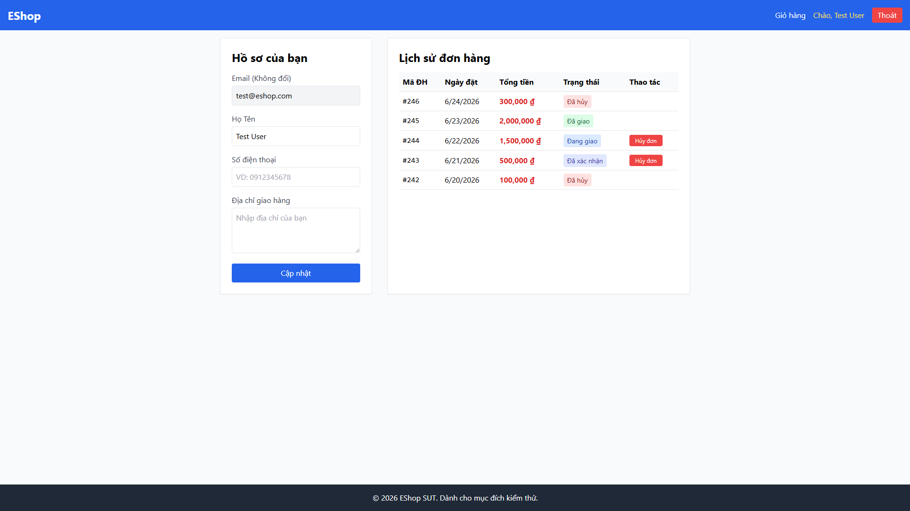
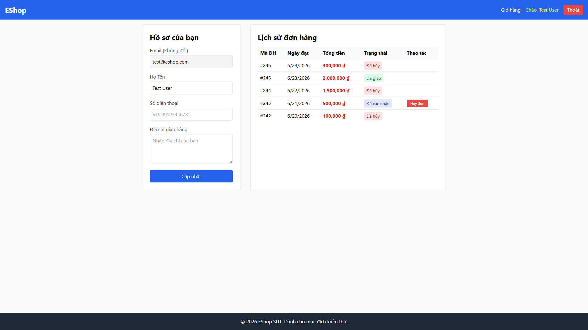
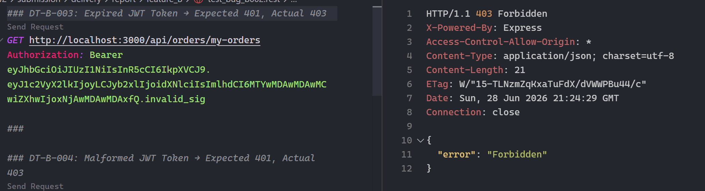
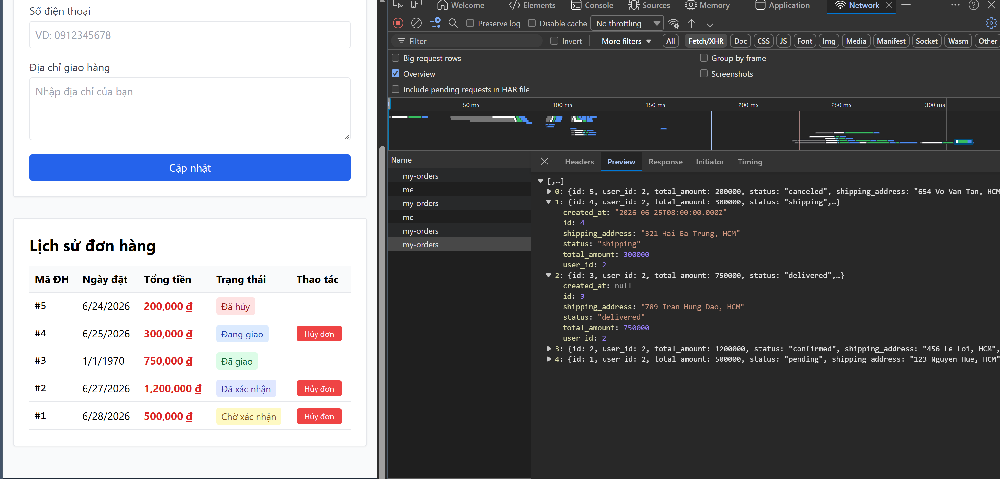
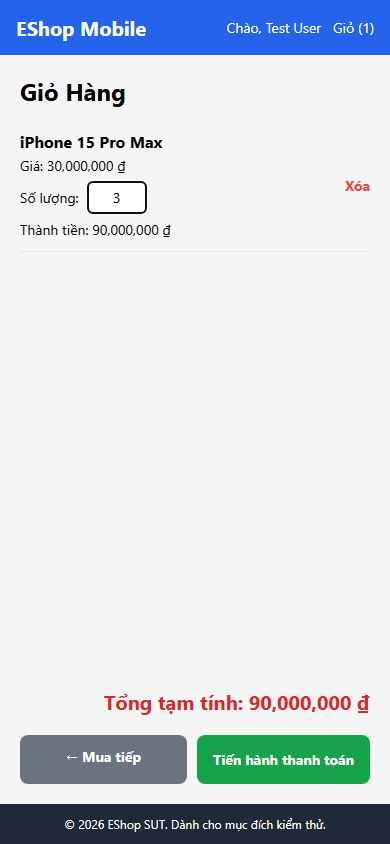
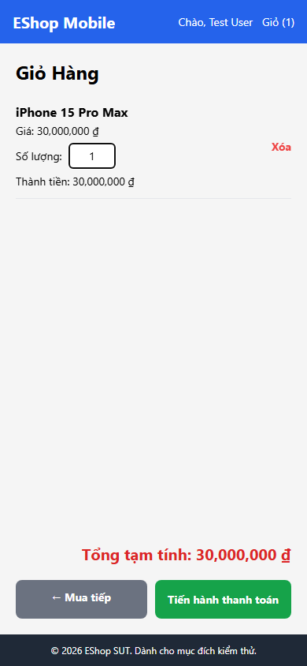
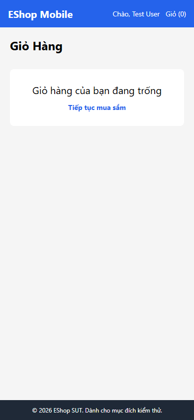

# Bug Report Summary — All Features

> **Source:** Tổng hợp từ `08_bug_report.md` của 4 features (A, B, C, D).
> Chỉ bao gồm bug phát hiện qua test FAIL thực tế — không bịa thêm.

---

## 1. Bảng tổng hợp bug (Master Table)

| Bug ID | Feature | Title | Severity | Priority | Related TC | Status | Screenshot | GitHub Issue |
| --- | --- | --- | --- | --- | --- | --- | --- | --- |
| BUG-A-001 | A — Login | Email input dùng `type="text"` thay vì `type="email"` | Medium | Medium | UI-A-001 | Open |  | [#23](https://github.com/DuyITLOR/group05_eshop/issues/23) |
| BUG-A-002 | A — Login | Password field hiển thị plaintext (`type="text"`) | High | High | UI-A-002 | Open |  | [#24](https://github.com/DuyITLOR/group05_eshop/issues/24) |
| BUG-A-003 | A — Login | Label email ghi "Username" thay vì "Email" | Low | Low | UI-A-003 | Open |  | [#25](https://github.com/DuyITLOR/group05_eshop/issues/25) |
| BUG-A-004 | A — Login | Heading ghi "Đăng Ký" thay vì "Đăng nhập" | Medium | High | UI-A-004 | Open |  | [#27](https://github.com/DuyITLOR/group05_eshop/issues/27) |
| BUG-A-005 | A — Login | Frontend không phân biệt lỗi 403 (khóa) vs 401 (sai mật khẩu) | Medium | Medium | UI-A-006 | Open |  | [#29](https://github.com/DuyITLOR/group05_eshop/issues/29) |
| BUG-A-006 | A — Login | API response trả về password dạng plaintext | Critical | Critical | DT-A-001, DT-A-014 | Open | — | — |
| BUG-B-001 | B — Orders | User cancel được order khi status=shipping (vi phạm SPEC FR-10) | High | High | DT-B-012 | Open |   | [#30](https://github.com/DuyITLOR/group05_eshop/issues/30) |
| BUG-B-002 | B — Orders | JWT verify trả 403 thay vì 401 cho expired/malformed token | Medium | Medium | DT-B-003, DT-B-004 | Open |  | [#86](https://github.com/DuyITLOR/group05_eshop/issues/86) |
| BUG-B-003 | B — Orders | NULL `created_at` hiển thị "Invalid Date" trên UI | Medium | Medium | DT-B-018 | Open |  | [#87](https://github.com/DuyITLOR/group05_eshop/issues/87) |
| BUG-C-001 | C — Category | Tạo category với tên rỗng `""` không bị reject | High | High | DT-C-007, BVA-C-001 | Open |   | [#31](https://github.com/DuyITLOR/group05_eshop/issues/31) |
| BUG-C-002 | C — Category | Tạo category không gửi field name không bị reject | High | High | DT-C-008 | Open |   | [#32](https://github.com/DuyITLOR/group05_eshop/issues/32) |
| BUG-C-003 | C — Category | Tạo category với tên whitespace-only không bị reject | Medium | Medium | DT-C-009 | Open |   | [#33](https://github.com/DuyITLOR/group05_eshop/issues/33) |
| BUG-C-004 | C — Category | XSS injection qua tên danh mục — script tag lưu nguyên trong DB | Critical | Critical | DT-C-010 | Open |   | [#34](https://github.com/DuyITLOR/group05_eshop/issues/34) |
| BUG-C-005 | C — Category | Cho phép tạo category trùng tên | Medium | Medium | DT-C-006, DT-C-026 | Open |   | [#35](https://github.com/DuyITLOR/group05_eshop/issues/35) |
| BUG-C-006 | C — Category | Update tên category thành rỗng không bị reject | High | High | DT-C-013, BVA-C-005 | Open |   | [#36](https://github.com/DuyITLOR/group05_eshop/issues/36) |
| BUG-C-007 | C — Category | Update category không gửi field name không bị reject | High | High | DT-C-014 | Open |   | [#37](https://github.com/DuyITLOR/group05_eshop/issues/37) |
| BUG-C-008 | C — Category | Update tên trùng danh mục khác không bị reject | Medium | Medium | DT-C-012 | Open |   | [#38](https://github.com/DuyITLOR/group05_eshop/issues/38) |
| BUG-C-009 | C — Category | DELETE/PUT id không tồn tại trả 200 OK (silent no-op) | Medium | High | DT-C-016, DT-C-021, BVA-C-015 | Open |   | [#39](https://github.com/DuyITLOR/group05_eshop/issues/39) |
| BUG-C-010 | C — Category | DELETE/PUT id=0 trả 200 OK | Medium | Medium | DT-C-017, BVA-C-009 | Open |   | [#40](https://github.com/DuyITLOR/group05_eshop/issues/40) |
| BUG-C-011 | C — Category | DELETE/PUT id âm trả 200 OK | Medium | Medium | DT-C-018 | Open |   | [#41](https://github.com/DuyITLOR/group05_eshop/issues/41) |
| BUG-C-012 | C — Category | DELETE/PUT id non-numeric trả 200 OK | Medium | Medium | DT-C-019 | Open |   | [#42](https://github.com/DuyITLOR/group05_eshop/issues/42) |
| BUG-C-013 | C — Category | Xóa category có products liên kết → orphan products | High | High | DT-C-023 | Open |   | [#43](https://github.com/DuyITLOR/group05_eshop/issues/43) |
| BUG-C-014 | C — Category | Trường bắt buộc không có ký hiệu `*` | Low | Medium | UI-C-003 | Open |  | [#44](https://github.com/DuyITLOR/group05_eshop/issues/44) |
| BUG-C-015 | C — Category | Xóa danh mục không có dialog xác nhận | Medium | High | UI-C-006 | Open |  | [#45](https://github.com/DuyITLOR/group05_eshop/issues/45) |
| BUG-C-016 | C — Category | Trang rỗng không có empty state | Low | Low | UI-C-007 | Open |  | [#46](https://github.com/DuyITLOR/group05_eshop/issues/46) |
| BUG-D-001 | D — Cart | Off-by-one trong cart inline edit — nhập N thành N+1 | Critical | Critical | DT-D-010, BVA-D-009→014 | Open |  | [#47](https://github.com/DuyITLOR/group05_eshop/issues/47) |
| BUG-D-002 | D — Cart | Cart inline edit qty=0 không xóa item — fallback về 1 | Medium | Medium | DT-D-014, BVA-D-008 | Open |  | [#48](https://github.com/DuyITLOR/group05_eshop/issues/48) |
| BUG-D-003 | D — Cart | Xóa sản phẩm không có dialog xác nhận | Medium | High | DT-D-023, DT-D-024 | Open |  | [#49](https://github.com/DuyITLOR/group05_eshop/issues/49) |
| BUG-D-004 | D — Cart | Không có nút +/- chỉnh quantity — chỉ có TextInput | Medium | Medium | DT-D-025 | Open |  | [#50](https://github.com/DuyITLOR/group05_eshop/issues/50) |

---

## 2. Bảng thống kê bug theo Severity

| Feature | Critical | High | Medium | Low | Tổng |
| --- | --- | --- | --- | --- | --- |
| A — FR-02 Login & Lockout | 1 | 1 | 3 | 1 | **6** |
| B — FR-11 Order History | 0 | 1 | 2 | 0 | **3** |
| C — FR-14 Category CRUD | 1 | 5 | 8 | 2 | **16** |
| D — FR-07 Mobile Cart | 1 | 0 | 3 | 0 | **4** |
| **Tổng** | **3** | **7** | **16** | **3** | **29** |

---

## 3. Cơ sở phân loại Severity

| Severity | Tiêu chí | Ví dụ trong bài |
| --- | --- | --- |
| **Critical** | Lỗ hổng bảo mật nghiêm trọng, dữ liệu bị tổn hại, hệ thống crash | BUG-C-004: XSS injection — attacker chèn script thực thi trên browser admin |
| **High** | Chức năng chính hoạt động sai so với SPEC, ảnh hưởng business logic | BUG-B-001: User bypass quyền Admin cancel shipping order. BUG-D-001: Mọi lần chỉnh qty đều sai +1 |
| **Medium** | Thiếu validation/constraint dẫn đến dữ liệu không hợp lệ, hoặc thiếu UI requirement quan trọng | BUG-C-003: Whitespace-only name được chấp nhận. BUG-D-003: Xóa item không có confirm dialog |
| **Low** | Lỗi UI cosmetic, thiếu marker/label, không ảnh hưởng chức năng | BUG-A-003: Label sai text. BUG-C-016: Thiếu empty state |

---

## 4. Chi tiết Steps to Reproduce

### BUG-A-001 — Email input dùng `type="text"` thay vì `type="email"`

**Severity:** Medium | **Feature:** A — Login | **Screenshot:** [BUG-A-001.png](report/feature_A/screenshots/BUG-A-001.png)

1. Mở `http://localhost:5173/login`
2. Nhấn F12 → Inspect trường nhập Email
3. Kiểm tra attribute `type`

**Actual:** `type="text"` — không có HTML5 email validation
**Expected:** `type="email"` — browser tự validate format email
**Root cause:** `Login.jsx` line 30

---

### BUG-A-002 — Password field hiển thị plaintext

**Severity:** High | **Feature:** A — Login | **Screenshot:** [BUG-A-002_1.png](report/feature_A/screenshots/BUG-A-002_1.png), [BUG-A-002_2.png](report/feature_A/screenshots/BUG-A-002_2.png)

1. Mở `http://localhost:5173/login`
2. Nhập password bất kỳ vào trường Password
3. Quan sát field password

**Actual:** Password hiển thị rõ từng ký tự (plaintext)
**Expected:** Password bị mask (••••••), sử dụng `type="password"`
**Root cause:** `Login.jsx` line 40

---

### BUG-A-003 — Label email ghi "Username" thay vì "Email"

**Severity:** Low | **Feature:** A — Login | **Screenshot:** [BUG-A-003.png](report/feature_A/screenshots/BUG-A-003.png)

1. Mở `http://localhost:5173/login`
2. Đọc label phía trên trường nhập đầu tiên

**Actual:** Label ghi "Username"
**Expected:** Label ghi "Email"
**Root cause:** `Login.jsx` line 28

---

### BUG-A-004 — Heading ghi "Đăng Ký" thay vì "Đăng nhập"

**Severity:** Medium | **Feature:** A — Login | **Screenshot:** [BUG-A-004.png](report/feature_A/screenshots/BUG-A-004.png)

1. Mở `http://localhost:5173/login`
2. Đọc heading (h2) ở đầu form

**Actual:** Heading ghi "Đăng Ký" — gây nhầm lẫn với chức năng Register
**Expected:** Heading ghi "Đăng nhập"
**Root cause:** `Login.jsx` line 24

---

### BUG-A-005 — Frontend không phân biệt lỗi 403 vs 401

**Severity:** Medium | **Feature:** A — Login | **Screenshot:** [BUG-A-005.png](report/feature_A/screenshots/BUG-A-005.png)

1. Set DB: `UPDATE users SET login_attempts=4, locked_until='2099-12-31T23:59:59.000Z' WHERE email='test@eshop.com'`
2. Mở `http://localhost:5173/login`
3. Nhập `test@eshop.com` / `Test1234!`
4. Bấm Sign In
5. Quan sát thông báo lỗi

**Actual:** "Đăng nhập thất bại. Vui lòng kiểm tra lại." (message chung cho cả 401 lẫn 403)
**Expected:** "Tài khoản đã bị khóa. Vui lòng thử lại sau." (message cụ thể từ API 403)
**Root cause:** `Login.jsx` lines 17-18 — catch chung, không đọc `err.response.data.error`

---

### BUG-A-006 — API response trả về password dạng plaintext

**Severity:** Critical | **Feature:** A — Login

1. POST `/api/login` với email/password hợp lệ (`test@eshop.com` / `Test1234!`)
2. Kiểm tra response body trong Network tab

**Actual:** Response `200 OK` trả về toàn bộ user object bao gồm `"password":"Test1234!"` dạng plaintext
**Expected:** Response không chứa field `password`
**Root cause:** Backend trả toàn bộ user row từ DB mà không filter sensitive fields

---

### BUG-B-001 — User cancel được order khi status=shipping

**Severity:** High | **Feature:** B — Orders | **Screenshot:** [before](report/feature_B/screenshots/BUG-B-001_before.png), [after](report/feature_B/screenshots/BUG-B-001_after.png)

1. Login as `test@eshop.com` / `Test1234!`
2. Tạo/có order với `status=shipping` trong DB
3. Vào Profile → Lịch sử đơn hàng
4. Bấm "Hủy đơn" trên order đang giao

**Actual:** `200 OK`, order status cập nhật thành `canceled`
**Expected:** `400 "Cannot cancel this order"` — SPEC FR-10: User không được phép hủy khi đang giao
**Root cause:** `server.js` line 329 — condition chỉ block `delivered` và `canceled`, thiếu `shipping`

---

### BUG-B-002 — JWT verify trả 403 thay vì 401

**Severity:** Medium | **Feature:** B — Orders | **Screenshot:** [BUG-B-002.png](report/feature_B/screenshots/BUG-B-002.png)

1. GET `/api/orders/my-orders` với expired hoặc malformed JWT token

**Actual:** `403 Forbidden`
**Expected:** `401 Unauthorized`
**Root cause:** `server.js` line 106 — `if (err) return res.status(403)`

---

### BUG-B-003 — NULL `created_at` hiển thị "Invalid Date"

**Severity:** Medium | **Feature:** B — Orders | **Screenshot:** [BUG-B-003.png](report/feature_B/screenshots/BUG-B-003.png)

1. Set DB: `UPDATE orders SET created_at=NULL WHERE id=1`
2. Login → Profile → Lịch sử đơn hàng

**Actual:** Hiển thị "Invalid Date"
**Expected:** Hiển thị "N/A" hoặc ẩn field
**Root cause:** `Profile.jsx` line 186 — không check null trước `new Date()`

---

### BUG-C-001 — Tạo category với tên rỗng không bị reject

**Severity:** High | **Feature:** C — Category | **Screenshot:** [clarify](report/feature_C/screenshots/bug-clarify/BUG-C-001.png), [test](report/feature_C/screenshots/bug-test/rest-01.png)

1. Login admin (`admin@eshop.com` / `Admin123!`), lấy JWT
2. `POST /api/categories` với body `{name: ""}`

**Actual:** `200 OK`, category created với name=""
**Expected:** `400 Bad Request` — "Tên danh mục không được để trống"
**Root cause:** Backend không validate field `name`

---

### BUG-C-002 — Tạo category không gửi field name không bị reject

**Severity:** High | **Feature:** C — Category | **Screenshot:** [clarify](report/feature_C/screenshots/bug-clarify/BUG-C-002.png), [test](report/feature_C/screenshots/bug-test/rest-02.png)

1. Login admin, lấy JWT
2. `POST /api/categories` với body `{}`

**Actual:** `200 OK`, category created với name=null
**Expected:** `400 Bad Request` — thiếu field bắt buộc
**Root cause:** Backend không validate field `name`

---

### BUG-C-003 — Tạo category với tên whitespace-only không bị reject

**Severity:** Medium | **Feature:** C — Category | **Screenshot:** [clarify](report/feature_C/screenshots/bug-clarify/BUG-C-003.png), [test](report/feature_C/screenshots/bug-test/rest-03.png)

1. Login admin, lấy JWT
2. `POST /api/categories` với body `{name: "   "}`

**Actual:** `200 OK`, category created với name="   "
**Expected:** `400 Bad Request` — whitespace-only coi như rỗng
**Root cause:** Backend không trim/validate field `name`

---

### BUG-C-004 — XSS injection qua tên danh mục

**Severity:** Critical | **Feature:** C — Category | **Screenshot:** [clarify](report/feature_C/screenshots/bug-clarify/BUG-C-004.png), [test](report/feature_C/screenshots/bug-test/rest-04.png)

1. Login admin, lấy JWT
2. `POST /api/categories` với body `{name: ""}`
3. `GET /api/categories` → kiểm tra response

**Actual:** `200 OK`, `` lưu nguyên trong DB
**Expected:** `400 Bad Request` hoặc sanitize — không cho lưu HTML/script tag
**Root cause:** Backend không sanitize input. Khi frontend render → script có thể thực thi

---

### BUG-C-005 — Cho phép tạo category trùng tên

**Severity:** Medium | **Feature:** C — Category | **Screenshot:** [clarify](report/feature_C/screenshots/bug-clarify/BUG-C-005.png), [test](report/feature_C/screenshots/bug-test/rest-05.png)

1. Login admin, lấy JWT
2. `POST /api/categories` với body `{name: "Điện thoại"}` (seed đã có tên này)

**Actual:** `200 OK`, tạo thêm category cùng tên với id mới
**Expected:** `400/409 Conflict` — tên đã tồn tại
**Root cause:** DB thiếu UNIQUE constraint trên column `name`

---

### BUG-C-006 — Update tên category thành rỗng không bị reject

**Severity:** High | **Feature:** C — Category | **Screenshot:** [clarify](report/feature_C/screenshots/bug-clarify/BUG-C-006.png), [test](report/feature_C/screenshots/bug-test/rest-06.png)

1. Login admin, lấy JWT
2. `PUT /api/categories/3` với body `{name: ""}`

**Actual:** `200 OK`, name set thành ""
**Expected:** `400 Bad Request` — tên không được rỗng
**Root cause:** Backend không validate field `name` khi update

---

### BUG-C-007 — Update category không gửi field name không bị reject

**Severity:** High | **Feature:** C — Category | **Screenshot:** [clarify](report/feature_C/screenshots/bug-clarify/BUG-C-007.png), [test](report/feature_C/screenshots/bug-test/rest-07.png)

1. Login admin, lấy JWT
2. `PUT /api/categories/3` với body `{}`

**Actual:** `200 OK`, name set thành null
**Expected:** `400 Bad Request` — thiếu field bắt buộc
**Root cause:** Backend không validate field `name` khi update

---

### BUG-C-008 — Update tên trùng danh mục khác không bị reject

**Severity:** Medium | **Feature:** C — Category | **Screenshot:** [clarify](report/feature_C/screenshots/bug-clarify/BUG-C-008.png), [test](report/feature_C/screenshots/bug-test/rest-08.png)

1. Login admin, lấy JWT
2. `PUT /api/categories/3` với body `{name: "Laptop"}` (id=2 đã có tên "Laptop")

**Actual:** `200 OK`, tên cập nhật thành "Laptop" (trùng)
**Expected:** `400/409 Conflict` — tên trùng
**Root cause:** DB thiếu UNIQUE constraint trên `name`

---

### BUG-C-009 — DELETE/PUT id không tồn tại trả 200 OK (silent no-op)

**Severity:** Medium | **Feature:** C — Category | **Screenshot:** [clarify](report/feature_C/screenshots/bug-clarify/BUG-C-009.png), [test](report/feature_C/screenshots/bug-test/rest-09.png)

1. Login admin, lấy JWT
2. `DELETE /api/categories/9999`

**Actual:** `200 OK`, `{message: "Category deleted"}` dù không có id=9999
**Expected:** `404 Not Found`
**Root cause:** Backend không check `this.changes` sau DELETE/UPDATE query

---

### BUG-C-010 — DELETE/PUT id=0 trả 200 OK

**Severity:** Medium | **Feature:** C — Category | **Screenshot:** [clarify](report/feature_C/screenshots/bug-clarify/BUG-C-010.png), [test](report/feature_C/screenshots/bug-test/rest-10.png)

1. Login admin, lấy JWT
2. `DELETE /api/categories/0`

**Actual:** `200 OK`, `{message: "Category deleted"}`
**Expected:** `400/404` — id=0 không hợp lệ (AUTOINCREMENT từ 1)
**Root cause:** Backend không validate id range

---

### BUG-C-011 — DELETE/PUT id âm trả 200 OK

**Severity:** Medium | **Feature:** C — Category | **Screenshot:** [clarify](report/feature_C/screenshots/bug-clarify/BUG-C-011.png), [test](report/feature_C/screenshots/bug-test/rest-11.png)

1. Login admin, lấy JWT
2. `DELETE /api/categories/-1`

**Actual:** `200 OK`, `{message: "Category deleted"}`
**Expected:** `400/404` — id âm không hợp lệ
**Root cause:** Backend không validate id range

---

### BUG-C-012 — DELETE/PUT id non-numeric trả 200 OK

**Severity:** Medium | **Feature:** C — Category | **Screenshot:** [clarify](report/feature_C/screenshots/bug-clarify/BUG-C-012.png), [test](report/feature_C/screenshots/bug-test/rest-12.png)

1. Login admin, lấy JWT
2. `DELETE /api/categories/abc`

**Actual:** `200 OK`, `{message: "Category deleted"}`
**Expected:** `400 Bad Request` — id phải là số
**Root cause:** Backend không validate id type

---

### BUG-C-013 — Xóa category có products liên kết → orphan products

**Severity:** High | **Feature:** C — Category | **Screenshot:** [clarify](report/feature_C/screenshots/bug-clarify/BUG-C-013.png), [test](report/feature_C/screenshots/bug-test/rest-13.png)

1. Login admin, lấy JWT
2. `DELETE /api/categories/1` (seed: category "Điện thoại" có products dùng category_id=1)
3. `GET /api/products` → kiểm tra

**Actual:** `200 OK`, category xóa thành công. Products có category_id=1 trở thành orphan
**Expected:** `400/409 Conflict` — không cho xóa khi có products liên kết
**Root cause:** DB thiếu FOREIGN KEY / ON DELETE constraint

---

### BUG-C-014 — Trường bắt buộc không có ký hiệu `*`

**Severity:** Low | **Feature:** C — Category | **Screenshot:** [img](report/feature_C/screenshots/bug-test/ui-c-003-required-field.png)

1. Login admin → tab "Danh mục"
2. Quan sát form thêm danh mục

**Actual:** Không có `*` bên cạnh nhãn. Input không có attribute `required`
**Expected:** Trường bắt buộc phải có `*` (FR-22)
**Root cause:** Frontend thiếu UI marker

---

### BUG-C-015 — Xóa danh mục không có dialog xác nhận

**Severity:** Medium | **Feature:** C — Category | **Screenshot:** [img](report/feature_C/screenshots/bug-test/ui-c-006-delete-confirm.png)

1. Login admin → tab "Danh mục"
2. Click nút "Xóa" bên cạnh 1 danh mục

**Actual:** Category bị xóa ngay lập tức — không có confirm dialog
**Expected:** Hiển thị confirm dialog trước khi xóa (FR-24)
**Root cause:** Frontend không implement confirmation

---

### BUG-C-016 — Trang danh mục rỗng không có empty state

**Severity:** Low | **Feature:** C — Category | **Screenshot:** [img](report/feature_C/screenshots/bug-test/ui-c-007-empty-state.png)

1. Login admin → tab "Danh mục"
2. Xóa hết categories
3. Quan sát giao diện

**Actual:** Bảng trống, không có message/icon thân thiện
**Expected:** Hiển thị empty state với icon + message (FR-24)
**Root cause:** Frontend thiếu empty state component

---

### BUG-D-001 — Off-by-one trong cart inline edit — nhập N thành N+1

**Severity:** Critical | **Feature:** D — Cart | **Screenshot:** [before](report/feature_D/screenshots/BUG-D-001-before.png), [after](report/feature_D/screenshots/BUG-D-001.png)

1. Thêm sản phẩm vào giỏ hàng
2. Vào màn hình Cart
3. Đổi ô quantity thành `"2"`

**Actual:** quantity = **3** (parsed+1). Tổng tiền tính sai theo.
**Expected:** quantity = 2
**Root cause:** `App.js:620` dùng `parsed + 1` thay vì `parsed`

---

### BUG-D-002 — Cart inline edit qty=0 không xóa item

**Severity:** Medium | **Feature:** D — Cart | **Screenshot:** [img](report/feature_D/screenshots/BUG-D-002.png)

1. Thêm sản phẩm vào giỏ hàng
2. Vào màn hình Cart
3. Đổi ô quantity thành `"0"`

**Actual:** quantity fallback = 1. Item vẫn còn trong giỏ.
**Expected:** Item bị xóa khỏi giỏ hàng (qty=0 = không mua)
**Root cause:** `App.js:617-621` fallback về 1 thay vì remove

---

### BUG-D-003 — Xóa sản phẩm không có dialog xác nhận

**Severity:** Medium | **Feature:** D — Cart | **Screenshot:** [before](report/feature_D/screenshots/BUG-D-003-before.png), [after](report/feature_D/screenshots/BUG-D-003.png)

1. Thêm sản phẩm vào giỏ hàng
2. Vào màn hình Cart
3. Bấm "Xóa" bên cạnh 1 sản phẩm

**Actual:** Item bị xóa ngay lập tức, không hỏi xác nhận
**Expected:** Hiển thị dialog xác nhận trước khi xóa (FR-07)
**Root cause:** `App.js:630` — `removeFromCart` gọi trực tiếp không qua Alert confirm

---

### BUG-D-004 — Không có nút +/- chỉnh quantity

**Severity:** Medium | **Feature:** D — Cart | **Screenshot:** [img](report/feature_D/screenshots/BUG-D-004.png)

1. Thêm sản phẩm vào giỏ hàng
2. Vào màn hình Cart
3. Quan sát cách chỉnh số lượng

**Actual:** Chỉ có TextInput nhập số trực tiếp. Không có nút "+" và "−"
**Expected:** Có nút "+" và "−" bên cạnh số lượng (FR-07)
**Root cause:** Implementation chọn TextInput thay nút stepper
