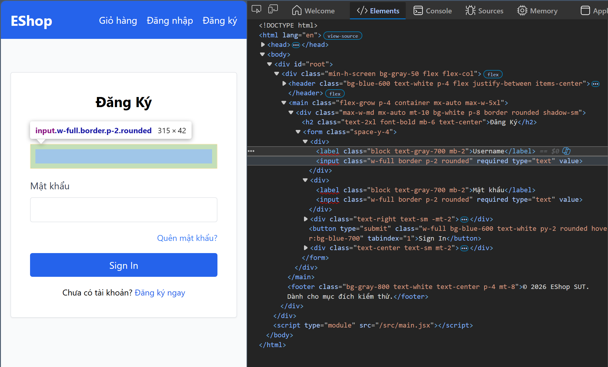
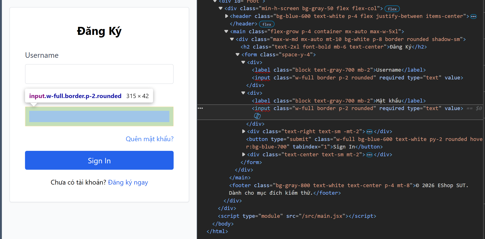
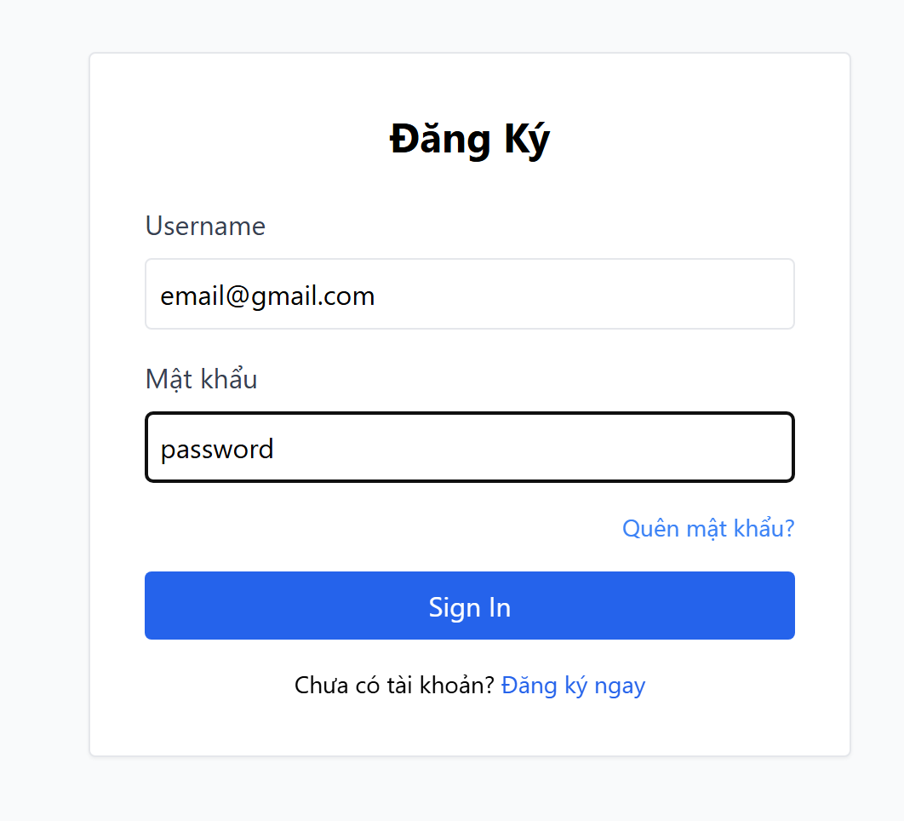
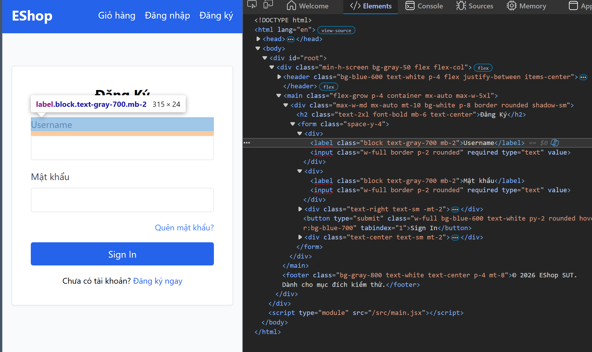
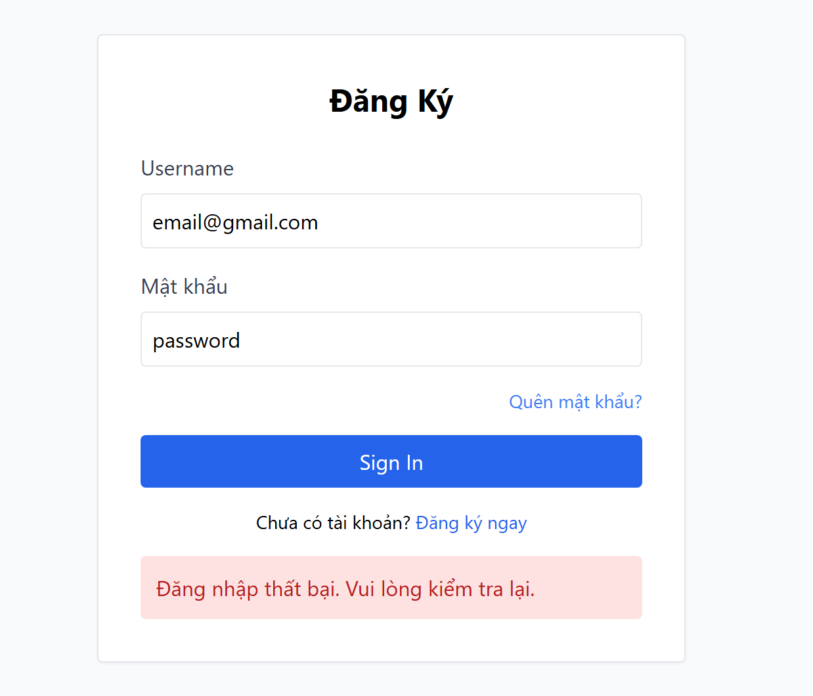

# 08 — Bug Report: feature_A (FR-02 — Login & Account Lockout)

---

### BUG-A-001 — Email input dùng `type="text"` thay vì `type="email"`

**Severity:** Medium
**Priority:** Medium

**Steps to reproduce**

1. Mở `/login`
2. Nhấn F12 → Inspect trường nhập Email
3. Kiểm tra attribute `type`

**Actual**
`type="text"` — không có HTML5 email validation (browser không kiểm tra format `@`, `.`)

**Expected**
`type="email"` — browser tự validate format email trước khi submit

**Notes**
Root cause: `Login.jsx` line 30. Related TC: UI-A-001

**Screenshot**

---

### BUG-A-002 — Password field hiển thị plaintext

**Severity:** High
**Priority:** High

**Steps to reproduce**

1. Mở `/login`
2. Nhập password bất kỳ
3. Quan sát field password

**Actual**
Password hiển thị rõ từng ký tự (plaintext)

**Expected**
Password phải được mask (••••••), sử dụng `type="password"`

**Notes**
Ảnh hưởng đến bảo mật (shoulder surfing). Root cause: `Login.jsx` line 40. Related TC: UI-A-002

**Screenshot**

---

### BUG-A-003 — Label trường email ghi "Username" thay vì "Email"

**Severity:** Low
**Priority:** Low

**Steps to reproduce**

1. Mở `/login`
2. Đọc label phía trên trường nhập đầu tiên

**Actual**
Label ghi "Username"

**Expected**
Label ghi "Email" (đúng với data type và backend field name)

**Notes**
Root cause: `Login.jsx` line 28. Related TC: UI-A-003

**Screenshot**

---

### BUG-A-004 — Heading trang Login ghi "Đăng Ký" thay vì "Đăng nhập"

**Severity:** Medium
**Priority:** High

**Steps to reproduce**

1. Mở `/login`
2. Đọc heading (h2) ở đầu form

**Actual**
Heading ghi "Đăng Ký" — gây nhầm lẫn với chức năng Register

**Expected**
Heading ghi "Đăng nhập" (đúng chức năng Login)

**Notes**
User tưởng đang ở trang đăng ký thay vì đăng nhập. Root cause: `Login.jsx` line 24. Related TC: UI-A-004

**Screenshot**

---

### BUG-A-005 — Frontend không phân biệt lỗi khóa tài khoản (403) vs sai mật khẩu (401)

**Severity:** Medium
**Priority:** Medium

**Steps to reproduce**

1. Set DB: `UPDATE users SET login_attempts=4, locked_until='2099-12-31T23:59:59.000Z' WHERE email='test@eshop.com'`
2. Mở `/login`
3. Nhập email `test@eshop.com` + password `Test1234!`
4. Bấm Sign In
5. Quan sát thông báo lỗi

**Actual**
Hiển thị "Đăng nhập thất bại. Vui lòng kiểm tra lại." (message chung cho cả 401 lẫn 403)

**Expected**
Hiển thị "Tài khoản đã bị khóa. Vui lòng thử lại sau." (message cụ thể từ API 403)

**Notes**
User bị khóa không biết lý do, không biết cần chờ bao lâu. Root cause: `Login.jsx` line 17-18 catch chung, không đọc `err.response.data.error`. Related TC: UI-A-006

**Screenshot**

---

### BUG-A-006 — API response trả về password dạng plaintext

**Severity:** Critical
**Priority:** Critical

**Steps to reproduce**

1. POST `/api/login` với email/password hợp lệ (`test@eshop.com` / `Test1234!`)
2. Kiểm tra response body trong Network tab

**Actual**
Response `200 OK` trả về toàn bộ user object bao gồm `"password":"Test1234!"` dạng plaintext.

**Expected**
Response không chứa field `password` — chỉ trả về thông tin cần thiết (token, role, name).

**Notes**
Lộ mật khẩu qua network traffic. Vi phạm nguyên tắc bảo mật cơ bản — password không bao giờ được trả về cho client. Related TC: DT-A-001, DT-A-014. Ref: OBS-01 trong `07_execution.md`.

---

## Thống kê

| Severity | Count | Bug IDs |
| --- | --- | --- |
| Critical | 1 | BUG-A-006 |
| High | 1 | BUG-A-002 |
| Medium | 3 | BUG-A-001, BUG-A-004, BUG-A-005 |
| Low | 1 | BUG-A-003 |
| **Tổng** | **6** | |
