# 08 — Bug Report: feature_C (FR-14 — Category Management CRUD)

---

### BUG-C-001 — Tạo category với tên rỗng không bị reject

**Severity:** High
**Priority:** High

**Steps to reproduce**

1. Login admin, lấy JWT
2. `POST /api/categories` với body `{name: ""}`

**Actual**
`200 OK`, category created với name=""

**Expected**
`400 Bad Request` — "Tên danh mục không được để trống" (FR-14)

**Notes**
Backend không validate name. Related TC: DT-C-007, BVA-C-001

**Screenshot**
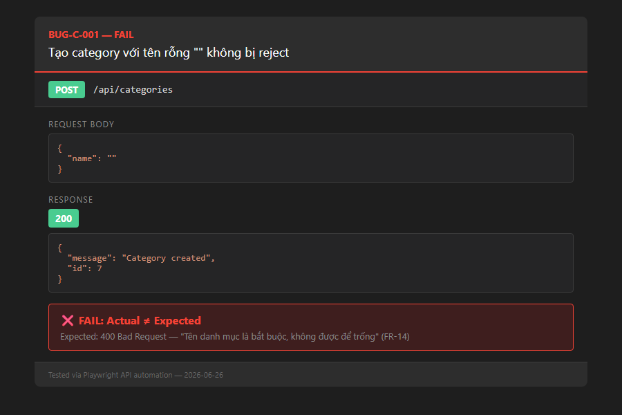
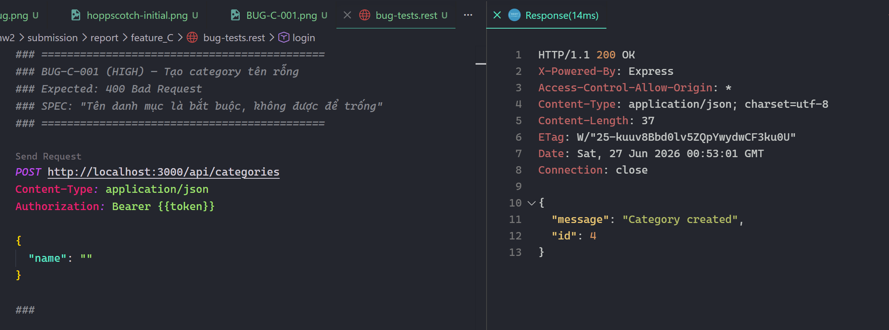

---

### BUG-C-002 — Tạo category không gửi field name không bị reject

**Severity:** High
**Priority:** High

**Steps to reproduce**

1. Login admin, lấy JWT
2. `POST /api/categories` với body `{}`

**Actual**
`200 OK`, category created với name=null

**Expected**
`400 Bad Request` — thiếu field bắt buộc

**Notes**
Related TC: DT-C-008

**Screenshot**
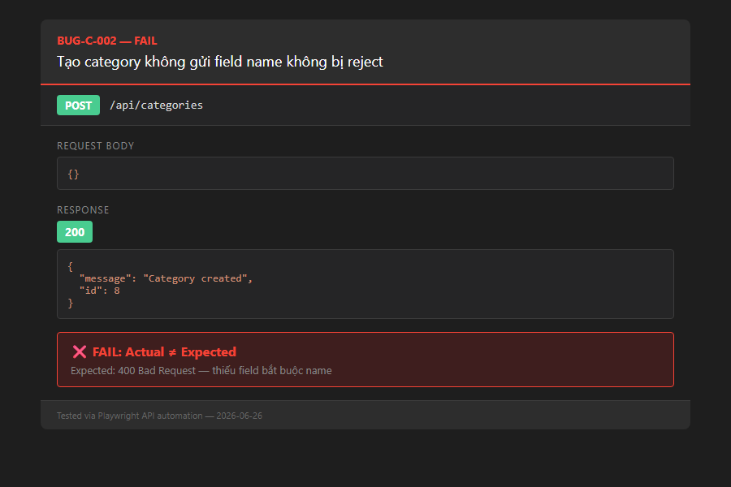
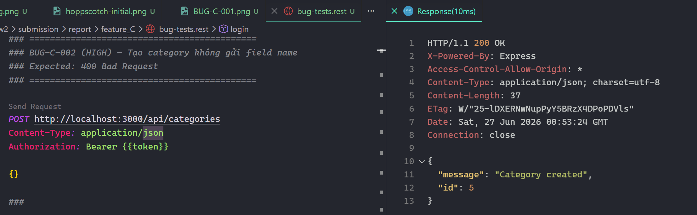

---

### BUG-C-003 — Tạo category với tên whitespace-only không bị reject

**Severity:** Medium
**Priority:** Medium

**Steps to reproduce**

1. Login admin, lấy JWT
2. `POST /api/categories` với body `{name: "   "}`

**Actual**
`200 OK`, category created với name="   "

**Expected**
`400 Bad Request` — whitespace-only coi như rỗng

**Notes**
Related TC: DT-C-009

**Screenshot**
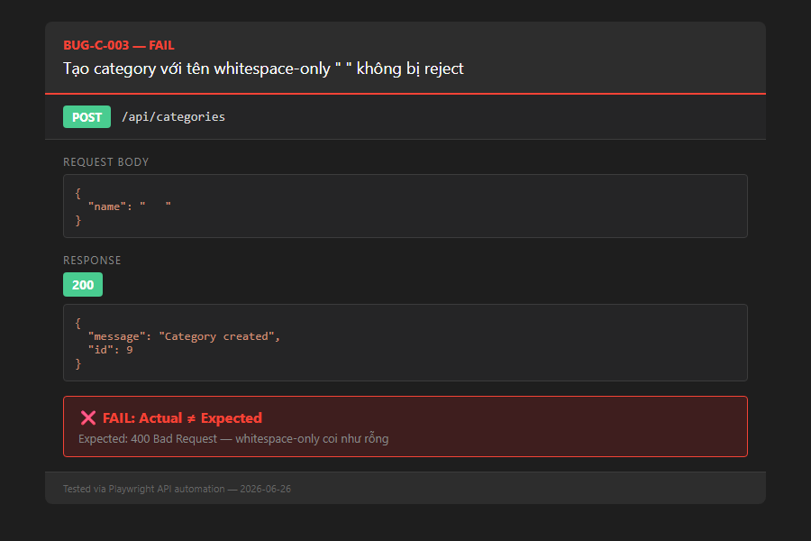
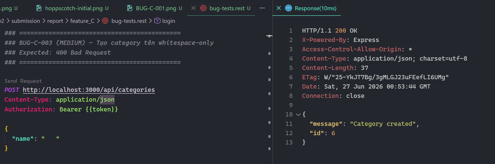

---

### BUG-C-004 — XSS injection qua tên danh mục

**Severity:** Critical
**Priority:** Critical

**Steps to reproduce**

1. Login admin, lấy JWT
2. `POST /api/categories` với body `{name: ""}`
3. `GET /api/categories` → kiểm tra

**Actual**
`200 OK`, `` lưu nguyên trong DB

**Expected**
`400 Bad Request` hoặc sanitize — không cho lưu HTML/script tag

**Notes**
Khi frontend render tên danh mục, script có thể thực thi → XSS attack. Related TC: DT-C-010

**Screenshot**
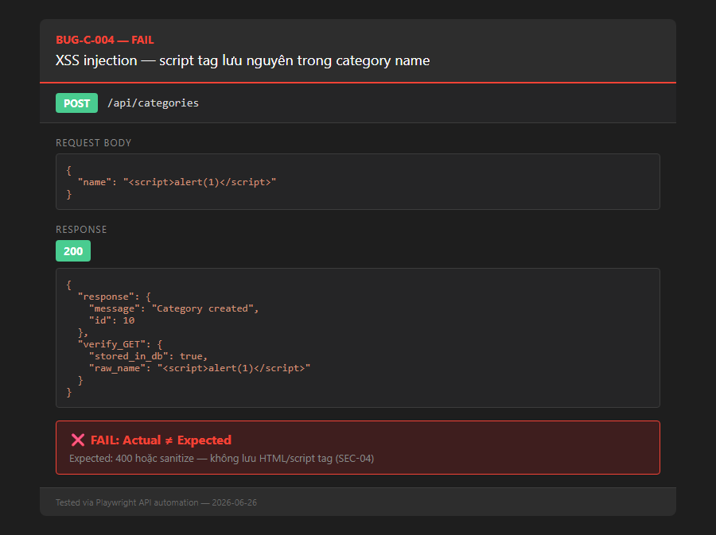
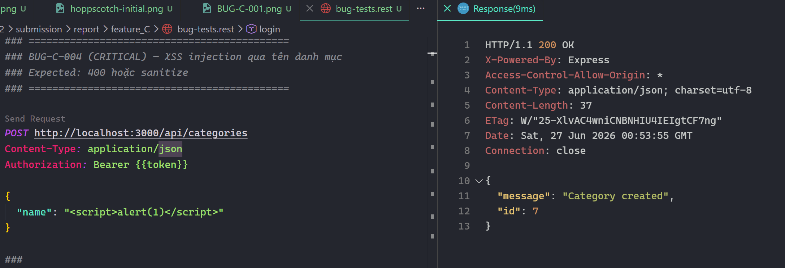

---

### BUG-C-005 — Cho phép tạo category trùng tên

**Severity:** Medium
**Priority:** Medium

**Steps to reproduce**

1. Login admin, lấy JWT
2. `POST /api/categories` với body `{name: "Điện thoại"}` (seed đã có)

**Actual**
`200 OK`, tạo thêm category cùng tên "Điện thoại" với id mới

**Expected**
`400/409 Conflict` — tên đã tồn tại

**Notes**
DB thiếu UNIQUE constraint trên `name`. Related TC: DT-C-006, DT-C-026

**Screenshot**
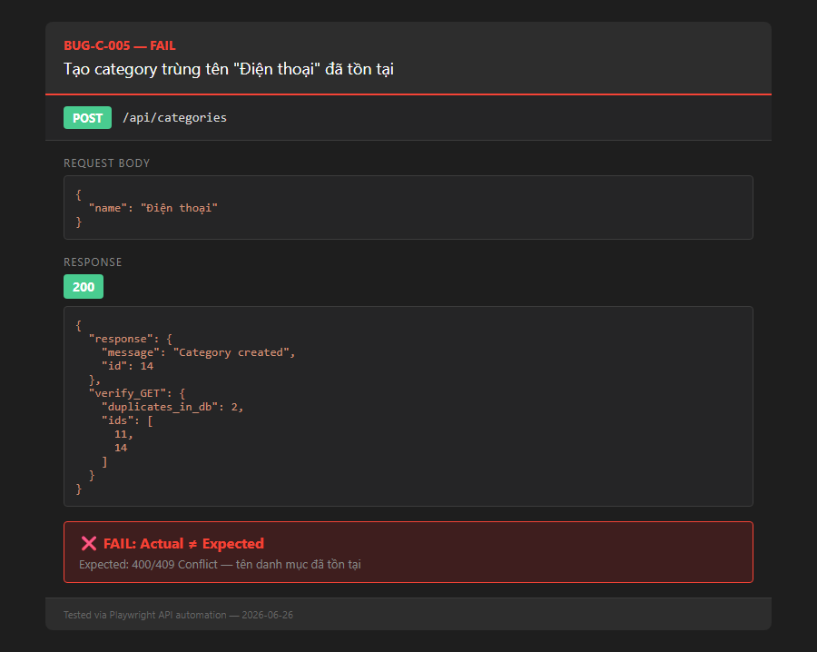
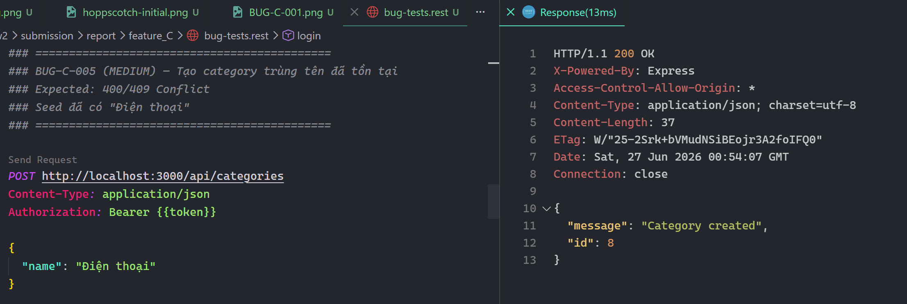

---

### BUG-C-006 — Update tên category thành rỗng không bị reject

**Severity:** High
**Priority:** High

**Steps to reproduce**

1. Login admin, lấy JWT
2. `PUT /api/categories/3` với body `{name: ""}`

**Actual**
`200 OK`, name set thành ""

**Expected**
`400 Bad Request` — tên không được rỗng

**Notes**
Related TC: DT-C-013, BVA-C-005

**Screenshot**
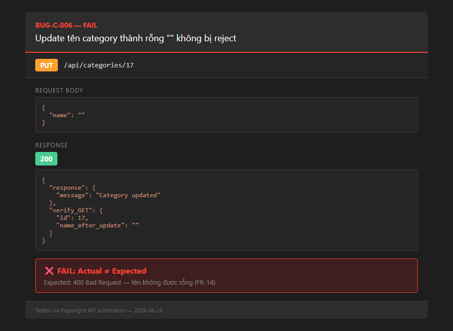
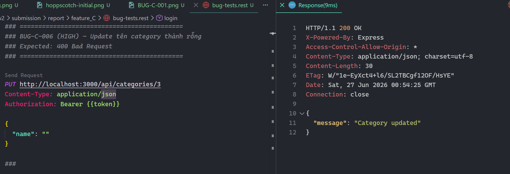

---

### BUG-C-007 — Update category không gửi field name không bị reject

**Severity:** High
**Priority:** High

**Steps to reproduce**

1. Login admin, lấy JWT
2. `PUT /api/categories/3` với body `{}`

**Actual**
`200 OK`, name set thành null

**Expected**
`400 Bad Request` — thiếu field bắt buộc

**Notes**
Related TC: DT-C-014

**Screenshot**
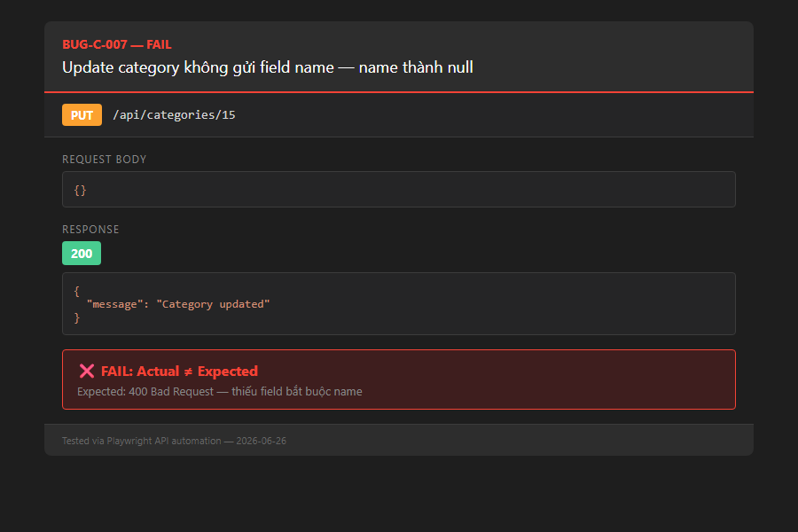
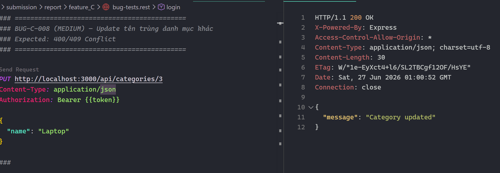

---

### BUG-C-008 — Update tên category trùng danh mục khác không bị reject

**Severity:** Medium
**Priority:** Medium

**Steps to reproduce**

1. Login admin, lấy JWT
2. `PUT /api/categories/3` với body `{name: "Laptop"}` (id=2 đã có tên "Laptop")

**Actual**
`200 OK`, tên cập nhật thành "Laptop" (trùng)

**Expected**
`400/409 Conflict` — tên trùng

**Notes**
Related TC: DT-C-012

**Screenshot**
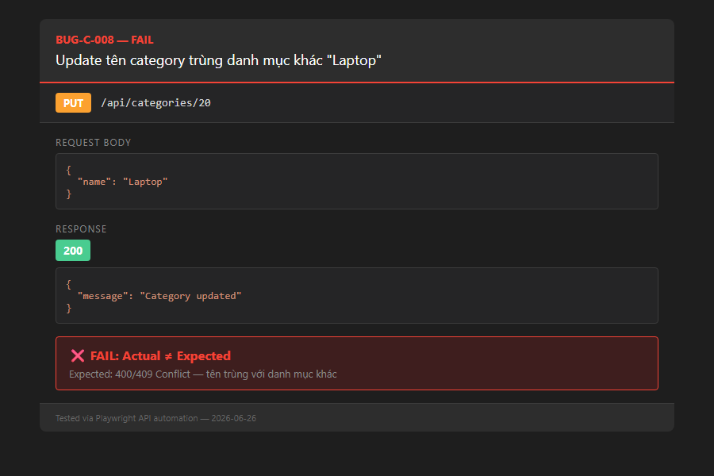
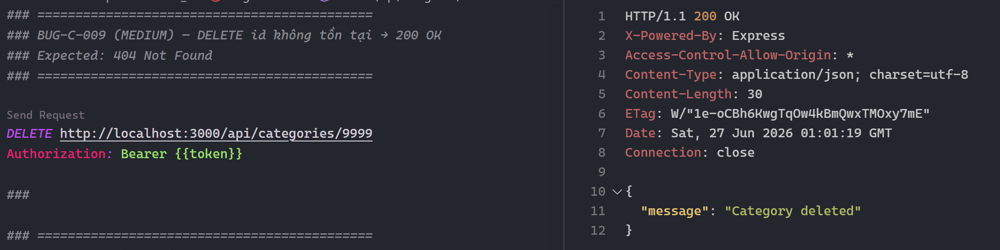

---

### BUG-C-009 — DELETE/PUT với id không tồn tại trả 200 OK (silent no-op)

**Severity:** Medium
**Priority:** High

**Steps to reproduce**

1. Login admin, lấy JWT
2. `DELETE /api/categories/9999`

**Actual**
`200 OK`, `{message: "Category deleted"}` dù không có id=9999

**Expected**
`404 Not Found`

**Notes**
Backend không check `this.changes` sau DELETE/UPDATE. Related TC: DT-C-016, DT-C-021, BVA-C-015

**Screenshot**
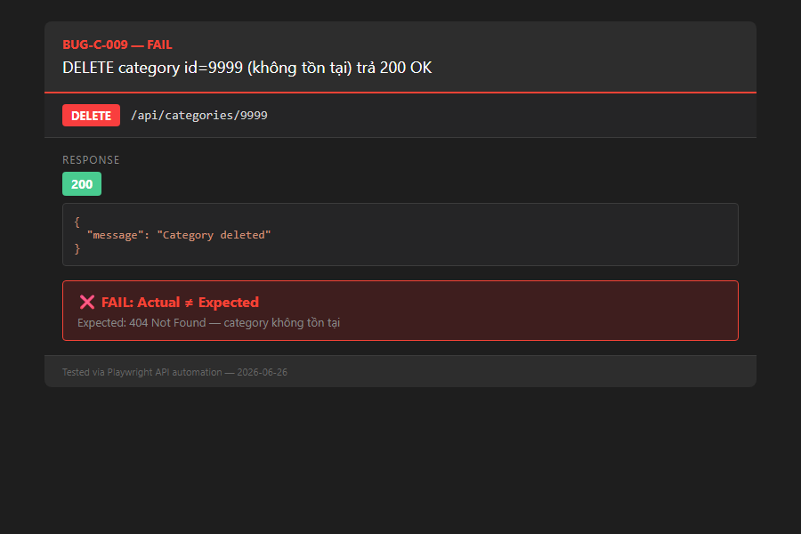
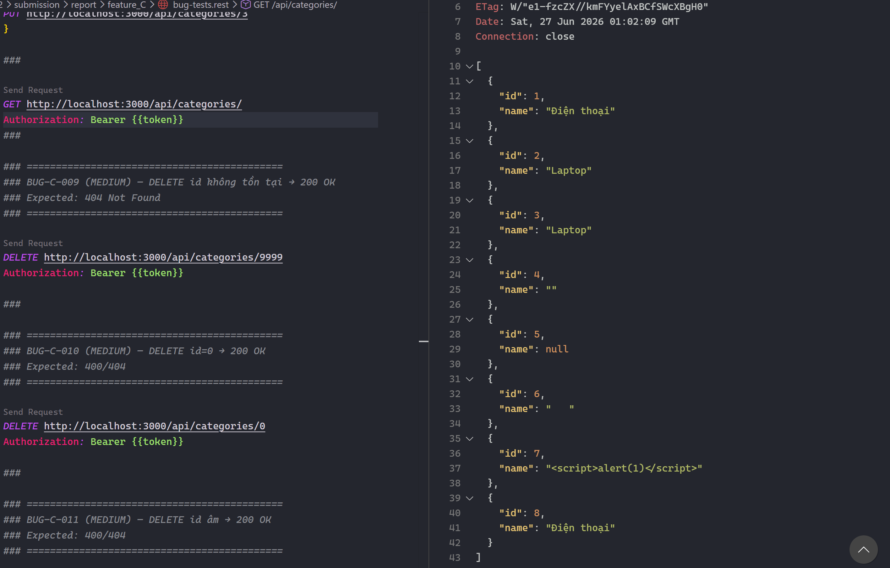

---

### BUG-C-010 — DELETE/PUT với id=0 trả 200 OK

**Severity:** Medium
**Priority:** Medium

**Steps to reproduce**

1. Login admin, lấy JWT
2. `DELETE /api/categories/0`

**Actual**
`200 OK`, `{message: "Category deleted"}`

**Expected**
`400/404` — id=0 không hợp lệ (AUTOINCREMENT từ 1)

**Notes**
Related TC: DT-C-017, BVA-C-009

**Screenshot**
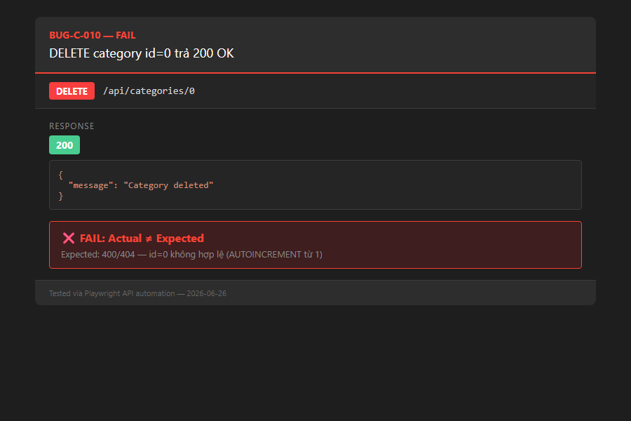
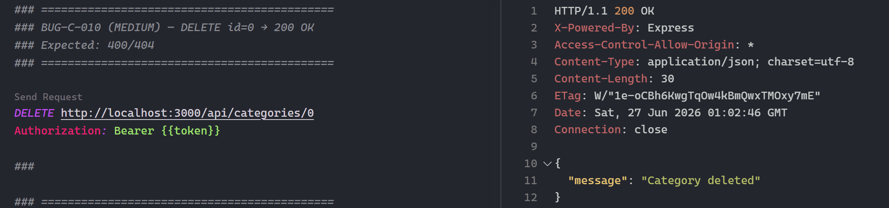

---

### BUG-C-011 — DELETE/PUT với id âm trả 200 OK

**Severity:** Medium
**Priority:** Medium

**Steps to reproduce**

1. Login admin, lấy JWT
2. `DELETE /api/categories/-1`

**Actual**
`200 OK`, `{message: "Category deleted"}`

**Expected**
`400/404` — id âm không hợp lệ

**Notes**
Related TC: DT-C-018

**Screenshot**
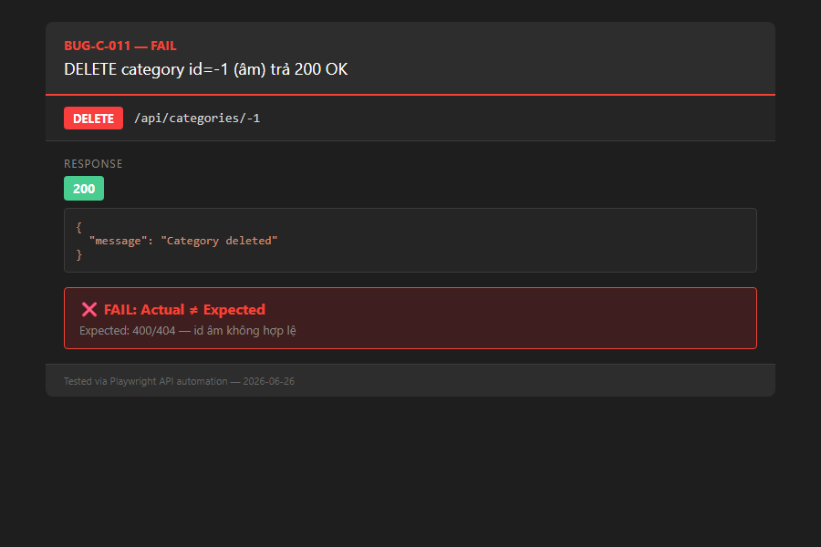
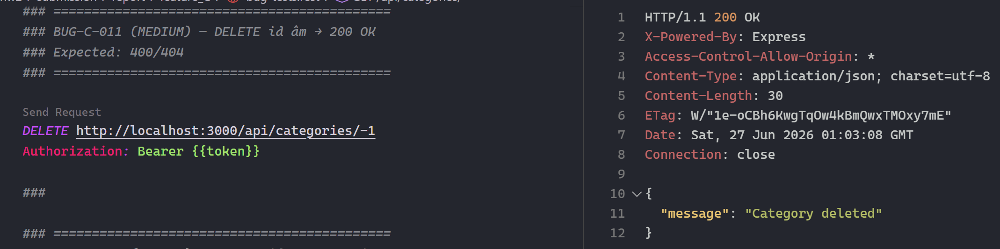

---

### BUG-C-012 — DELETE/PUT với id non-numeric trả 200 OK

**Severity:** Medium
**Priority:** Medium

**Steps to reproduce**

1. Login admin, lấy JWT
2. `DELETE /api/categories/abc`

**Actual**
`200 OK`, `{message: "Category deleted"}`

**Expected**
`400 Bad Request` — id phải là số

**Notes**
Related TC: DT-C-019

**Screenshot**
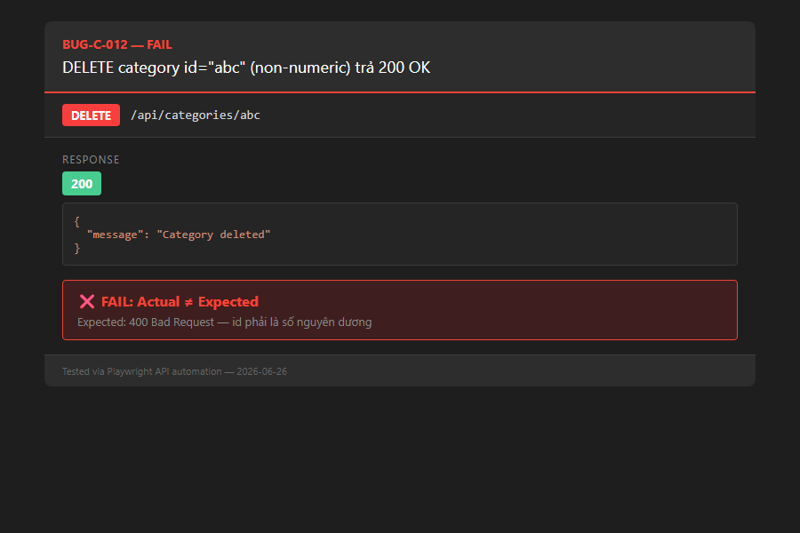
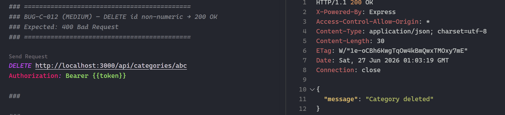

---

### BUG-C-013 — Xóa category có products liên kết → orphan products

**Severity:** High
**Priority:** High

**Steps to reproduce**

1. Login admin, lấy JWT
2. `DELETE /api/categories/1` (seed: category "Điện thoại" có products dùng category_id=1)
3. `GET /api/products` → kiểm tra

**Actual**
`200 OK`, category xóa thành công. Products có category_id=1 trở thành orphan

**Expected**
`400/409 Conflict` — không cho xóa khi có products liên kết

**Notes**
DB thiếu FOREIGN KEY / ON DELETE constraint. Related TC: DT-C-023

**Screenshot**
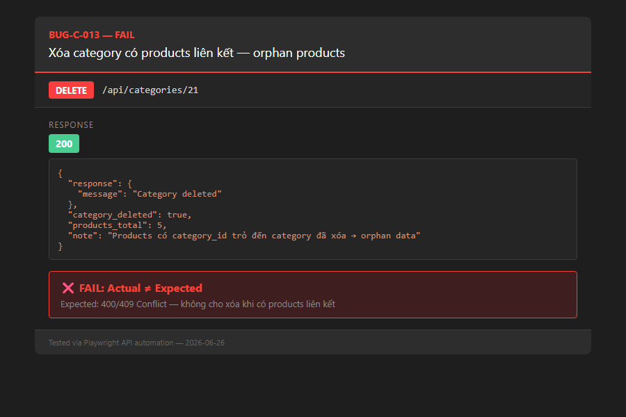
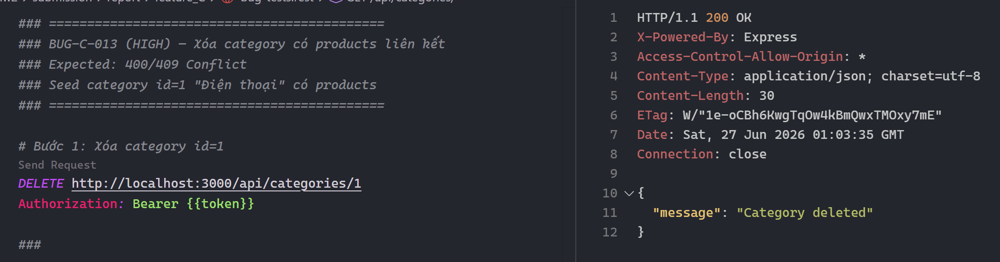

---

### BUG-C-014 — Trường bắt buộc "Tên danh mục" không có ký hiệu `*`

**Severity:** Low
**Priority:** Medium

**Steps to reproduce**

1. Login admin
2. Vào tab "Danh mục"
3. Quan sát form thêm danh mục

**Actual**
Không có `*` bên cạnh nhãn. Input không có attribute `required`

**Expected**
Trường bắt buộc phải có `*` (FR-22)

**Notes**
Related TC: UI-C-003

**Screenshot**
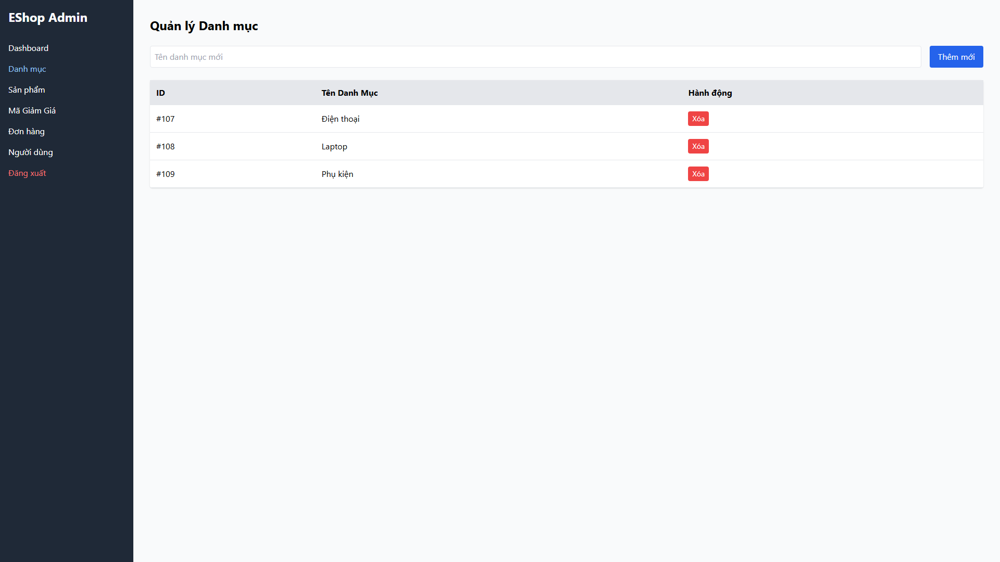

---

### BUG-C-015 — Xóa danh mục không có dialog xác nhận

**Severity:** Medium
**Priority:** High

**Steps to reproduce**

1. Login admin → tab "Danh mục"
2. Click nút "Xóa" bên cạnh 1 danh mục

**Actual**
Category bị xóa ngay lập tức — không có confirm dialog

**Expected**
Hiển thị confirm dialog trước khi xóa (FR-24)

**Notes**
Related TC: UI-C-006

**Screenshot**
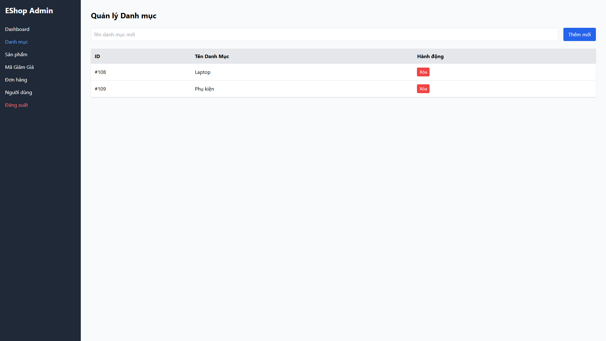

---

### BUG-C-016 — Trang danh mục rỗng không có empty state

**Severity:** Low
**Priority:** Low

**Steps to reproduce**

1. Login admin → tab "Danh mục"
2. Xóa hết categories
3. Quan sát giao diện

**Actual**
Bảng trống, không có message/icon thân thiện

**Expected**
Hiển thị empty state với icon + message (FR-24)

**Notes**
Related TC: UI-C-007

**Screenshot**
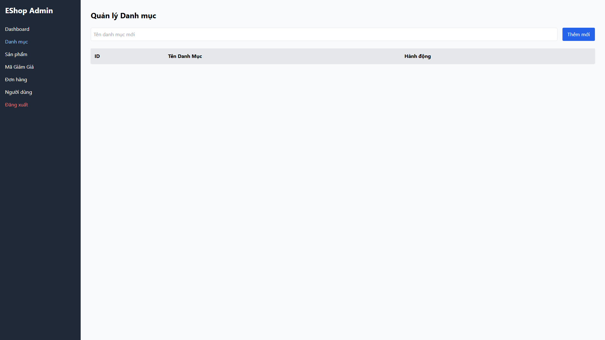

---

## Thống kê

| Severity | Count | Bug IDs |
| --- | --- | --- |
| Critical | 1 | BUG-C-004 |
| High | 5 | BUG-C-001, BUG-C-002, BUG-C-006, BUG-C-007, BUG-C-013 |
| Medium | 8 | BUG-C-003, BUG-C-005, BUG-C-008, BUG-C-009, BUG-C-010, BUG-C-011, BUG-C-012, BUG-C-015 |
| Low | 2 | BUG-C-014, BUG-C-016 |
| **Tổng** | **16** | |
