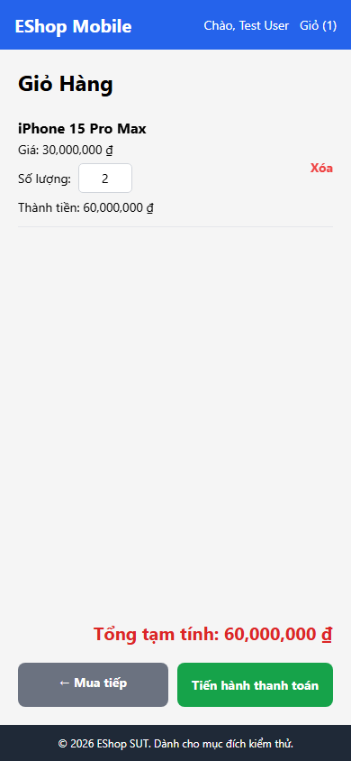

# 08 — Bug Report: feature_D (FR-07 — Mobile Shopping Cart)

---

### BUG-D-001 — Off-by-one trong cart inline edit — nhập N thành N+1

**Severity:** High
**Priority:** High

**Steps to reproduce**

1. Thêm sản phẩm vào giỏ hàng
2. Vào màn hình Cart
3. Đổi ô quantity thành `"2"`

**Actual**
quantity = **3** (parsed+1). Tổng tiền tính sai theo.

**Expected**
quantity = 2. Tổng tiền cập nhật đúng.

**Notes**
Root cause: App.js:620 dùng `parsed + 1` thay vì `parsed`. Related TC: DT-D-010, DT-D-011, DT-D-012, BVA-D-009→BVA-D-014

**Screenshot**

---

### BUG-D-002 — Cart inline edit qty=0 không xóa item — fallback về 1

**Severity:** Medium
**Priority:** Medium

**Steps to reproduce**

1. Thêm sản phẩm vào giỏ hàng
2. Vào màn hình Cart
3. Đổi ô quantity thành `"0"`

**Actual**
quantity fallback = 1. Item vẫn còn trong giỏ.

**Expected**
Item bị xóa khỏi giỏ hàng (qty=0 = không mua).

**Notes**
App.js:617-621 fallback về 1 thay vì remove. Related TC: DT-D-014, BVA-D-008

**Screenshot**

---

### BUG-D-003 — Xóa sản phẩm không có dialog xác nhận

**Severity:** Medium
**Priority:** High

**Steps to reproduce**

1. Thêm sản phẩm vào giỏ hàng
2. Vào màn hình Cart
3. Bấm "Xóa" bên cạnh 1 sản phẩm

**Actual**
Item bị xóa ngay lập tức, không hỏi xác nhận.

**Expected**
Hiển thị dialog xác nhận trước khi xóa (FR-07).

**Notes**
`removeFromCart` gọi trực tiếp không qua Alert confirm. Related TC: DT-D-023, DT-D-024

**Screenshot**

---

### BUG-D-004 — Không có nút +/- chỉnh quantity — dùng TextInput

**Severity:** Medium
**Priority:** Medium

**Steps to reproduce**

1. Thêm sản phẩm vào giỏ hàng
2. Vào màn hình Cart
3. Quan sát cách chỉnh số lượng

**Actual**
Chỉ có TextInput để nhập số trực tiếp. Không có nút "+" và "−".

**Expected**
Có nút "+" và "−" bên cạnh số lượng (FR-07).

**Notes**
Dev chọn TextInput thay nút +/- stepper. Related TC: DT-D-025

**Screenshot**

---

## Thống kê

| Severity | Count | Bug IDs |
| --- | --- | --- |
| High | 1 | BUG-D-001 |
| Medium | 3 | BUG-D-002, BUG-D-003, BUG-D-004 |
| **Tổng** | **4** | |
