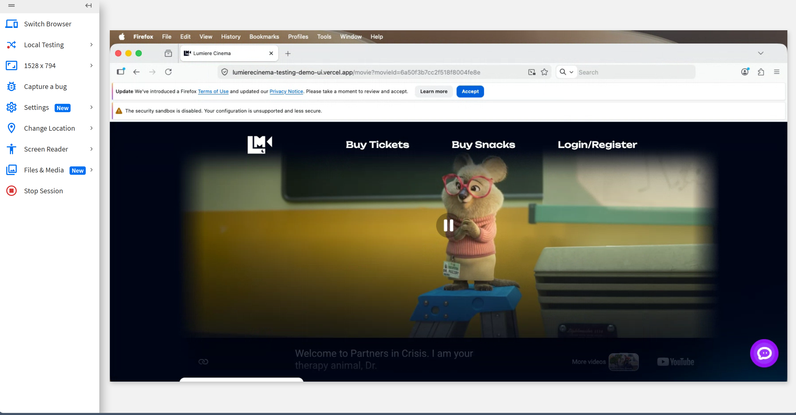
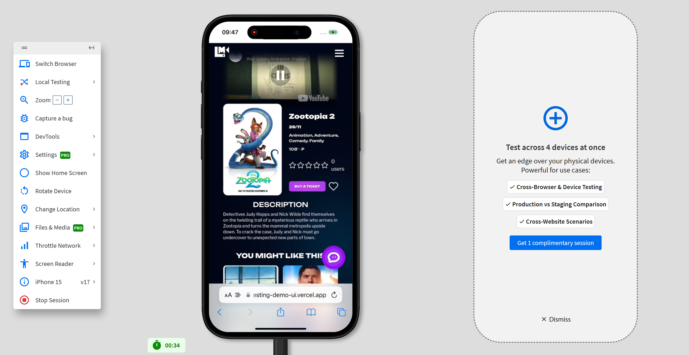

# Kiểm tra cross-browser bằng BrowserStack — U-03

- Website: https://lumierecinema-testing-demo-ui.vercel.app/
- Flow chạy lại: U-03 — Tìm kiếm phim, xem chi tiết, thêm/xóa wishlist
- Công cụ: BrowserStack Live
- Ngày kiểm tra: CHƯA THU THẬP

## Hướng dẫn thực hiện (làm theo từng bước)

### Bước 0 — Chuẩn bị
- Đăng nhập BrowserStack, vào **Live** (không phải Automate).
- Có sẵn tài khoản test đã đăng nhập được của Lumiere (cần cho phần wishlist — FR-10) và **từ khóa phim có thật** (ví dụ "Inception", "Interstellar" như P01/P02).
- Chuẩn bị công cụ chụp màn hình (BrowserStack có nút Screenshot sẵn trên thanh điều khiển phiên).

### Bước 1 — Cấu hình #1: Chrome (browser mốc so sánh)
1. Trong BrowserStack Live chọn **Windows 11 → Chrome** (phiên bản mới nhất).
2. Nhập URL: `https://lumierecinema-testing-demo-ui.vercel.app/` và Enter.
3. Đăng nhập bằng tài khoản test → xác nhận wishlist trống.

### Bước 2 — Chạy lại đúng flow U-03 và quan sát
Thực hiện lần lượt, mỗi bước để ý **layout có vỡ / có thao tác được không**:
1. **Tìm kiếm** phim bằng từ khóa (FR-16) → kết quả có hiện đúng không?
2. **Mở trang chi tiết** phim (FR-15) → poster/thông tin/lịch chiếu có hiển thị đủ, không tràn/đè chữ?
3. **Thêm vào wishlist** phim này (FR-10) → nút bấm được không, có toast xác nhận (FR-37)?
4. **Lưu thêm** 1 phim nữa, rồi **mở danh sách wishlist** (FR-10) → hiển thị đúng danh sách?
5. **Xóa 1 phim** khỏi wishlist → danh sách cập nhật đúng?
6. Ghi kết quả từng bước vào bảng "Kết quả từng bước" cột **Chrome**.

### Bước 3 — Chụp screenshot #1
- Chụp **ít nhất 1 ảnh** ở bước bộc lộ rõ giao diện (ví dụ trang chi tiết hoặc trang wishlist).
- **Bắt buộc thấy khung BrowserStack** (thanh hiển thị OS + trình duyệt + phiên bản) để chứng minh đang chạy trên BrowserStack, không phải máy cá nhân.
- Lưu vào `evidence/browserstack/chrome-01.png`.

### Bước 4 — Cấu hình #2: trình duyệt khác (Firefox / Safari / Edge)
- Đổi sang cấu hình **thứ hai khác Chrome**, ví dụ: **Windows 11 → Firefox**, hoặc **macOS → Safari**, hoặc **iPhone Safari** (nếu muốn test mobile responsive).
- Lặp lại **y hệt Bước 2** (6 bước flow), ghi vào cột trình duyệt 2.
- Chụp **ít nhất 1 screenshot** kèm khung BrowserStack → lưu `evidence/browserstack/browser2-01.png`.

### Bước 5 — Đối chiếu và kết luận
- So sánh trình duyệt 2 với Chrome: có bước nào **lỗi / vỡ layout / không bấm được**?
  - Nếu **có**: mô tả cụ thể (bước nào, hiện tượng gì), chụp thêm ảnh minh chứng, và ghi vào bug report (`evidence/bugs/`) nếu là lỗi chức năng.
  - Nếu **không**: ghi nguyên văn "Không phát hiện lỗi cross-browser trên BrowserStack trong flow đã chọn."
- Điền các bảng bên dưới và phần "Kết luận cross-browser".

### Yêu cầu tối thiểu để đạt (checklist)
- [ ] Chạy trên **2 trình duyệt khác nhau**, một trong đó là Chrome.
- [ ] Dùng đúng website deploy `https://lumierecinema-testing-demo-ui.vercel.app/`.
- [ ] Có **>= 2 screenshot** BrowserStack, **thấy rõ OS/trình duyệt/thiết bị** đang dùng.
- [ ] Ghi nhận có/không lỗi, vỡ layout, không thao tác được.
- [ ] Lưu ảnh trong `evidence/browserstack/`.

## Cấu hình đã test

| # | Trình duyệt | Phiên bản | Hệ điều hành / Thiết bị | Screenshot |
| - | ----------- | --------- | ----------------------- | ---------- |
| 1 | Firefox | mới nhất | macOS (desktop, 1528×794) | evidence/firefox.png |
| 2 | Safari | iOS 17 | iPhone 15 (mobile) | evidence/chrome-mobile.png |

> ⚠ **Lưu ý cần xử lý:** đề yêu cầu chạy trên **Chrome + 1 trình duyệt khác**. Hai cấu hình hiện có là **Firefox (macOS)** và **Safari (iPhone 15 / iOS 17)** — **chưa có Chrome**. Nên bổ sung một lần chạy trên **Chrome** để đủ điều kiện đề (file `evidence/chrome-mobile.png` thực chất là Safari trên iPhone, không phải Chrome).

### Ảnh minh chứng

**Cấu hình 1 — Firefox trên macOS** (thấy rõ menu BrowserStack + URL `lumierecinema-testing-demo-ui.vercel.app`):

**Cấu hình 2 — Safari trên iPhone 15 (iOS 17)** (thấy rõ khung thiết bị iPhone 15 v17 trong BrowserStack Live):

## Kết quả từng bước của flow

| Bước | Firefox / macOS | Safari / iPhone 15 | Ghi chú |
| ---- | --------------- | ------------------ | ------- |
| Tải trang chủ & phát trailer (FR-14/FR-15) | OK, render đúng, không vỡ layout | OK, render đúng trên mobile | |
| Tìm kiếm phim (FR-16) | Chưa có trong ảnh chụp | Chưa có trong ảnh chụp | Cần bổ sung ảnh nếu muốn minh chứng bước này |
| Trang chi tiết phim (FR-15) | OK (URL `/movie?movieId=...`) | OK (Zootopia 2 hiển thị đầy đủ) | Poster hiện "IMAGE NOT FOUND" trên cả 2 — vấn đề nội dung chung, không phải lỗi trình duyệt |
| Thêm wishlist (FR-10) | Chưa thực hiện (phiên đang ở trạng thái chưa đăng nhập) | Nút wishlist (icon trái tim) hiển thị đúng | Firefox capture chưa đăng nhập nên chưa chạy được bước wishlist |
| Xem/xóa wishlist (FR-10) | Chưa có trong ảnh chụp | Chưa có trong ảnh chụp | Cần bổ sung nếu muốn minh chứng đầy đủ |
| Phản hồi trạng thái (FR-37) | Không quan sát thấy vỡ | Không quan sát thấy vỡ | |

## Kết luận cross-browser

- Trên **cả 2 cấu hình (Firefox/macOS và Safari/iPhone 15)**, giao diện Lumiere Cinema **render đúng, không vỡ layout, thao tác điều hướng hoạt động**; trang chi tiết phim và trailer hiển thị bình thường.
- **Không phát hiện lỗi cross-browser đặc thù** trong phạm vi các bước đã chụp.
- Quan sát chung (không phải lỗi cross-browser): poster phim hiển thị **"IMAGE NOT FOUND"** trên mọi trình duyệt → nên tách thành bug nội dung/ảnh (`evidence/bugs/`), không tính vào cross-browser.
- **Hạn chế của minh chứng hiện tại:** (1) chưa có cấu hình **Chrome** như đề yêu cầu; (2) capture Firefox đang ở trạng thái chưa đăng nhập nên chưa chạy trọn bước wishlist. Nên bổ sung 1 lần chạy Chrome (đăng nhập sẵn) và chụp thêm ảnh bước wishlist để đủ điều kiện.

> Yêu cầu tối thiểu: >= 2 screenshot BrowserStack thể hiện rõ trình duyệt/thiết bị đang dùng — đã có `evidence/firefox.png` và `evidence/chrome-mobile.png`.
