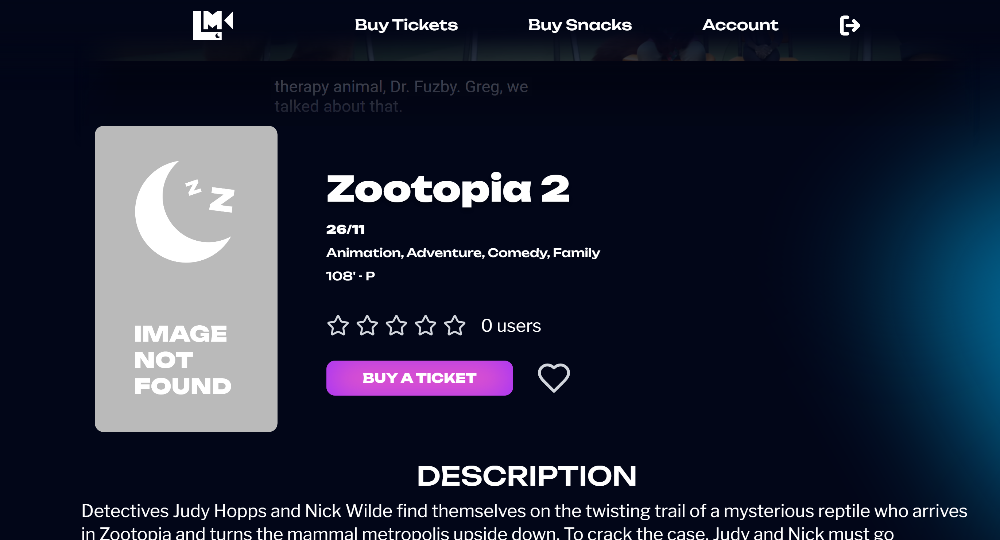
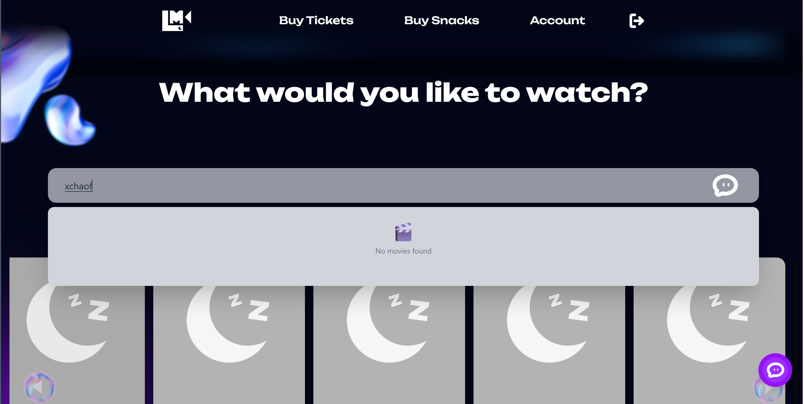
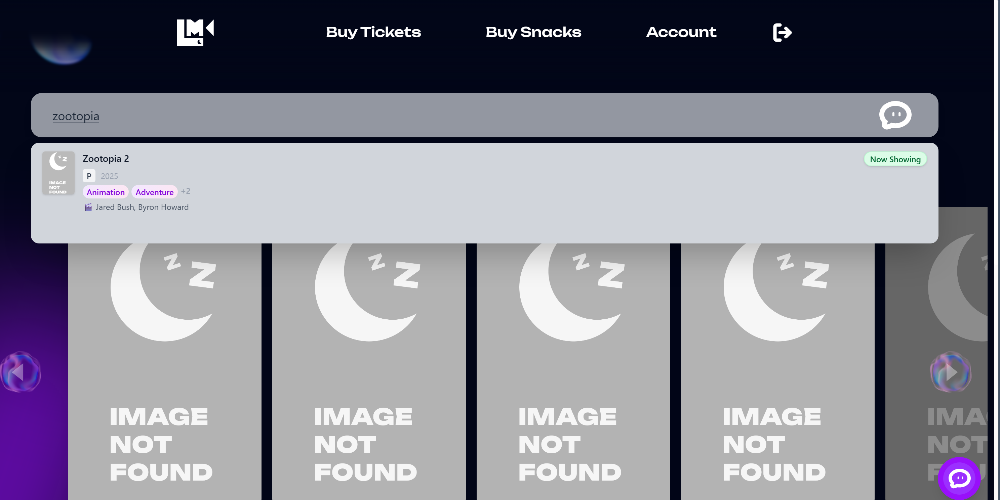
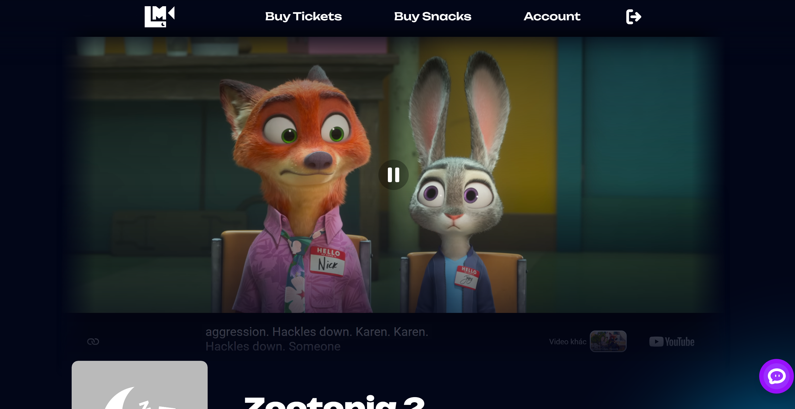

# Báo cáo usability testing — U-03

## Phạm vi và phương pháp

- Website: https://lumierecinema-testing-demo-ui.vercel.app/
- Flow: U-03 — Tìm kiếm phim, xem chi tiết, thêm/xóa wishlist
- FR: FR-10, FR-14, FR-15, FR-16, FR-35, FR-37
- Ngày test: 2026-07-20
- Mẫu: 3 người tham gia thật (P01–P03) — **hiện đã thu thập P01, P02; P03 CHƯA THU THẬP**
- Phương pháp: moderated think-aloud, timebox 8 phút/người
- Start state: đã đăng nhập sẵn tài khoản test (P01: `user_test_01`, P02: `user_test_02`), wishlist trống
- Deviation/giới hạn: Không có deviation ở P01/P02. Cỡ mẫu nhỏ (n=2 đã điền) — các tỷ lệ và median chỉ mang tính định hướng, chưa đủ suy rộng.

## Kết quả tổng quan

| Participant | Outcome | Thời gian | Error | Wrong turn | Hesitation | Intervention | Tìm đúng phim | Đã lưu | Đã xóa | Ratings (tìm/tự tin/rõ) |
| --- | --- | ---: | ---: | ---: | ---: | ---: | :---: | ---: | :---: | --- |
| P01 | SUCCESS_ASSISTED | 310s | 2 | 1 | 3 | 1 | Có | 2 | Có | 4 / 4 / 3 |
| P02 | SUCCESS_UNASSISTED | 245s | 1 | 0 | 2 | 0 | Có | 2 | Có | 5 / 4 / 4 |

- Tỷ lệ hoàn thành (mọi hình thức): 2/2 phiên đã điền hoàn thành task (P03 chưa có).
- Tỷ lệ hoàn thành không trợ giúp: 1/2 (P02). Có trợ giúp: 1/2 (P01).
- Median thời gian của lượt thành công: ~278s (trên 2 lượt: 245s, 310s) — cần P03 để median ổn định.
- Tổng hợp rating (trung bình trên 2 phiên): Q1 (tìm phim dễ) = 4.5 · Q2 (tự tin lưu/xóa đúng) = 4.0 · Q3 (thông tin/phản hồi rõ) = 3.5.
- Kết quả cross-browser (BrowserStack): giao diện render đúng, **không vỡ layout** trên cả Firefox/macOS và Safari/iPhone 15 — xem mục "Kết quả BrowserStack" bên dưới.

> **Cần bổ sung để hoàn tất theo yêu cầu đề:** đề yêu cầu **3 người tham gia** — hiện bảng mới có P01, P02; cần điền dữ liệu thật của **P03** rồi cập nhật lại các tỷ lệ, median và frequency ở mục Findings (đổi mẫu số từ /2 thành /3). Không tự bịa dữ liệu người tham gia thứ 3.

## Findings

Mỗi finding là một vấn đề usability riêng biệt. Severity theo thang của đề:

| Mức | Ý nghĩa |
| --- | ------- |
| S1 | Không hoàn thành được task. |
| S2 | Hoàn thành nhưng cần trợ giúp hoặc nhầm nghiêm trọng. |
| S3 | Hoàn thành nhưng bị chậm/do dự nhiều. |
| S4 | Vướng nhỏ, không ảnh hưởng nhiều. |

### F-01 — Khó tìm lại trang/danh sách wishlist sau khi đã lưu

- Flow: U-03
- FR liên quan: FR-10 (xem wishlist), FR-35 (điều hướng flow khách hàng)
- Frequency: 1/2 phiên đã điền (P01)
- Bằng chứng (quan sát + quote): P01 lúc 04:00 dừng lại tìm menu, thốt "Wishlist ở đâu ta?"; đến 04:05 moderator phải gợi ý "kiểm tra menu góc trên bên phải" thì mới tìm được → đây là lý do outcome của P01 là SUCCESS_ASSISTED. P02 tìm thấy icon wishlist ngay (không vướng).
- Tác động đến task: Chặn bước "xem/xóa" cho tới khi được trợ giúp; biến một lượt lẽ ra tự hoàn thành thành có trợ giúp.
- Severity: **S2** (hoàn thành nhưng cần trợ giúp).
- Lý do severity: Người dùng không tự khôi phục được, phải nhờ moderator can thiệp (1 intervention).
- Nguyên nhân khả dĩ (diễn giải, không phải quan sát): Lối vào wishlist có thể bị ẩn trong menu/icon nhỏ, thiếu nhãn rõ ràng ở khu vực dễ thấy.
- Đề xuất cải thiện: Đưa lối vào wishlist ra vị trí cố định dễ thấy (header có nhãn chữ, không chỉ icon); hoặc hiển thị link "Xem danh sách đã lưu" ngay trong toast xác nhận sau khi lưu.
- Tiêu chí xác minh (coi là đã khắc phục khi...): Trong lượt test lại, người dùng tìm ra trang wishlist trong <10s và không cần trợ giúp.

### F-02 — Nút "Thêm vào wishlist" trên trang chi tiết khó nhận biết, dễ nhầm với icon khác

- Flow: U-03
- FR liên quan: FR-10 (thêm wishlist), FR-35 (giao diện khách hàng)
- Frequency: 2/2 phiên đã điền (P01, P02)
- Bằng chứng: P01 lúc 01:10 do dự "Nút thêm ở đâu nhỉ?", sau đó lúc 01:40 click nhầm icon share (không có phản hồi) rồi mới click đúng "Add to wishlist" ở 02:05. P02 lúc 02:10 click lệch icon ("Ủa chưa ăn?") rồi click lại đúng ở 02:18.
- Bằng chứng hình ảnh: trên trang chi tiết, nút lưu chỉ là **icon trái tim viền mảnh** đặt cạnh nút lớn "BUY A TICKET" → dễ bị bỏ qua/nhầm.

  
- Tác động đến task: Gây thao tác thừa và nhầm lẫn ở cả 2 người; góp phần vào error count (P01: 2, P02: 1).
- Severity: **S3** (hoàn thành nhưng chậm/do dự, nhầm rồi tự sửa được).
- Lý do severity: Cả hai đều tự khôi phục không cần trợ giúp; ảnh hưởng tốc độ và sự chắc chắn, không chặn task.
- Nguyên nhân khả dĩ (diễn giải): Icon "add to wishlist" thiếu affordance/nhãn, đặt gần icon share nên dễ lẫn.
- Đề xuất cải thiện: Dùng nút có nhãn chữ "Lưu / Thêm vào wishlist" (hoặc icon trái tim quen thuộc) tách khỏi cụm share; thêm tooltip.
- Tiêu chí xác minh: Người dùng mới xác định đúng nút lưu ngay lần đầu, không click nhầm sang icon khác.

### F-03 — Click icon wishlist "không ăn" và thiếu phản hồi khi click trượt (hit area nhỏ)

- Flow: U-03
- FR liên quan: FR-37 (phản hồi trạng thái), FR-10 (thêm wishlist)
- Frequency: 2/2 phiên đã điền (P01, P02)
- Bằng chứng: P01 lúc 01:40 "Không có phản hồi" khi click; P02 lúc 02:10 click lệch → "Không có phản hồi", researcher note "hit area của icon nhỏ → dễ miss click". Câu hỏi mở cả hai đều trả lời từng "không chắc thao tác đã thành công": P01 "không thấy rõ thay đổi", P02 "click lần đầu không có phản hồi".
- Tác động đến task: Người dùng nghi ngờ đã lưu chưa, phải thử lại; hạ điểm tự tin (Q2 = 4/4, chưa tuyệt đối) và điểm rõ ràng (Q3 P01 = 3).
- Severity: **S3** (hoàn thành nhưng do dự nhiều do thiếu phản hồi tức thời).
- Lý do severity: Không chặn hoàn thành nhưng lặp lại ở cả 2 người và làm giảm sự tin tưởng vào kết quả.
- Nguyên nhân khả dĩ (diễn giải): Vùng bấm (hit area) của icon nhỏ; khi click trượt hệ thống không báo gì (không lỗi, không hover/active state).
- Đề xuất cải thiện: Tăng hit area của nút; thêm trạng thái hover/active/disabled rõ; đảm bảo mọi click (kể cả trượt) có phản hồi trực quan; giữ toast thành công đủ lâu.
- Tiêu chí xác minh: Không còn quan sát "click không ăn"; người dùng khẳng định chắc chắn đã lưu ngay sau thao tác.

> Ghi chú phân tích: F-02 và F-03 liên quan nhau (đều quanh nút wishlist) nhưng tách riêng vì khác nguyên nhân gốc — F-02 là *khả năng nhận biết/nhầm nút*, F-03 là *hit area + thiếu phản hồi*. Cần bổ sung dữ liệu P03 để xác nhận frequency thực (hiện tính trên 2/3 phiên).

## Bằng chứng phiên (ảnh desktop, tài khoản đã đăng nhập)

Các ảnh chụp trong phiên usability, minh họa các bước của flow U-03:

- **Tìm kiếm không có kết quả** — nhập từ khóa lạ "xchaof" → empty state "No movies found" (FR-16, FR-37):

  

- **Gợi ý tìm kiếm hoạt động** — nhập "zootopia" → gợi ý "Zootopia 2 · Now Showing" kèm thể loại, đạo diễn (FR-16, FR-14):

  

- **Trang chi tiết phim** — poster, thời lượng, nhãn tuổi, rating, mô tả, trailer (FR-15):

  

> Lưu ý xuyên suốt: poster phim hiển thị "IMAGE NOT FOUND" / placeholder → là vấn đề nội dung/ảnh (ứng viên bug), nên tách vào `evidence/bugs/`, không phải finding usability.

## Kết quả BrowserStack

Đã chạy lại flow U-03 trên 2 cấu hình bằng BrowserStack Live. Chi tiết từng bước: xem `browserstack.md`.

- **Cấu hình 1 — Firefox trên macOS:** trang chủ, trailer và trang chi tiết render đúng, không vỡ layout.

  

- **Cấu hình 2 — Safari trên iPhone 15 (iOS 17):** trang chi tiết phim hiển thị đúng trên mobile, nút wishlist (icon trái tim) hiển thị.

  

- Ghi nhận lỗi/vỡ layout/không thao tác được: **Không phát hiện lỗi cross-browser đặc thù**; giao diện render đúng trên cả 2. (Poster "IMAGE NOT FOUND" xuất hiện trên mọi trình duyệt → vấn đề nội dung chung, không phải lỗi cross-browser.)
- Screenshot minh chứng (>= 2): `evidence/firefox.png`, `evidence/chrome-mobile.png` (đều thấy rõ khung BrowserStack + OS/thiết bị).

> ⚠ **Cần bổ sung:** đề yêu cầu **Chrome + 1 trình duyệt khác**; hai ảnh hiện có là Firefox (macOS) và Safari (iPhone 15) — **chưa có Chrome**. Nên chạy thêm 1 lần trên Chrome (đăng nhập sẵn) và chụp thêm bước thêm/xóa wishlist để minh chứng đầy đủ.

## Kết luận và giới hạn

- Cả 2 người tham gia đã điền đều hoàn thành task; điểm mạnh nhất là **tìm kiếm phim** (Q1 = 4.5; P02: "Search khá nhanh và chính xác").
- Nút nghẽn tập trung ở **khu vực wishlist**: khó tìm lại danh sách (F-01, S2), nút thêm dễ nhầm (F-02, S3), và thiếu phản hồi khi thao tác (F-03, S3). Ưu tiên sửa F-01 trước vì nó gây phải-trợ-giúp; F-02/F-03 nên gộp vào một đợt tinh chỉnh nút wishlist.
- **Giới hạn:** mới có 2/3 phiên, cỡ mẫu nhỏ nên tỷ lệ/median chỉ định hướng; cần hoàn tất P03 và kết quả BrowserStack để chốt frequency và cross-browser. Các phần nghi ngờ do lỗi hạ tầng (nếu có) cần tách khỏi finding usability.
