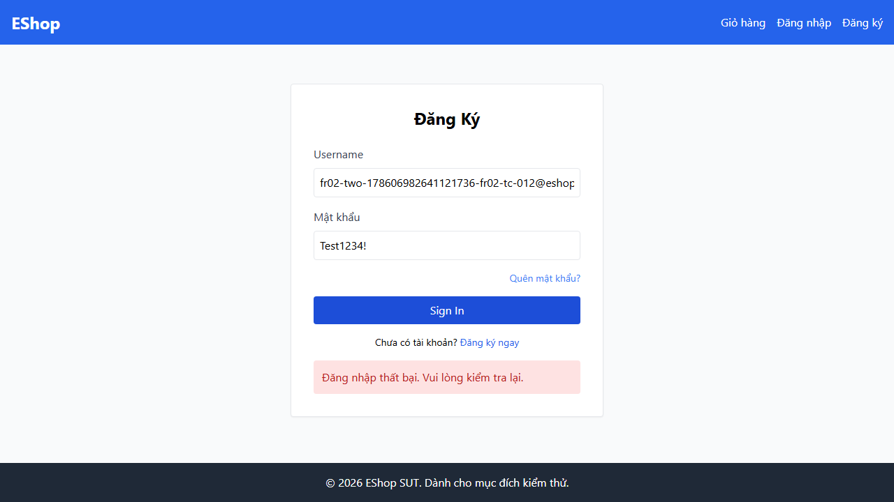
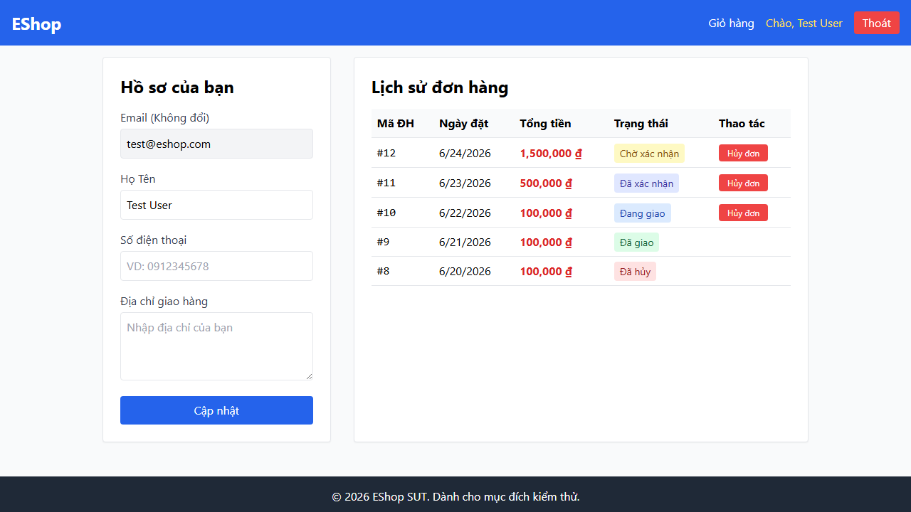
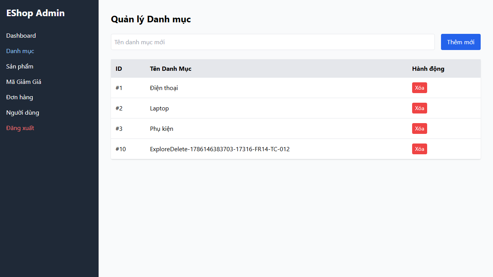
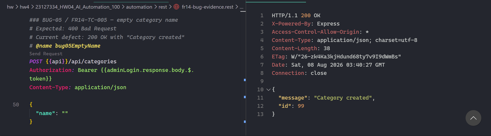
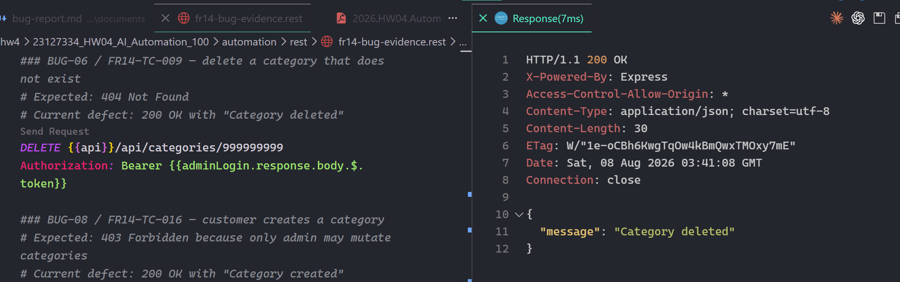
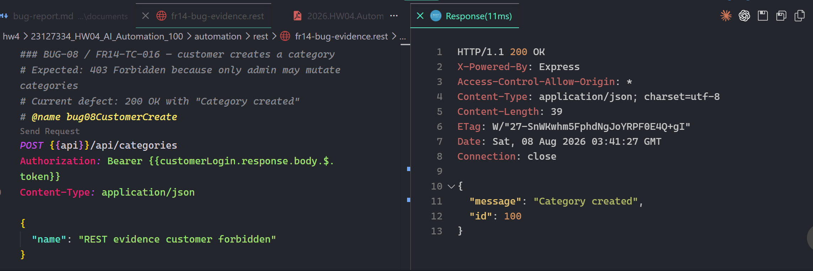

# Confirmed SUT Defects and Published GitHub Issues

Environment for all entries: local EShop, Playwright 1.55, Node 20, Chromium/Firefox/WebKit.
Published after explicit student approval on 2026-08-08. All issues carry labels `bug` and `hw4`.

- BUG-01: https://github.com/ThanhDang-Vn/software-testing/issues/33
- BUG-02: https://github.com/ThanhDang-Vn/software-testing/issues/34
- BUG-03: https://github.com/ThanhDang-Vn/software-testing/issues/35
- BUG-04: https://github.com/ThanhDang-Vn/software-testing/issues/36
- BUG-05: https://github.com/ThanhDang-Vn/software-testing/issues/37
- BUG-06: https://github.com/ThanhDang-Vn/software-testing/issues/38
- BUG-07: https://github.com/ThanhDang-Vn/software-testing/issues/39
- BUG-08: https://github.com/ThanhDang-Vn/software-testing/issues/40

| Draft | Feature / cases | Expected | Actual | Priority | Evidence |
| --- | --- | --- | --- | --- | --- |
| BUG-01 Login inputs use wrong native types | FR-02 TC-009/010 | email/password types | both text | P1 accessibility/security UX | screenshot below; three FR-02 reports and traces |
| BUG-02 Lock attempt arithmetic | FR-02 TC-012/013 | +1; lock on third | +2; premature lock | P0 core security rule | screenshot below; `server.js:54-61`; reports |
| BUG-03 Lock duration/feedback | FR-02 TC-014/015 | specific feedback; 30 s | generic UI; 180 s | P0 account availability | screenshot below; `server.js:40-57`; reports |
| BUG-04 Shipping order cancellable | FR-11 TC-012 | no cancel at shipping | third cancel action shown/accepted | P0 order integrity | screenshot below; `server.js:321-337`; reports |
| BUG-05 Invalid category names accepted | FR-14 TC-005/006/007 | HTTP 400 | HTTP 200 | P1 data integrity | REST screenshot below; `server.js:249-253`; reports |
| BUG-06 Unknown delete reports success | FR-14 TC-009 | HTTP 404 | HTTP 200 | P1 API correctness | REST screenshot below; `server.js:269-275`; reports |
| BUG-07 Category field lacks required contract | FR-14 TC-011 | native/visible required | neither present | P1 validation UX | screenshot below; three reports/traces |
| BUG-08 Customer can create category | FR-14 TC-016 | HTTP 403 | HTTP 200 | P0 authorization | REST screenshot below; `server.js:249`; reports |

The Firefox TC-008 protocol teardown is excluded because it is classified FLAKY and passed 3/3
repetitions. FR14-TC-012 confirmation is excluded because it is exploratory, not an FR-14 requirement.

## Screenshot evidence

All images below are original Playwright failure artifacts from Chromium executions. They have only
been copied and renamed for the submission; their pixels were not edited.

### BUG-01 — Password control displays the entered value

FR02-TC-010 expected a masked password control. The captured value remains visibly rendered as
plain text.

### BUG-02 — Correct login below the documented threshold fails

FR02-TC-012 submits the correct password after two failed attempts. The generic failure visible in
the screenshot supports the premature-lock symptom; the trace and server source establish the
incorrect `+2` attempt arithmetic.

### BUG-03 — Locked account receives generic feedback

FR02-TC-014 expected appropriate locked-account feedback. The UI only displays the generic login
failure message.

### BUG-04 — Shipping order still exposes Cancel

FR11-TC-012 shows order `#10` in `Đang giao` status with a visible `Hủy đơn` action, although a
shipping user must not be allowed to cancel it.

### BUG-07 — Category name field has no visible required contract

FR14-TC-011 captures the category form with an empty field, no visible required indicator and an
enabled `Thêm mới` action.

### BUG-05 — Empty category name returns success

The REST Client capture shows FR14-TC-005 sending `{ "name": "" }`. The annotated oracle expects
`400 Bad Request`, but the actual response is `HTTP/1.1 200 OK` with `Category created` and ID `99`.

### BUG-06 — Deleting an unknown category returns success

The request deletes category ID `999999999`. The annotated oracle expects `404 Not Found`, but the
actual response is `HTTP/1.1 200 OK` with `Category deleted`.

### BUG-08 — Customer token creates a category

The REST Client capture uses the chained customer login token. The annotated oracle expects
`403 Forbidden`, but the actual response is `HTTP/1.1 200 OK` with `Category created` and ID `100`.

For manual response screenshots, open
[`fr14-bug-evidence.rest`](../automation/rest/fr14-bug-evidence.rest) with the VS Code REST Client,
start the backend, and send its requests from top to bottom. It includes explicit expected/current
statuses plus cleanup calls for any categories created while reproducing BUG-05 and BUG-08.
