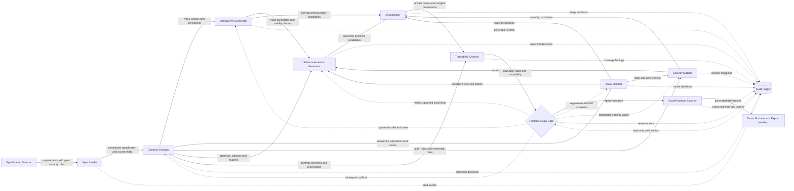

# AI-driven API Test Generator — Drawing Brief

## Component list

1. Spec Loader
2. Contract Extractor
3. Domain/BVA Generator
4. State Modeler
5. Security Mapper
6. Schema Assertion Generator
7. Deduplicator
8. Traceability Checker
9. Human Review Gate
10. Excel/Postman Exporter
11. Audit Logger

## Responsibilities

| Component | Responsibilities |
| --- | --- |
| Spec Loader | Load and normalize functional requirements, security requirements, OpenAPI/API documents, data dictionaries, examples, and policy notes. Preserve source identifiers and locations for traceability. Reject unreadable or unsupported inputs. |
| Contract Extractor | Extract endpoints, methods, parameters, headers, authentication rules, request/response schemas, status codes, constraints, examples, and explicit business rules from normalized specifications. Mark conflicts and uncertain interpretations. |
| Domain/BVA Generator | Derive valid, invalid, equivalence-partition, and boundary-value test candidates from types, ranges, formats, enums, required fields, and business constraints. Include values immediately below, at, and above inclusive/exclusive boundaries. |
| State Modeler | Represent resources, actors, roles, states, transitions, preconditions, setup actions, teardown actions, and legal/illegal operation sequences. Produce stateful scenarios with deterministic initial state. |
| Security Mapper | Map authentication, authorization, ownership, role, input-validation, sensitive-data, rate-limit, and abuse requirements to positive and negative security tests. Identify missing-authorization and privilege-boundary scenarios. |
| Schema Assertion Generator | Generate precise assertions for status, headers, response body schema, field types, required/optional fields, value constraints, error shape, and relevant side effects. Avoid assertions unsupported by the contract. |
| Deduplicator | Detect exact and semantic duplicates across domain, state, security, and schema candidates. Merge equivalent cases while retaining distinct coverage, provenance, and requirement mappings. |
| Traceability Checker | Verify that every generated case maps to a requirement, contract element, security rule, or explicitly recorded assumption; calculate coverage and identify uncovered or orphaned items. Block cases with missing provenance or unresolved contradictions. |
| Human Review Gate | Present candidates, assumptions, conflicts, risk, expected results, and coverage gaps for approval, edit, rejection, or deferral. Require explicit human disposition before export. |
| Excel/Postman Exporter | Convert approved canonical cases into the required Excel test-case format and executable Postman collection, environment template, and iteration data. Preserve stable TC_ID values and traceability fields across formats. |
| Audit Logger | Record input versions/hashes, extraction decisions, model/generator version, prompts or policies where permitted, candidate transformations, deduplication decisions, traceability findings, reviewer actions, export versions, timestamps, and errors. Never log plaintext secrets or live tokens. |

## Inputs and outputs

| Component | Inputs | Outputs |
| --- | --- | --- |
| Spec Loader | Requirement files, OpenAPI/API specification, security requirements, examples, data dictionary, source metadata | Normalized specification package; source index; validation errors; source hashes |
| Contract Extractor | Normalized specification package; source index | Canonical API contract; extracted business constraints; ambiguity/conflict list; provenance links |
| Domain/BVA Generator | Canonical contract; business constraints; data dictionary | Domain partitions; boundary sets; positive/negative test candidates; test-data constraints |
| State Modeler | Canonical contract; resource rules; actor/role definitions; business constraints | State graph model; legal and illegal transition scenarios; setup/preconditions; teardown/reset requirements |
| Security Mapper | Canonical contract; security requirements; actor/role definitions; state model | Security test candidates; auth/authz matrix; ownership and privilege cases; sensitive-data assertions; security coverage mappings |
| Schema Assertion Generator | Canonical contract; generated candidates; expected state transitions | Assertion sets; expected status/headers/body; schema checks; side-effect verification requirements |
| Deduplicator | Domain/BVA candidates; stateful scenarios; security candidates; assertion sets; provenance | Canonical unique test candidates; merged provenance; duplicate/merge report |
| Traceability Checker | Unique candidates; source index; canonical contract; requirements and security mappings | Traceability matrix; coverage report; uncovered requirements; orphaned tests; unresolved-gap list; gate status |
| Human Review Gate | Unique candidates; assertion sets; traceability results; ambiguities; risks; audit context | Approved, edited, rejected, or deferred cases; reviewer rationale; resolved assumptions; export authorization |
| Excel/Postman Exporter | Approved canonical cases; assertion sets; setup/teardown model; test data; export configuration | Excel test-case workbook; Postman collection; environment template without secrets; iteration-data files; export manifest |
| Audit Logger | Events and metadata emitted by all components; reviewer actions; export manifest | Append-only audit records; correlation IDs; version history; decision history; integrity metadata; sanitized error log |

## Connection list

1. Specification sources to Spec Loader: requirement, API, security, example, and dictionary documents are ingested with source metadata.
2. Spec Loader to Contract Extractor: normalized specification package and source index are supplied for contract extraction.
3. Spec Loader to Audit Logger: source hashes, validation outcome, input version, and loading errors are recorded.
4. Contract Extractor to Domain/BVA Generator: canonical endpoint/field constraints and business rules drive domain and boundary generation.
5. Contract Extractor to State Modeler: operations, actors, resources, preconditions, and business rules drive the state model.
6. Contract Extractor to Security Mapper: authentication, authorization, headers, roles, ownership rules, and security constraints drive security coverage.
7. Contract Extractor to Schema Assertion Generator: request/response schemas, status codes, headers, examples, and constraints define supported assertions.
8. Contract Extractor to Traceability Checker: extracted contract elements, ambiguities, conflicts, and provenance become traceability targets.
9. Domain/BVA Generator to Schema Assertion Generator: generated inputs and expected validity classes are converted into response and error assertions.
10. Domain/BVA Generator to Deduplicator: domain and boundary candidates enter the common candidate set.
11. State Modeler to Security Mapper: actors, roles, ownership, resource state, and transitions provide context for authorization and misuse cases.
12. State Modeler to Schema Assertion Generator: expected transitions and side effects define post-request verification assertions.
13. State Modeler to Deduplicator: stateful sequences, setup, preconditions, and teardown enter the common candidate set.
14. Security Mapper to Schema Assertion Generator: expected denial/success behavior and sensitive-data rules are converted into security assertions.
15. Security Mapper to Deduplicator: security candidates and their requirement mappings enter the common candidate set.
16. Schema Assertion Generator to Deduplicator: assertion-enriched candidates are normalized and compared for semantic duplication.
17. Deduplicator to Traceability Checker: unique canonical candidates and merged provenance are checked for coverage and origin.
18. Traceability Checker to Human Review Gate: candidates, traceability matrix, coverage gaps, orphan findings, ambiguities, and gate status are presented for disposition.
19. Human Review Gate to Contract Extractor: reviewer-requested reinterpretation or conflict resolution is returned for controlled re-extraction.
20. Human Review Gate to Domain/BVA Generator, State Modeler, Security Mapper, or Schema Assertion Generator: approved corrections are routed to the responsible generator for regeneration.
21. Human Review Gate to Excel/Postman Exporter: only explicitly approved canonical cases and resolved assumptions are released for export.
22. Excel/Postman Exporter to Audit Logger: export manifest, output hashes, tool/version data, and export errors are recorded.
23. Every processing component to Audit Logger: decisions, transformations, warnings, errors, correlation IDs, and sanitized execution metadata are appended to the audit trail.
24. Audit Logger to Human Review Gate: relevant decision history and provenance are available to reviewers as read-only context.

## Mermaid reference

