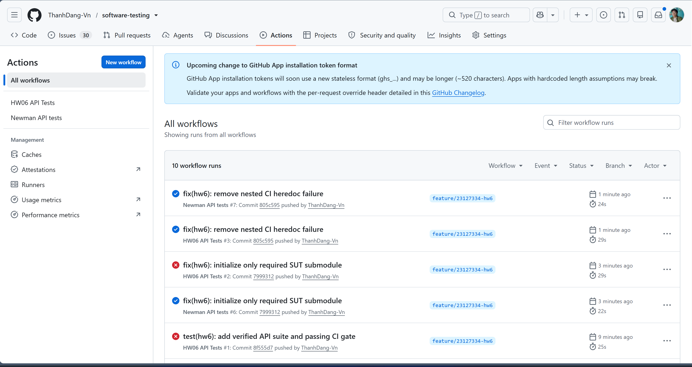
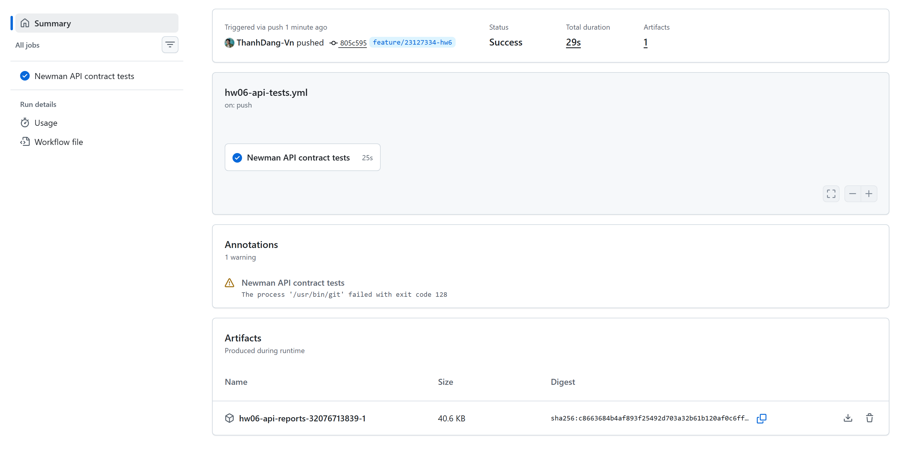
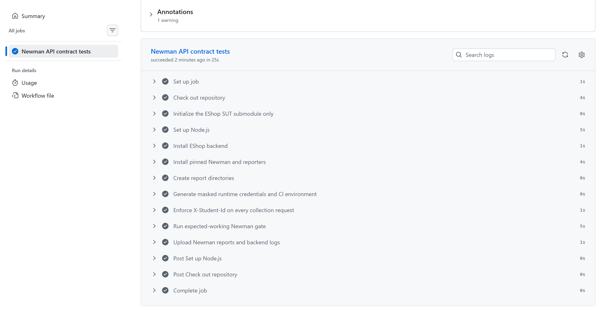

# HW06 CI/CD Report

## Trigger

Workflow [`hw06-api-tests.yml`](../../../../.github/workflows/hw06-api-tests.yml) chạy khi:

- Có `push` hoặc `pull_request` thay đổi `hw/hw6/**`, `hw/eshop-sut/backend/**` hoặc chính workflow.
- Người dùng chạy thủ công bằng `workflow_dispatch`.

Workflow dùng quyền `contents: read`. Các run cùng workflow và cùng Git ref nằm trong một concurrency group; run cũ đang chạy sẽ bị hủy khi có run mới.

## Jobs

Workflow có một job `newman`, hiển thị là `Newman API contract tests`, chạy trên `ubuntu-latest` với giới hạn 20 phút. Job thực hiện checkout, khởi tạo riêng submodule EShop, cài SUT và Newman, tạo môi trường runtime, kiểm tra header sinh viên, chạy ba suite độc lập và upload báo cáo.

## Setup

- Repository được checkout bằng `actions/checkout@v6`; chỉ `hw/eshop-sut` được khởi tạo để tránh legacy gitlink `hw/hw2/group05_eshop` không có URL trong `.gitmodules`.
- Node.js `20.20.2` được cài bằng `actions/setup-node@v6`, có npm cache theo backend lockfile.
- Backend được cài bằng `npm ci` tại `hw/eshop-sut/backend`.
- Newman `6.2.1` và `newman-reporter-htmlextra` `1.23.1` được cài dưới `RUNNER_TEMP`.
- Trước mỗi suite, backend được khởi động mới. Việc load `server.js` làm SQLite được drop, tạo lại và seed; CI chờ readiness bằng `GET /api/products` tối đa 15 giây.
- Readiness request và các collection/supporting request đều phải có `X-Student-Id: 23127334`. Một preflight guard dừng job nếu collection-level upsert, assertion giá trị header hoặc header trong `pm.sendRequest` bị thiếu.

## Data strategy

Mỗi suite dùng một backend và database mới để tránh state leakage. Sau seed, hai mật khẩu public của user/admin được thay bằng mật khẩu ngẫu nhiên tạo trong run bằng OpenSSL. Các giá trị này được mask, chỉ tồn tại trong environment của job và không được upload.

Postman environment runtime được sinh từ `23127334_HW06_Local.example.postman_environment.json` vào `RUNNER_TEMP`. `baseUrl` là `http://127.0.0.1:3000`, `studentId` là `23127334`, token ban đầu rỗng và được lấy khi setup/login. Dữ liệu lặp dùng đúng một row xác định trong `postman/data/ci-expected-working.json`.

## Newman command

Mỗi lần chạy chọn `00 Setup`, đúng một test case expected-working và `99 Verification-Teardown`:

```bash
newman run "$COLLECTION" \
  --environment "$HW06_CI_ENV" \
  --iteration-data "hw/hw6/postman/data/ci-expected-working.json" \
  --folder "00 Setup" \
  --folder "$test_item" \
  --folder "99 Verification-Teardown" \
  --timeout-request 5000 \
  --timeout 300000 \
  --reporters cli,junit,htmlextra \
  --reporter-junit-export "$REPORT_DIR/${suite}.xml" \
  --reporter-htmlextra-export "$REPORT_DIR/${suite}.html" \
  --reporter-htmlextra-skipSensitiveData \
  --color off
```

Ba test case của gate là `REG-AI-001`, `CPN-AI-017` và `PRD-AI-001`. Output CLI được truyền qua `tee`, còn exit code thật của Newman được lấy từ `PIPESTATUS[0]`.

## Artifacts

Artifact có tên `hw06-api-reports-<run_id>-<run_attempt>` và được giữ 14 ngày. Nội dung gồm:

- Ba CLI report, ba JUnit XML report và ba HTML report cho Register, Coupon và Product.
- Ba backend log tương ứng, dùng để xác nhận reset/seed, server start và kết nối database.

Upload dùng `if: always()` khi đã có report, nên evidence vẫn được lưu khi assertion fail. HTML bật `skipSensitiveData`; runtime environment, Newman JSON, mật khẩu và token không được upload.

## Pass/fail rule

Mỗi suite trả về đúng Newman exit code. Workflow vẫn chạy các suite còn lại để thu đủ evidence, nhưng đặt `overall_status=1` nếu bất kỳ suite nào fail và kết thúc job bằng status đó. Vì vậy:

- Job pass chỉ khi header guard, setup/readiness và toàn bộ assertion trong ba test case được chọn đều pass.
- Một assertion fail làm step Newman và job fail.
- Workflow không dùng `continue-on-error`, `--suppress-exit-code` hoặc ép exit code về 0.

## Passing-run evidence

- Commit: [`805c5959dd0a19b3a93035c7829dce595ecf8d40`](https://github.com/ThanhDang-Vn/software-testing/commit/805c5959dd0a19b3a93035c7829dce595ecf8d40)
- Run/job: [run 32076713839, job 95531370911](https://github.com/ThanhDang-Vn/software-testing/actions/runs/32076713839/job/95531370911)
- Artifact: [`hw06-api-reports-32076713839-1`](https://github.com/ThanhDang-Vn/software-testing/actions/runs/32076713839/artifacts/9303692181)
- Artifact SHA-256: `C8663684B4AF893F25492D703A32B61B120AF0C6FF9CAEFC2FF206A3E1A52432`
- Kết quả: Register `26/0`, Coupon `26/0`, Product `26/0` assertions failed; job kết luận `success`.







## One-failure-run evidence

- Commit: [`8f7786b96b85233c81e788ac028e5f2c5596f2ef`](https://github.com/ThanhDang-Vn/software-testing/commit/8f7786b96b85233c81e788ac028e5f2c5596f2ef)
- Run: [run 32078644821](https://github.com/ThanhDang-Vn/software-testing/actions/runs/32078644821)
- Artifact: [`hw06-api-reports-32078644821-1`](https://github.com/ThanhDang-Vn/software-testing/actions/runs/32078644821/artifacts/9304316399)
- Artifact SHA-256: `4299F0DB299EBB157DB97A46AF5FF1D853219892ED4217CA4CA75A7BE5166126`
- Kết quả: Register `26/0`, Coupon `27/1`, Product `26/0`; assertion fail duy nhất là `CI DEMO FAILURE | intentional single assertion failure` trong `CPN-AI-017`; job kết luận `failure`.
- Demo chỉ thêm một assertion sai có chủ đích; không thay đổi request, fixture, SUT, dữ liệu thật hoặc assertion hợp lệ khác.


## Limitations

- Gate chỉ chạy ba đường đi expected-working đã audit, không đại diện cho toàn bộ 148 test case. Các defect-revealing case vẫn nằm trong collection và evidence bug nhưng không thuộc merge gate này.
- SQLite được reset theo suite trong cùng runner; pipeline chưa kiểm chứng database hoặc deployment production bên ngoài runner.
- Artifact hết hạn sau 14 ngày. SHA-256 và ảnh do người dùng lưu giúp truy vết run, nhưng không thay thế việc giữ artifact lâu dài nếu môn học yêu cầu lưu trữ dài hạn.
- Passing run có warning hậu xử lý Git exit code 128 do legacy gitlink thiếu URL. Các step chính và job vẫn xanh; warning này không phải assertion failure.
- Evidence hình ảnh là ảnh thật do người dùng cung cấp tại thời điểm run. Báo cáo không tạo lại hoặc suy diễn hình ảnh GitHub Actions.
