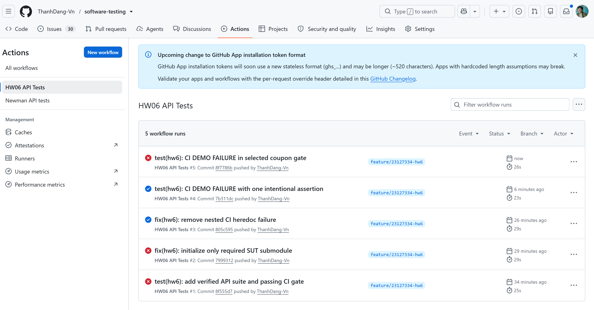
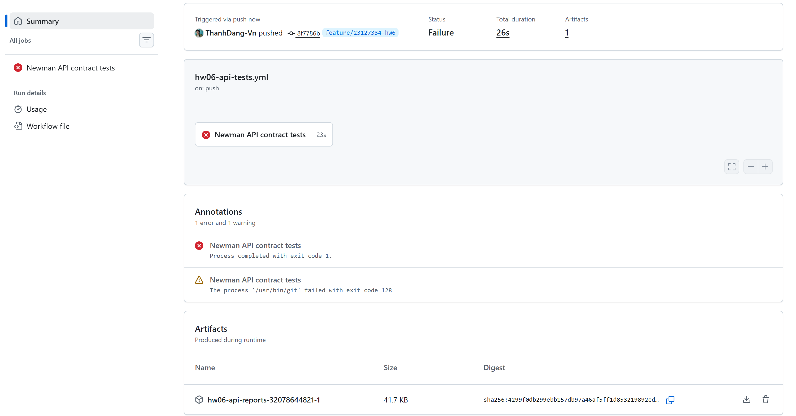
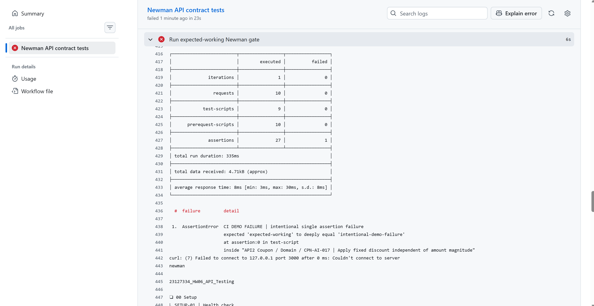
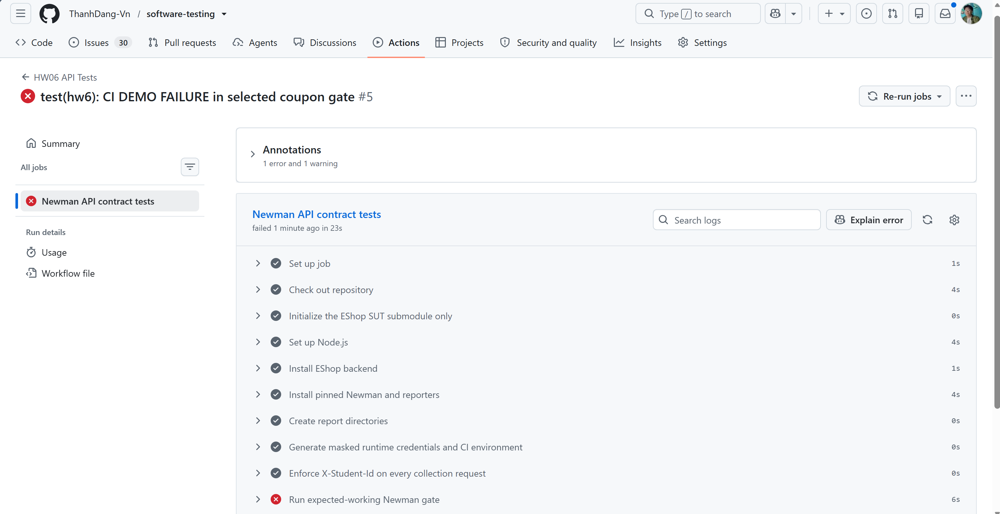

# HW06 Intentional CI Failure Demonstration

This exercise demonstrates that one failed Newman assertion makes the workflow fail while all unrelated setup, requests, assertions, teardown, and artifact upload continue to run. The demonstration does not change SUT code, database seed data, request data, or expected behavior in any other test.

## Three-commit sequence

| Stage | Commit | Reason |
| --- | --- | --- |
| Passing baseline | [`805c5959dd0a19b3a93035c7829dce595ecf8d40`](https://github.com/ThanhDang-Vn/software-testing/commit/805c5959dd0a19b3a93035c7829dce595ecf8d40) | Real successful `HW06 API Tests` run: all three expected-working suites passed and reports were uploaded. |
| One-failure demonstration | [`8f7786b96b85233c81e788ac028e5f2c5596f2ef`](https://github.com/ThanhDang-Vn/software-testing/commit/8f7786b96b85233c81e788ac028e5f2c5596f2ef) | Places exactly one deliberately false Postman assertion named `CI DEMO FAILURE | intentional single assertion failure` in selected case `CPN-AI-017`. No request, fixture, SUT, or legitimate assertion changes. Local verification: Newman exit `1`, 27 assertions, exactly 1 failed. |
| Restore correct assertion set | [`5c3074e38c89c99932b80a02cb69df788dce76b3`](https://github.com/ThanhDang-Vn/software-testing/commit/5c3074e38c89c99932b80a02cb69df788dce76b3) | Removes only the deliberate assertion, restoring the exact passing collection behavior. Local verification: Register, Coupon, and Product each exited `0` with 26 assertions and 0 failed. |

The later evidence-only commit `eacbea47e04f5977707c8b59050e6a1115a63609` records the already successful passing run images/artifact review; it is not one of the three behavioral states above.

Commit `7b311dcebe54aa683d4a04c3923d4553c61e7d0f` attempted the demonstration but placed the assertion in non-selected case `CPN-AI-002`; its real run correctly stayed green. It is retained in history for audit transparency and is not counted as the one-failure behavioral commit.

## Expected failure signature

- Register suite: pass unchanged.
- Coupon suite: request and legitimate assertions pass; exactly one assertion fails with label `CI DEMO FAILURE`.
- Product suite: pass unchanged because the workflow aggregates suite status and continues collecting evidence.
- Workflow/job conclusion: failure, because Newman returns non-zero and the shell preserves that status.
- Artifact upload: still runs and retains the real CLI/JUnit/HTML reports plus backend reset logs.

## Real failure evidence

- GitHub Actions run URL: [run 32078644821](https://github.com/ThanhDang-Vn/software-testing/actions/runs/32078644821)
- Demonstration commit SHA: `8f7786b96b85233c81e788ac028e5f2c5596f2ef`
- Artifact URL: [artifact 9304316399](https://github.com/ThanhDang-Vn/software-testing/actions/runs/32078644821/artifacts/9304316399)
- Artifact file: [`hw06-api-reports-32078644821-1.zip`](../../actions/fail/hw06-api-reports-32078644821-1.zip)
- Artifact SHA-256: `4299F0DB299EBB157DB97A46AF5FF1D853219892ED4217CA4CA75A7BE5166126`
- Run conclusion: `failure`
- Observed result: Register `26/0`; Coupon `27/1` with only `CI DEMO FAILURE`; Product `26/0`.

### Real images









The run and artifact URLs above were copied from the user-supplied [`actions/fail/evidence.md`](../../actions/fail/evidence.md); they were not inferred from filenames or generated from an ID pattern.

## Restore procedure

After the real failure evidence is saved:

1. Remove only these three Postman script lines from `CPN-AI-017`:

   ```javascript
   pm.test('CI DEMO FAILURE | intentional single assertion failure', function () {
     pm.expect('expected-working').to.eql('intentional-demo-failure');
   });
   ```

2. Parse the collection JSON and run the expected-working gate locally.
3. Commit the removal as the restore commit.
4. Push and confirm the restored GitHub Actions run is green.
5. Record the real one-failure SHA, restore SHA, run URLs, artifact link, and real images here. Because a commit cannot contain its own final SHA, the restore SHA is filled into this working report after the restore commit is created.

## Restore verification

- Restore commit: `5c3074e38c89c99932b80a02cb69df788dce76b3`
- Collection parse: pass.
- `CI DEMO FAILURE` assertion remaining in collection: `0`.
- Register local gate: exit `0`, 26 assertions, 0 failed.
- Coupon local gate: exit `0`, 26 assertions, 0 failed.
- Product local gate: exit `0`, 26 assertions, 0 failed.
- Restored GitHub Actions job/run: [run 32079401638, job 95539251820](https://github.com/ThanhDang-Vn/software-testing/actions/runs/32079401638/job/95539251820).
- Restored artifact: [artifact 9304578117](https://github.com/ThanhDang-Vn/software-testing/actions/runs/32079401638/artifacts/9304578117).
- Restored artifact SHA-256: `A7A75CF8E864017D04B81C98753FAE81C9DE0E4C2C2F9E2C31B3BA229E5FEA52`.
- Restored remote artifact result: Register `26/0`, Coupon `26/0`, Product `26/0`; `CI DEMO FAILURE` occurrences: `0`.
- Restored run-list image: [`restore-runs.png`](../../actions/restore/img/restore-runs.png).
- Restored summary/artifact image: [`restore-summary.png`](../../actions/restore/img/restore-summary.png).
- Restored successful-steps image: [`restore-steps.png`](../../actions/restore/img/restore-steps.png).

## Final CI demonstration conclusion

The three behavioral states are evidenced as follows:

1. Passing baseline `805c595`: real green run and artifact.
2. One-failure demonstration `8f7786b`: real red run caused by exactly one labeled assertion; other suites completed normally and artifact upload succeeded.
3. Restore `5c3074e`: real artifact confirms all three suites returned to 26 assertions with 0 failures and the demo assertion is absent.

The passing, intentional-failure, and restored states now each include real user-supplied images alongside their URL, SHA, and artifact evidence. No functional, report, URL, SHA, artifact-content, or image evidence remains missing.
